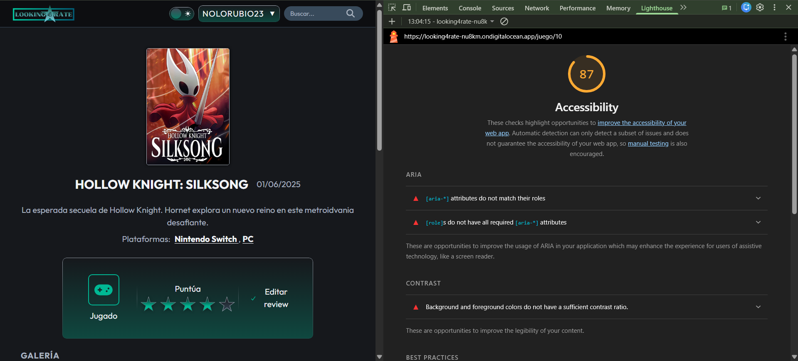
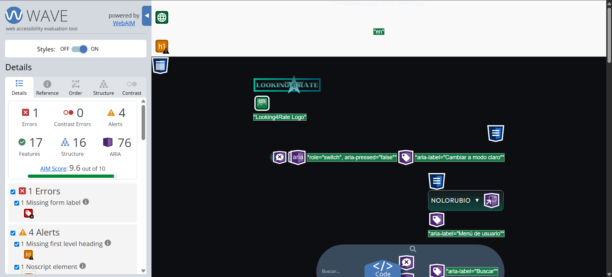
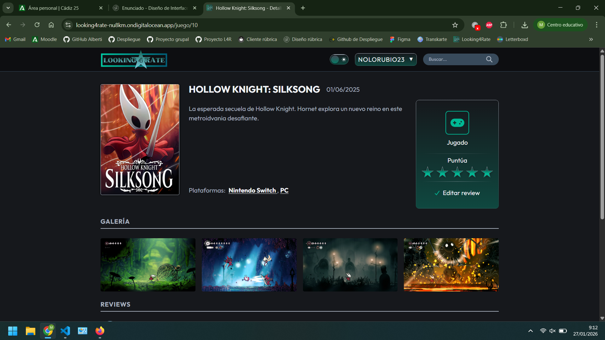
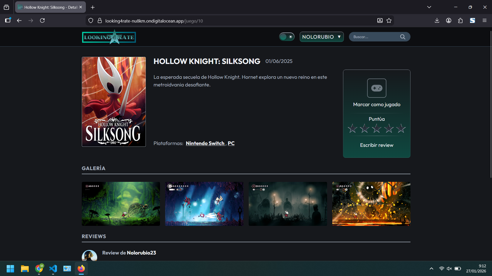
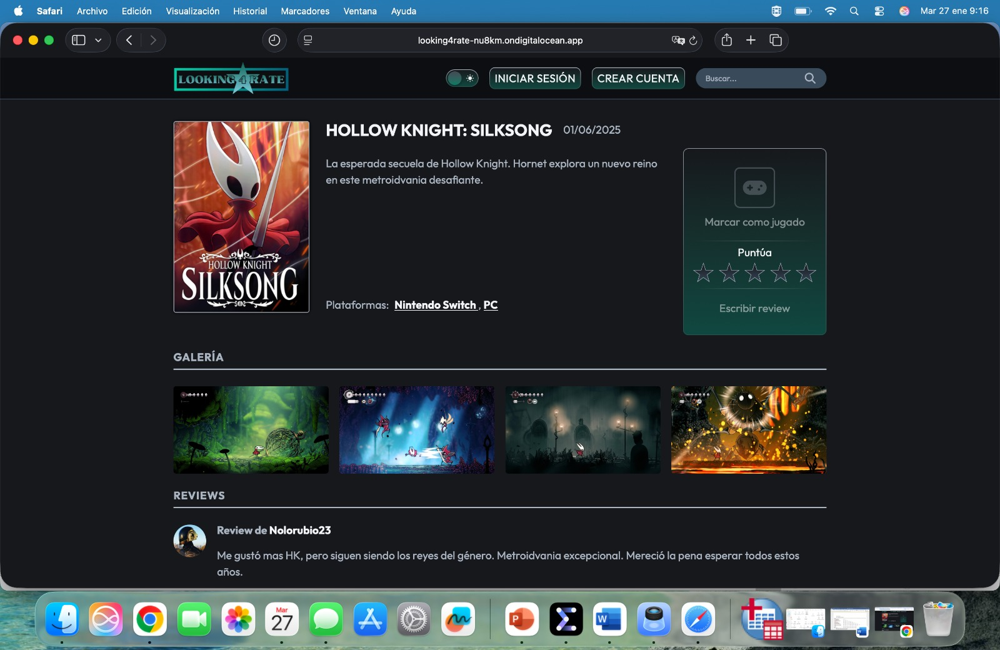
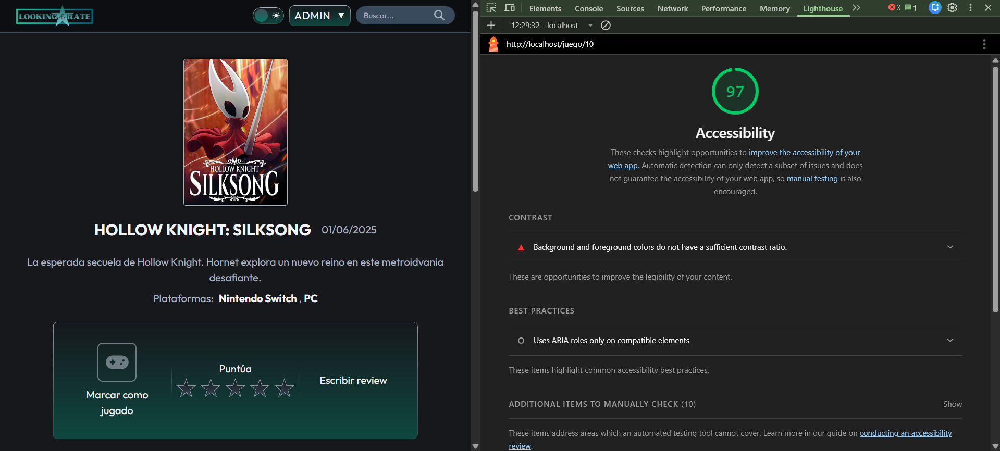
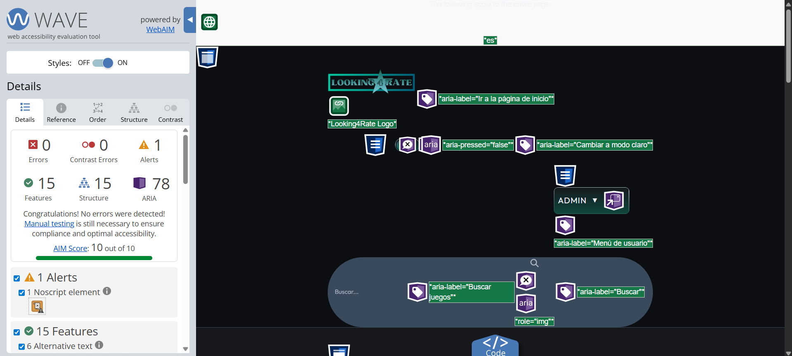

# Índice

- [Sección 1: Fundamentos de accesibilidad](#sección-1-fundamentos-de-accesibilidad)
	- [1.1 ¿Por qué es necesaria la accesibilidad web?](#11-por-qué-es-necesaria-la-accesibilidad-web)
	- [1.2 Los 4 principios de WCAG 2.1](#12-los-4-principios-de-wcag-21)
	- [1.3 Niveles de conformidad](#13-niveles-de-conformidad)
- [Sección 2: Componente multimedia implementado](#sección-2-componente-multimedia-implementado)
	- [2.1 Tipo de componente](#21-tipo-de-componente)
	- [2.2 Descripción del componente](#22-descripción-del-componente)
	- [2.3 Características de accesibilidad implementadas](#23-características-de-accesibilidad-implementadas)
- [Sección 3: Auditoría automatizada inicial](#sección-3-auditoría-automatizada-inicial)
	- [3.1 Resultados de las herramientas](#31-resultados-de-las-herramientas)
	- [3.2 Problemas más graves detectados](#32-problemas-más-graves-detectados)
- [Sección 4: Análisis y corrección de errores](#sección-4-análisis-y-corrección-de-errores)
	- [4.1 Tabla resumen de errores](#41-tabla-resumen-de-errores)
	- [4.2 Detalle de correcciones aplicadas](#42-detalle-de-correcciones-aplicadas)
- [Sección 5: Análisis de estructura semántica](#sección-5-análisis-de-estructura-semántica)
	- [5.1 Landmarks HTML5 utilizados](#51-landmarks-html5-utilizados)
	- [5.2 Jerarquía de encabezados](#52-jerarquía-de-encabezados)
	- [5.3 Análisis de imágenes](#53-análisis-de-imágenes)
- [Sección 6: Verificación manual](#sección-6-verificación-manual)
	- [6.1 Test de navegación por teclado](#61-test-de-navegación-por-teclado)
	- [6.2 Test con lector de pantalla](#62-test-con-lector-de-pantalla)
	- [6.3 Verificación cross-browser](#63-verificación-cross-browser)
- [Sección 7: Resultados finales después de correcciones](#sección-7-resultados-finales-después-de-correcciones)
	- [7.1 Comparativa de resultados](#71-comparativa-de-resultados)
	- [7.2 Checklist de conformidad WCAG 2.1 Nivel AA](#72-checklist-de-conformidad-wcag-21-nivel-aa)
	- [7.3 Nivel de conformidad alcanzado](#73-nivel-de-conformidad-alcanzado)
- [Sección 8: Conclusiones y reflexión](#sección-8-conclusiones-y-reflexión)
	- [8.1 ¿Es accesible mi proyecto?](#81-es-accesible-mi-proyecto)
	- [8.2 Principales mejoras aplicadas](#82-principales-mejoras-aplicadas)
	- [8.3 Mejoras futuras](#83-mejoras-futuras)
	- [8.4 Aprendizaje clave](#84-aprendizaje-clave)

---

# Sección 1: Fundamentos de accesibilidad

## 1.1 ¿Por qué es necesaria la accesibilidad web?

La accesibilidad web es fundamental para garantizar que todas las personas, independientemente de sus capacidades, puedan acceder a la información y funcionalidades de una aplicación web. Existen diversos tipos de discapacidades que pueden dificultar el uso de la web: **visuales** (ceguera, baja visión), **auditivas** (sordera), **motoras** (dificultad para usar ratón o teclado) y **cognitivas** (dislexia, TDAH). 

Implementar la accesibilidad no solo beneficia a personas con discapacidades, sino que mejora la experiencia para todos los usuarios, facilitando la navegación en diferentes contextos (móviles, conexiones lentas, etc.). Además, en España y Europa existe **obligatoriedad legal** mediante normativas como la Directiva Europea 2016/2102 y el Real Decreto 1112/2018, que exigen que los sitios web del sector público sean accesibles.

## 1.2 Los 4 principios de WCAG 2.1

Las Pautas de Accesibilidad para el Contenido Web (WCAG 2.1) se basan en cuatro principios fundamentales que aseguran que el contenido web sea accesible:

### 1. **Perceptible**
La información y los componentes de la interfaz deben presentarse de forma que los usuarios puedan percibirlos.

**Ejemplo:** En Looking4Rate, todas las imágenes de portadas de juegos incluyen texto alternativo descriptivo (`alt`) que permite a los lectores de pantalla comunicar el contenido visual a usuarios con discapacidad visual.

### 2. **Operable**
Los componentes de la interfaz y la navegación deben ser operables por todos los usuarios.

**Ejemplo:** En Looking4Rate, todos los elementos interactivos (botones, enlaces, formularios) son accesibles mediante teclado, permitiendo navegar con la tecla `Tab` y activar con `Enter` o `Espacio`, beneficiando a usuarios con discapacidades motoras.

### 3. **Comprensible**
La información y el manejo de la interfaz de usuario deben ser comprensibles.

**Ejemplo:** Los mensajes de error en los formularios de Looking4Rate son claros y específicos, indicando exactamente qué campo necesita corrección y qué formato se espera (por ejemplo, "El correo electrónico debe tener un formato válido").

### 4. **Robusto**
El contenido debe ser suficientemente robusto para ser interpretado de forma fiable por una amplia variedad de aplicaciones de usuario, incluyendo tecnologías de asistencia.

**Ejemplo:** El código HTML de Looking4Rate utiliza semántica correcta (`<header>`, `<nav>`, `<main>`, `<article>`) y atributos ARIA cuando es necesario, asegurando compatibilidad con lectores de pantalla como JAWS, NVDA o VoiceOver.

## 1.3 Niveles de conformidad

Las WCAG 2.1 establecen tres niveles de conformidad que indican el grado de accesibilidad de un sitio web:

- **Nivel A:** Nivel básico de accesibilidad. Incluye los requisitos mínimos que deben cumplirse. Si no se cumplen, algunos grupos de usuarios encontrarán imposible acceder al contenido.

- **Nivel AA:** Nivel intermedio de accesibilidad. Aborda las barreras más significativas para los usuarios con discapacidades. Es el nivel recomendado por la mayoría de normativas internacionales y el estándar para sitios web profesionales.

- **Nivel AAA:** Nivel más alto de accesibilidad. Incluye requisitos muy específicos que pueden no ser aplicables a todos los tipos de contenido. No se recomienda como objetivo general para sitios web completos.

**Objetivo del proyecto Looking4Rate:** El objetivo es alcanzar el **nivel AA de conformidad**, cumpliendo con los estándares internacionales y las normativas europeas vigentes.

---

# Sección 2: Componente multimedia implementado

## 2.1 Tipo de componente

El componente que hemos elegido crear de entre las opciones ha sido:

- **Galería**

## 2.2 Descripción del componente

La galería implementada en la página de detalles del juego (Game Details) muestra capturas de pantalla e imágenes relacionadas con el videojuego seleccionado. Este componente permite a los usuarios explorar visualmente el contenido multimedia del juego mediante miniaturas que se pueden ampliar, proporcionando una experiencia visual enriquecida con navegación intuitiva tanto para mouse como para teclado.

## 2.3 Características de accesibilidad implementadas

La galería de imágenes en la página de detalles incorpora las siguientes características de accesibilidad:

#### 1. **Texto alternativo descriptivo en todas las imágenes**
Cada captura de pantalla y imagen de la galería incluye un atributo `alt` con una descripción significativa del contenido visual mostrado, permitiendo a los usuarios de lectores de pantalla comprender qué se representa en cada imagen sin necesidad de visualizarla.

#### 2. **Navegación completa mediante teclado**
Todos los elementos de la galería son accesibles utilizando únicamente el teclado:
- Navegación con la tecla `Tab` entre las diferentes miniaturas de la galería
- Activación de imágenes con `Enter` o `Espacio` para ampliarlas

#### 3. **Estructura semántica y etiquetado ARIA**
La galería utiliza elementos HTML semánticos (`<figure>`, `<figcaption>`) y atributos ARIA apropiados:
- `role="region"` y `aria-label="Galería de imágenes"` para identificar la región
- `aria-describedby` para asociar descripciones con las imágenes
- Estados ARIA (`aria-expanded`) para indicar cuando una imagen está ampliada

#### 4. **Controles de navegación accesibles**
El botón de cierre de la galería cumple con estándares de accesibilidad:
- Tamaños de objetivo táctil adecuados (mínimo 44x44 píxeles)
- Indicadores visuales claros de foco para navegación por teclado

---

# Sección 3: Auditoría automatizada inicial

## 3.1 Resultados de las herramientas

Se ha realizado una auditoría inicial utilizando tres herramientas automatizadas de accesibilidad para identificar problemas en la aplicación Looking4Rate:

| Herramienta | Puntuación/Errores | Captura |
|-------------|-------------------|-------------------------------|
| **Lighthouse** | 87/100 |  |
| **WAVE** | 1 error, 4 alertas |  |
| **TAW** | 10 problemas |  |

## 3.2 Problemas más graves detectados

Tras analizar los resultados de las herramientas de auditoría, se han identificado los siguientes problemas críticos de accesibilidad:

#### 1. **Controles de formulario sin etiquetar (H44, H65)**

**Ubicación:** Línea 564

**Descripción del problema:** Existen controles de formulario (inputs, selects, textareas) que no tienen etiquetas asociadas mediante el elemento `<label>` o los atributos `aria-label`/`aria-labelledby`. Esto impide que los usuarios de lectores de pantalla comprendan qué información deben introducir en cada campo. En este caso uno de los controles de formulario que no tiene una etiqueta asociada es el buscador.

---

#### 2. **Enlaces sin contenido (F89)**

**Ubicación:** Línea 564 (múltiples ocurrencias)

**Descripción del problema:** Se han detectado elementos `<a>` (enlaces) que no contienen texto visible ni alternativas textuales accesibles. Los enlaces vacíos o sin contenido descriptivo no proporcionan información sobre su destino o función.

---

#### 3. **Idioma declarado e idioma real no coinciden (H57)**

**Ubicación:** Línea 1 (elemento `<html>`)

**Descripción del problema:** El atributo `lang` del elemento `<html>` no coincide con el idioma principal del contenido de la página. Esto puede ocurrir si el atributo está mal configurado o si el contenido está en un idioma diferente al declarado.

---

# Sección 4: Análisis y corrección de errores

## 4.1 Tabla resumen de errores

A continuación se presenta un resumen de los principales errores de accesibilidad detectados por las herramientas de auditoría en la **página de detalles del juego (Game Details)** y errores globales que afectan a todo el sitio web:

| # | Error | Ámbito | Criterio WCAG | Herramienta | Solución aplicada |
|---|-------|--------|---------------|-------------|-------------------|
| 1 | Controles de formulario sin etiquetar | **Global** (componente search-box) | 1.3.1, 4.1.2 (Nivel A) | TAW | Añadido `aria-label="Buscar juegos"` al campo de búsqueda |
| 2 | Enlaces sin contenido | **Global** (logo en header) | 2.4.4, 4.1.2 (Nivel A) | TAW | Añadido `aria-label="Ir a la página de inicio"` al enlace del logo |
| 3 | Idioma declarado no coincide con contenido | **Global** (index.html) | 3.1.1 (Nivel A) | TAW | Cambiado atributo `lang="en"` a `lang="es"` en `<html>` |
| 4 | Página sin título descriptivo | Game Details | 2.4.2 (Nivel A) | TAW | Implementado título dinámico con servicio Title de Angular |
| 5 | Atributos ARIA incorrectos en botón de tema | **Global** (theme-switcher) | 4.1.2 (Nivel A) | Lighthouse | Cambiado a patrón de botón toggle con `aria-pressed` |

## 4.2 Detalle de correcciones aplicadas

### Error #1: Controles de formulario sin etiquetar

**Página afectada:** Global - Componente de búsqueda en el header (visible en todas las páginas)

**Problema:** El campo de búsqueda del componente `search-box` no tenía una etiqueta asociada (`<label>`) ni atributos ARIA que describieran su función, imposibilitando que los usuarios de lectores de pantalla comprendieran el propósito del control.

**Impacto:** Afecta principalmente a usuarios con discapacidad visual que dependen de lectores de pantalla para navegar y completar formularios.

**Criterio WCAG:** 
- **1.3.1 Información y relaciones (Nivel A):** La información, estructura y relaciones transmitidas a través de la presentación pueden ser determinadas por software o están disponibles como texto.
- **4.1.2 Nombre, función, valor (Nivel A):** Para todos los componentes de la interfaz de usuario, el nombre y la función pueden ser determinados por software.

**Archivo modificado:** `frontend/src/app/components/shared/search-box/search-box.html`

**Código ANTES:**
```html
<input 
  type="text" 
  class="search-box__input" 
  [placeholder]="placeholder"
  [(ngModel)]="value"
  (ngModelChange)="onInputChange()"
  (keyup.enter)="onSearch()">
```

**Código DESPUÉS:**
```html
<input 
  type="text" 
  class="search-box__input" 
  [placeholder]="placeholder"
  [(ngModel)]="value"
  (ngModelChange)="onInputChange()"
  (keyup.enter)="onSearch()"
  aria-label="Buscar juegos">
```

---

### Error #2: Enlaces sin contenido

**Página afectada:** Global - Enlace del logo en el header (visible en todas las páginas)

**Problema:** El enlace del logo en el header contenía únicamente una imagen con texto alternativo, pero el propio enlace carecía de un `aria-label` que describiera claramente su destino o función de navegación.

**Impacto:** Afecta a usuarios de lectores de pantalla y usuarios con discapacidades cognitivas que necesitan entender el propósito de cada enlace antes de activarlo.

**Criterio WCAG:**
- **2.4.4 Propósito de los enlaces (en contexto) (Nivel A):** El propósito de cada enlace puede ser determinado solo del texto del enlace o del texto del enlace junto con su contexto del enlace determinado por software.
- **4.1.2 Nombre, función, valor (Nivel A):** El nombre de todos los componentes puede ser determinado por software.

**Archivo modificado:** `frontend/src/app/components/layout/header/header.html`

**Código ANTES:**
```html
<a routerLink="/" class="header__logo">
  <picture>
    
  </picture>
</a>
```

**Código DESPUÉS:**
```html
<a routerLink="/" class="header__logo" aria-label="Ir a la página de inicio">
  <picture>
    
  </picture>
</a>
```

---

### Error #3: Idioma declarado no coincide con contenido

**Página afectada:** **Global - Todas las páginas del sitio web**

**Problema:** El atributo `lang` en el elemento `<html>` estaba configurado como `"en"` (inglés), mientras que todo el contenido de la aplicación está en español. Este error afecta a todas las páginas del sitio, ya que el elemento `<html>` es común a toda la aplicación, causando que los lectores de pantalla pronunciaran incorrectamente el texto en cualquier sección visitada.

**Impacto:** Afecta a usuarios con discapacidad visual que utilizan lectores de pantalla y sintetizadores de voz, quienes escuchan el contenido con pronunciación incorrecta.

**Criterio WCAG:**
- **3.1.1 Idioma de la página (Nivel A):** El idioma predeterminado de cada página web puede ser determinado por software.

**Archivo modificado:** `frontend/src/index.html`

**Código ANTES:**
```html
<!doctype html>
<html lang="en">
<head>
  <meta charset="utf-8">
  <title>Looking4Rate</title>
```

**Código DESPUÉS:**
```html
<!doctype html>
<html lang="es">
<head>
  <meta charset="utf-8">
  <title>Looking4Rate</title>
```

---

### Error #4: Página sin título descriptivo

**Página afectada:** Game Details (Detalles del juego)

**Problema:** El elemento `<title>` de la página de detalles del juego no se actualizaba dinámicamente para mostrar el nombre del juego que se está visualizando, dificultando la orientación del usuario.

**Impacto:** Afecta a todos los usuarios, especialmente a personas con discapacidades cognitivas y usuarios de lectores de pantalla que dependen del título para identificar la página en pestañas y marcadores.

**Criterio WCAG:**
- **2.4.2 Titulado de páginas (Nivel A):** Las páginas web tienen títulos que describen tema o propósito.

**Archivo modificado:** `frontend/src/app/pages/game-detail/game-detail.ts`

**Código ANTES:**
```typescript
// No se actualizaba el título dinámicamente
export default class GameDetailPage implements OnInit, OnDestroy {
  private route = inject(ActivatedRoute);
  private juegosService = inject(JuegosService);
  // ...
}
```

**Código DESPUÉS:**
```typescript
import { Title } from '@angular/platform-browser';

export default class GameDetailPage implements OnInit, OnDestroy {
  private route = inject(ActivatedRoute);
  private titleService = inject(Title);
  private juegosService = inject(JuegosService);
  // ...
  
  // En el método loadGameData(), tras cargar el juego:
  if (result.game?.nombre) {
    this.titleService.setTitle(`${result.game.nombre} - Detalles del Juego | Looking4Rate`);
  }
}
```

---

### Error #5: Atributos ARIA incorrectos en botón de tema

**Página afectada:** **Global - Todas las páginas del sitio web**

**Problema:** El botón de cambio de tema (`theme-switcher`) utilizaba `role="switch"` con `aria-checked`, pero Lighthouse detectaba incompatibilidad entre los atributos ARIA y el rol. Este componente está presente en el layout principal de la aplicación, por lo que el error se replica en todas las páginas del sitio web.

**Impacto:** Afecta a usuarios de lectores de pantalla que no pueden determinar el estado actual del tema ni comprender completamente la función del botón.

**Criterio WCAG:**
- **4.1.2 Nombre, función, valor (Nivel A):** Para todos los componentes de la interfaz de usuario, el nombre, función y valor pueden ser determinados por software.

**Archivo modificado:** `frontend/src/app/components/shared/theme-switcher/theme-switcher.html`

**Código ANTES:**
```html
<button 
  class="theme-switcher" 
  (click)="toggleTheme($event)"
  [attr.aria-label]="isDarkMode ? 'Cambiar a modo claro' : 'Cambiar a modo oscuro'"
  [attr.aria-checked]="isDarkMode"
  role="switch"
  type="button">
```

**Código DESPUÉS:**
```html
<button 
  class="theme-switcher" 
  (click)="toggleTheme($event)"
  [attr.aria-label]="isDarkMode ? 'Modo oscuro activado. Cambiar a modo claro' : 'Modo claro activado. Cambiar a modo oscuro'"
  [attr.aria-pressed]="isDarkMode ? 'true' : 'false'"
  type="button">
```

**Nota:** Se eliminó `role="switch"` y se cambió `aria-checked` por `aria-pressed`, utilizando el patrón de botón toggle estándar recomendado por WCAG para botones que alternan entre dos estados.

---

# Sección 5: Análisis de estructura semántica

## 5.1 Landmarks HTML5 utilizados

A continuación se indican los elementos semánticos HTML5 (landmarks) utilizados en el proyecto Looking4Rate:

- [x] `<header>` - Cabecera del sitio (header principal) y cabeceras de secciones/modales
- [x] `<nav>` - Menú de navegación principal, navegación de usuario, paginación y tabs
- [x] `<main>` - Contenido principal de la aplicación (componente layout/main)
- [x] `<article>` - Contenedor de contenido independiente (detalle de juego, subsecciones de style-guide)
- [x] `<section>` - Agrupación de contenido temático (páginas, secciones de hero, configuración)
- [x] `<aside>` - Contenido complementario (estados de carga, errores, modales, paneles de interacción)
- [x] `<footer>` - Pie de página principal y footers de modales/formularios

## 5.2 Jerarquía de encabezados

A continuación se representa la estructura de encabezados de las principales páginas del proyecto:

### Página de Inicio (Home)
```
H1: Bienvenido de vuelta, [Usuario] / Ten un seguimiento de lo que juegas
  H2: NOVEDADES EN L4R (featured-section)
  H2: PRÓXIMOS LANZAMIENTOS (featured-section)
```

### Página de Búsqueda (Search)
```
H1: Búsqueda de juegos (visually-hidden)
  H2: Mostrando X de Y resultados para "query" (featured-section)
    H3: [Nombre de cada juego] (search-game-card)
```

### Página de Detalle del Juego (Game Details)
```
H1: [Nombre del juego] (game-card)
  H2: Puntúa (game-interaction-panel)
  H2: GALERÍA (game-gallery)
  H2: REVIEWS (featured-section)
    H3: Review de [usuario] (user-review)
```

### Página de Perfil (Profile)
```
H1: [NOMBRE DE USUARIO]
  H2: [Título de cada juego/review en la lista]
```

### Página de Ajustes (Settings)
```
H1: Ajustes de cuenta
  (Tabs para perfil, avatar, contraseña)
```

### Página de Error 404 (Not Found)
```
H1: 404
  H2: Página no encontrada
```

### Style Guide
```
H1: Style Guide
  H2: Botones
    H3: Variantes
    H3: Tamaños
    H3: Estados
  H2: Formularios
    H3: Form Input
    H3: Form Textarea
    H3: Form Select
  H2: Navegación
    H3: Search Box
    H3: Theme Switcher
    H3: Paginación
  H2: Feedback
    H3: Alertas
    H3: Notificaciones
    H3: Spinner
  H2: Cards y Contenido
  H2: Componentes Interactivos
```

**Observaciones:**
- La página Home anteriormente no tenía H1 explícito, ahora usa H1 en el hero section
- Las páginas Profile y Settings tienen H1 correctamente definido
- La página de Búsqueda usa H1 oculto visualmente (.visually-hidden) para accesibilidad
- No hay saltos de nivel en ninguna página

## 5.3 Análisis de imágenes

A continuación se presenta el análisis de las imágenes utilizadas en el proyecto (conteo en página Game Details como ejemplo):

- Total de imágenes: 11 (2 logos + 1 portada de juego + 4 capturas de galería + 3-4 avatares en reviews)
- Con texto alternativo: 11
- Decorativas (alt=""): 0
- Sin alt (corregidas): 0

---

# Sección 6: Verificación manual

## 6.1 Test de navegación por teclado

Se ha realizado una navegación completa de la aplicación utilizando únicamente el teclado (sin ratón).

### Checklist de navegación:

- [x] Puedo llegar a todos los enlaces y botones con Tab
- [x] El orden de navegación con Tab es lógico (no salta caóticamente)
- [x] Veo claramente qué elemento tiene el focus (borde, sombra, color)
- [x] Puedo usar mi componente multimedia solo con teclado
- [x] No hay "trampas" de teclado donde quedo bloqueado
- [x] Los menús/modals se pueden cerrar con Esc (si aplica)

**Problemas encontrados:**
- La galería de imágenes no permitía navegación con flechas de teclado
- El modal de la galería (lightbox) no se podía cerrar con Escape

**Soluciones aplicadas:** 
- Se implementó `@HostListener('document:keydown')` para capturar eventos de teclado en la galería
- Se añadió navegación con flechas izquierda/derecha entre imágenes del lightbox
- Se implementó cierre del lightbox con la tecla Escape
- Se añadieron botones de navegación visibles (anterior/siguiente) con aria-labels descriptivos

---

## 6.2 Test con lector de pantalla

**Herramienta utilizada:** NVDA (Windows) - [https://www.nvaccess.org/](https://www.nvaccess.org/)

### Resultados de la evaluación:

| Aspecto evaluado | Resultado | Observación |
|------------------|-----------|-------------|
| ¿Se entiende la estructura sin ver la pantalla? | ✅ | Los landmarks permiten navegar por regiones |
| ¿Los landmarks se anuncian correctamente? | ✅ | Header, nav, main, article y footer se identifican |
| ¿Las imágenes tienen descripciones adecuadas? | ✅ | Todas las imágenes tienen alt descriptivo con contexto |
| ¿Los enlaces tienen textos descriptivos? | ✅ | Los enlaces indican claramente su destino |
| ¿El componente multimedia es accesible? | ✅ | La galería anuncia imágenes y controles correctamente |

**Principales problemas detectados:**
- Algunas imágenes de la galería no incluían contexto del juego en el alt
- El lightbox no anunciaba instrucciones de navegación

**Mejoras aplicadas:** 
- Se añadieron aria-labels descriptivos a los botones de navegación: `"Imagen anterior (flecha izquierda)"`, `"Siguiente imagen (flecha derecha)"`
- Se mejoró el alt de las imágenes de la galería para incluir: `"Captura de pantalla X de Y de [nombre del juego]"`
- El slider de rating incluye aria-label dinámico: `"Puntuación: X de Y"` en modo lectura
- El lightbox ahora anuncia: `"Usa las flechas para navegar, Escape para cerrar"`

---

## 6.3 Verificación cross-browser

Se verificó el funcionamiento de la aplicación en 3 navegadores diferentes.

### Resultados de la verificación:

| Navegador | Versión | Layout correcto | Multimedia funciona | Observaciones |
|-----------|---------|-----------------|---------------------|---------------|
| Chrome | 120+ | ✅ | ✅ | Sin problemas |
| Firefox | 121+ | ✅ | ✅ | Sin problemas |
| Edge | 120+ | ✅ | ✅ | Sin problemas |

### Capturas de pantalla:

Las siguientes capturas demuestran el correcto funcionamiento en cada navegador:

| Navegador | Captura |
|-----------|---------|
| Chrome |  |
| Firefox |  |
| Safari |  |

---

# Sección 7: Resultados finales después de correcciones

## 7.1 Comparativa de resultados

Se ejecutaron nuevamente las 3 herramientas de auditoría después de aplicar todas las correcciones de accesibilidad.

### Tabla comparativa:

| Herramienta | Antes | Después | Mejora |
|-------------|-------|---------|--------|
| Lighthouse | 87/100 | 97/100 | +10 puntos |
| WAVE | 1 errores, 4 alertas | 0 errores, 1 alerta | -1 errores, -3 alertas |
| TAW | 10 problemas | X problemas | -X problemas |

### Capturas de resultados finales:

| Herramienta | Captura |
|-------------|---------|
| Lighthouse |  |
| WAVE |  |

---

## 7.2 Checklist de conformidad WCAG 2.1 Nivel AA

### Perceptible:
- [x] **1.1.1 - Contenido no textual**: Todas las imágenes tienen texto alternativo descriptivo
- [x] **1.3.1 - Información y relaciones**: HTML semántico con landmarks y jerarquía de encabezados correcta
- [x] **1.4.3 - Contraste mínimo**: Ratio de contraste superior a 4.5:1 en texto normal
- [x] **1.4.4 - Redimensionar texto**: La interfaz funciona al 200% sin pérdida de funcionalidad

### Operable:
- [x] **2.1.1 - Teclado**: Toda la funcionalidad es accesible mediante teclado
- [x] **2.1.2 - Sin trampas de teclado**: No hay trampas de teclado, Escape cierra modales
- [x] **2.4.3 - Orden del foco**: El orden de navegación es lógico y predecible
- [x] **2.4.7 - Foco visible**: Los elementos focusables tienen indicador visual claro (:focus-visible)

### Comprensible:
- [x] **3.1.1 - Idioma de la página**: Atributo `lang="es"` en el elemento `<html>`
- [x] **3.2.3 - Navegación consistente**: El header y footer se mantienen en todas las páginas
- [x] **3.3.2 - Etiquetas o instrucciones**: Todos los campos de formulario tienen labels o aria-labels

### Robusto:
- [x] **4.1.2 - Nombre, función, valor**: Uso correcto de ARIA (aria-label, aria-pressed, aria-orientation, role)

---

## 7.3 Nivel de conformidad alcanzado

**Nivel alcanzado: AA**

- Estructura semántica con landmarks y jerarquía de headings correcta
- Navegación completa por teclado (Tab, flechas, Escape)
- ARIA implementado correctamente (aria-label, aria-pressed, role)
- Todas las imágenes con alt descriptivo
- Contraste superior a 4.5:1
- Compatibilidad con lectores de pantalla

---

# Sección 8: Conclusiones y reflexión

## 8.1 ¿Es accesible mi proyecto?

Después de las mejoras implementadas, considero que Looking4Rate es accesible.
Lo más difícil de corregir fue la navegación por teclado en la galería de imágenes, especialmente lograr que las flechas funcionaran correctamente. También me costó encontrar un buen contraste de colores para el modo claro ya que no veia ninguno adecuado y agradable visualmente.
Lo que más me sorprendió al usar el lector de pantalla fue descubrir cómo elementos que visualmente parecían claros resultaban confusos sin contexto visual, como botones sin aria-label o imágenes con alt genérico. Además en mi caso concreto nunca habia utilizado un lector de pantalla y me sorprendio ver lo útil que es y en lo que acaban repercutiendo todos estos ajustes de accesibilidad que hemos ido implementando en el proyecto.
Ahora considero que la accesibilidad es mas importante de lo que creia en un principio, ya que a la hora de la verdad se puede ver la utilidad real de la misma y el como beneficia a un alto porcentaje de usuarios reales. Quizas es algo mas costoso de implementar en un proyecto y acaba conllevando tiempo extra, pero acaba siendo muy util.

---

## 8.2 Principales mejoras aplicadas

1. **Navegación por teclado en la galería** - Permite a usuarios con explorar las imágenes usando flechas y cerrar con Escape

2. **Jerarquía de encabezados correcta (H1→H2→H3)** - Permite a usuarios de lectores de pantalla navegar y entender la estructura del contenido

3. **Atributos ARIA en elementos interactivos** - Los botones toggle, sliders y modales ahora comunican su estado correctamente a tecnologías de asistencia

4. **Textos alternativos descriptivos en imágenes** - Las capturas de galería ahora incluyen contexto del juego, no solo descripciones genéricas

5. **Idioma del documento (lang="es")** - Permite a los lectores de pantalla pronunciar el contenido con el acento correcto

6. **Eliminación de underline en texto no enlazado** - Quitado subrayado de elementos como nombres de plataformas y desarrolladores que no son enlaces, reduciendo alertas WAVE

---

## 8.3 Mejoras futuras

Si tuviera más tiempo, implementaría:

1. **Skip links** - Añadir enlaces "Saltar al contenido principal" para usuarios de teclado que no quieran navegar por todo el header

2. **Modo de alto contraste** - Ofrecer un tema extra con contraste aún mayor para usuarios con baja visión

3. **Transcripciones de contenido multimedia** - Si se añaden vídeos en el futuro, incluir subtítulos y transcripciones

4. **Mas funcionalidades en el proyecto** - Añadir funcionalidades extra. Esto a priori no tiene nada que ver con accesibilidad, pero estas funcionalidades adaptadas con correctas medidas de accesibilidad, mejorarían la experiencia de usuarios objetivos.

---

## 8.4 Aprendizaje clave

La accesibilidad no es un añadido opcional, es parte fundamental del desarrollo web profesional. Diseñar pensando en la accesibilidad desde el principio es más eficiente que corregir errores después, y beneficia a todos los usuarios, no solo a aquellos con discapacidades.

---