# Índice

- [Sección 1: Arquitectura CSS y comunicación visual](#sección-1-arquitectura-css-y-comunicación-visual)
	- [1.1 Principios de comunicación visual](#11-principios-de-comunicación-visual)
	- [1.2 Metodología CSS](#12-metodología-css)
	- [1.3 Organización de archivos: Estructura ITCSS](#13-organización-de-archivos-estructura-itcss)
	- [1.4 Sistema de Design Tokens](#14-sistema-de-design-tokens)
	- [1.5 Mixins y funciones](#15-mixins-y-funciones)
	- [1.6 ViewEncapsulation en Angular](#16-viewencapsulation-en-angular)
	- [Enfoque híbrido: ITCSS + Encapsulación Angular](#enfoque-híbrido-itcss--encapsulación-angular)
- [Sección 2: HTML semántico y estructura](#sección-2-html-semántico-y-estructura)
	- [2.1 Elementos semánticos utilizados](#21-elementos-semánticos-utilizados)
	- [2.2 Jerarquía de headings](#22-jerarquía-de-headings)
	- [2.3 Estructura de formularios](#23-estructura-de-formularios)
- [Sección 3: Sistema de componentes UI](#sección-3-sistema-de-componentes-ui)
	- [3.1 Componentes implementados](#31-componentes-implementados)
	- [3.2 Nomenclatura y metodología](#32-nomenclatura-y-metodología)
	- [3.3 Style Guide](#33-style-guide)
- [Sección 4: Responsive Design](#sección-4-responsive-design)
	- [4.1 Breakpoints definidos](#41-breakpoints-definidos)
	- [4.2 Estrategia responsive](#42-estrategia-responsive)
	- [4.3 Container Queries](#43-container-queries)
	- [4.4 Adaptaciones principales](#44-adaptaciones-principales)
	- [4.5 Páginas implementadas](#45-páginas-implementadas)
	- [4.6 Screenshots comparativos](#46-screenshots-comparativos)
- [Sección 5: Optimización multimedia](#sección-5-optimización-multimedia)
	- [5.1 Formatos elegidos](#51-formatos-elegidos)
	- [5.2 Herramientas utilizadas](#52-herramientas-utilizadas)
	- [5.3 Resultados de optimización](#53-resultados-de-optimización)
	- [5.4 Tecnologías implementadas](#54-tecnologías-implementadas)
	- [5.5 Animaciones CSS](#55-animaciones-css)
- [Sección 6: Sistema de temas](#sección-6-sistema-de-temas)
	- [6.1 Variables de tema](#61-variables-de-tema)
	- [6.2 Implementación del Theme Switcher](#62-implementación-del-theme-switcher)
	- [6.3 Capturas de pantalla](#63-capturas-de-pantalla)
# Sección 1: Arquitectura CSS y comunicación visual.
## 1.1 Principios de comunicación visual

En el diseño de la interfaz de Looking4Rate se han aplicado los siguientes principios básicos de comunicación visual:

**Jerarquía:**  
Se utiliza el tamaño, el peso tipográfico y el espaciado para destacar los elementos más importantes, como títulos, botones principales y mensajes clave. Los encabezados son más grandes y en negrita, mientras que los textos secundarios y descripciones tienen menor tamaño y peso. El espaciado entre secciones ayuda a separar bloques de información y guiar la atención del usuario.

**Contraste:**  
El contraste se logra mediante el uso de colores diferenciados para elementos interactivos (botones, enlaces) y fondos. Los colores vivos se reservan para llamadas a la acción, mientras que los textos y fondos mantienen una paleta neutra para facilitar la lectura. También se emplea contraste en el tamaño y el peso de la tipografía para distinguir títulos de contenido secundario.

**Alineación:**  
La alineación principal es a la izquierda para textos y formularios, lo que mejora la legibilidad. Para elementos visuales y tarjetas se utiliza un sistema de grid ya implementado, asegurando que los componentes estén alineados de forma consistente y ordenada en diferentes resoluciones y dispositivos. En casos específicos, como mensajes centrales o modales, se emplea alineación centrada para destacar el contenido.

**Proximidad:**  
Los elementos relacionados, como campos de formularios, botones de acción y etiquetas, se agrupan mediante espaciado reducido entre ellos. Esto facilita la comprensión y el uso, ya que el usuario identifica rápidamente qué elementos pertenecen a la misma función o sección.

**Repetición:**  
Se repiten patrones visuales como el estilo de botones, tarjetas, iconografía y colores en toda la aplicación. Esto crea coherencia y familiaridad, permitiendo que el usuario reconozca rápidamente las acciones y secciones, y manteniendo una identidad visual uniforme en todo el proyecto.

### Ejemplo visual

| Diseño en Figma |
|:---------------:|
| 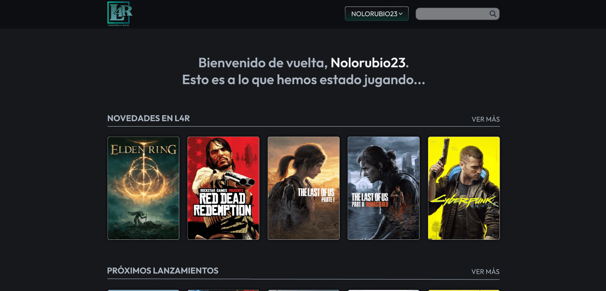 |

A continuación se señalan ejemplos concretos de cada principio en la interfaz de Looking4Rate, según la captura de pantalla:

**Jerarquía:**
El mensaje de bienvenida (“Bienvenido de vuelta, Nolorubio23...”) utiliza un tamaño de fuente grande y negrita, destacando la importancia de la información principal. Los títulos de sección como “NOVEDADES EN L4R” y “PRÓXIMOS LANZAMIENTOS” también emplean mayor peso y tamaño para guiar la atención.

**Contraste:**
Se observa contraste en el uso de colores: el fondo oscuro permite que los textos claros y los elementos visuales (portadas de juegos) resalten. Los botones y enlaces (“VER MÁS”) utilizan un color diferente para indicar interactividad.

**Alineación:**
La alineación de los textos y elementos es principalmente a la izquierda, lo que mejora la legibilidad. Las tarjetas de juegos están alineadas mediante un sistema de grid, creando orden visual, consistencia y adaptabilidad en la interfaz.

**Proximidad:**
Las portadas de los juegos están agrupadas con poco espacio entre ellas, indicando que pertenecen a la misma categoría (“Novedades en L4R”). Los títulos y sus respectivas secciones están próximos, facilitando la relación visual.

**Repetición:**
Se repite el estilo de las tarjetas de juegos, el formato de los títulos de sección y el diseño de los botones/enlaces, lo que aporta coherencia y uniformidad a la interfaz.

## 1.2 Metodología CSS

Para la organización y estructuración de los estilos CSS en Looking4Rate se utiliza la metodología BEM (Block, Element, Modifier) la cual facilita la organización y el mantenimiento de los estilos en aplicaciones grandes y colaborativas como esta.

BEM permite:
- Evitar conflictos de nombres entre clases, ya que cada bloque, elemento y modificador tiene una estructura clara y única.
- Mejorar la legibilidad del código CSS, haciendo evidente la relación entre los componentes y sus partes.
- Favorecer la escalabilidad, permitiendo agregar nuevas variantes o modificar estilos sin afectar otras partes del sistema.

En BEM, cada clase se compone de tres partes principales:

- **Bloques:** Representan componentes independientes de la interfaz, por ejemplo `.ficha-juego`.
- **Elementos:** Son partes internas del bloque que dependen de él, por ejemplo `.ficha-juego__titulo`.
- **Modificadores:** Indican variaciones o estados del bloque o elemento, por ejemplo `.ficha-juego--destacada`.

**Ejemplo de nomenclatura BEM:**
```css
.ficha-juego { ... }
.ficha-juego__titulo { ... }
.ficha-juego__imagen { ... }
.ficha-juego--destacada { ... }
```

Esta metodología permite identificar rápidamente la función y relación de cada clase, favoreciendo la reutilización y el trabajo colaborativo en el proyecto.

## 1.3 Organización de archivos: Estructura ITCSS

En Looking4Rate se utiliza la metodología ITCSS (Inverted Triangle CSS) para organizar los archivos de estilos. ITCSS permite estructurar el CSS desde lo más genérico y global hasta lo más específico y particular, facilitando el mantenimiento y la escalabilidad.

El orden de las carpetas sigue el principio de menor a mayor especificidad:

1. **00-settings:** Variables globales (colores, tipografías, tamaños, breakpoints, etc.) que pueden ser reutilizadas en todo el proyecto.
2. **01-tools:** Mixins y funciones Sass que ayudan a generar estilos reutilizables y dinámicos.
3. **02-generic:** Estilos genéricos como resets y normalizaciones que afectan a todos los elementos.
4. **03-elements:** Estilos para elementos HTML básicos (`h1`, `p`, `ul`, `button`, etc.), sin clases.
5. **04-layout:** Estructuras de layout y sistemas de grid, que definen la organización visual sin aplicar estilos específicos.
6. **05-components:** Componentes reutilizables y específicos de la interfaz, como tarjetas, botones, formularios, etc.
7. **06-utilities:** Clases utilitarias para aplicar estilos rápidos y específicos (márgenes, alineaciones, colores, etc.).

### Árbol de carpetas de estilos

```plaintext
src/
	styles/
		main.scss
		00-settings/
			_variables.scss
		01-tools/
			_mixins.scss
		02-generic/
			_reset.scss
		03-elements/
			_elements.scss
		04-layout/
			_grid.scss
		05-components/
			(vacío o componentes específicos)
		06-utilities/
			(vacío o utilidades específicas)
```

Esta estructura permite que los estilos más generales se carguen primero y los más específicos al final, evitando conflictos y facilitando la sobrescritura controlada de reglas CSS.

## 1.4 Sistema de Design Tokens

En Looking4Rate se utilizan design tokens para definir variables globales que garantizan coherencia y flexibilidad en el diseño. Los principales grupos de tokens son:

### Colores

Se ha elegido una paleta oscura moderna, con acentos vibrantes y colores semánticos claros para mejorar la accesibilidad y la experiencia visual.  
- Los colores principales (`$color-primary-dark`, `$color-secondary-dark`) transmiten profesionalidad y permiten que los elementos destacados (botones, enlaces, badges) resalten con el color de acento (`$color-accent-dark`).
- Los colores semánticos (`$color-error-dark`, `$color-success-dark`, `$color-warning-dark`, `$color-info-dark`) facilitan la comunicación de estados y mensajes al usuario.
- La paleta de grises permite crear jerarquía visual y separar secciones sin perder armonía.

A continuación se documentan todas las variables utilizadas:

**Modo oscuro:**
- `$color-primary-dark`: Fondo principal (#16181C)
- `$color-secondary-dark`: Fondo secundario (#384A5B)
- `$color-accent-dark`: Color de acento y elementos destacados (#00B894)
- `$color-text-dark`: Texto principal (#F2F4F8)
- `$color-text-alt-dark`: Texto secundario (#AAB4C0)
- `$color-header-footer-dark`: Fondo de header y footer (#0D0E11)

**Colores semánticos (oscuro):**
- `$color-error-dark`: Error (#D46363)
- `$color-success-dark`: Éxito (#B5D366)
- `$color-warning-dark`: Advertencia (#F59E42)
- `$color-info-dark`: Información (#3B82F6)

**Modo claro:**
- `$color-primary-light`: Fondo principal (#EDEDED)
- `$color-secondary-light`: Fondo secundario (#597085)
- `$color-accent-light`: Color de acento (#0A7CFF)
- `$color-text-light`: Texto principal (#1A1A1A)
- `$color-text-alt-light`: Texto secundario (#4E4F50)
- `$color-header-footer-light`: Fondo de header y footer (#2A2F2F)

**Colores semánticos (claro):**
- `$color-error-light`: Error (#EF4444)
- `$color-success-light`: Éxito (#22C55E)
- `$color-warning-light`: Advertencia (#F59E42)
- `$color-info-light`: Información (#3B82F6)

**Paleta de grises:**
- `$color-gray-50-dark` a `$color-gray-900-dark`: Diferentes tonos de gris para fondos, bordes y separadores

### CSS Custom Properties

Además de las variables SCSS, el proyecto utiliza **CSS Custom Properties** (variables CSS nativas) para implementar el sistema de temas dinámico. Estas variables se definen en el archivo `00-settings/_css-variables.scss` y permiten cambiar entre modo claro y oscuro sin recargar la página.

**Variables CSS para temas:**

En **modo oscuro** (por defecto en `:root`):
- `--bg-primary`: Fondo principal (#16181C)
- `--bg-secondary`: Fondo secundario (#384A5B)
- `--bg-header-footer`: Fondo de header y footer (#0D0E11)
- `--text-primary`: Texto principal (#F2F4F8)
- `--text-secondary`: Texto secundario (#AAB4C0)
- `--color-accent`: Color de acento (#00B894)
- `--color-error`: Color de error (#D46363)
- `--color-success`: Color de éxito (#B5D366)
- `--color-warning`: Color de advertencia (#F59E42)
- `--color-info`: Color de información (#3B82F6)
- `--border-color`: Color de bordes (#384A5B)

En **modo claro** (`[data-theme='light']`):
- Las mismas variables pero con valores del modo claro
- Ejemplo: `--bg-primary: #EDEDED`, `--text-primary: #1A1A1A`, etc.

**Ventajas de CSS Custom Properties:**
- Cambio dinámico de tema sin recarga de página
- Mejor rendimiento que recompilar SCSS
- Cascada natural de CSS permite sobrescribir valores por contexto
- Compatible con JavaScript para cambios programáticos

**Uso en componentes:**
```scss
.component {
  background-color: var(--bg-primary);
  color: var(--text-primary);
  border: 1px solid var(--border-color);
}
```

El componente `ThemeToggle` cambia el atributo `data-theme` del elemento `<html>`, lo que activa automáticamente las variables del tema correspondiente.

### Tipografía

Se utiliza la fuente principal 'Outfit' por su legibilidad y estilo contemporáneo, y 'Playfair Display' como secundaria para títulos elegantes.  
- La escala tipográfica está basada en múltiplos de 8px, lo que facilita la modularidad y la consistencia en todos los tamaños de pantalla.
- Los pesos tipográficos permiten diferenciar títulos, subtítulos y textos secundarios, mejorando la jerarquía visual.

A continuación se documentan todas las variables utilizadas:

- `$font-primary`: 'Outfit', Arial, sans-serif (principal, moderna y legible)
- `$font-secondary`: 'Playfair Display', serif (secundaria, elegante para títulos)

**Escala de tamaños (base 8px):**
- `$font-size-xs`: 8px
- `$font-size-sm`: 12px
- `$font-size-md`: 16px
- `$font-size-lg`: 24px
- `$font-size-xl`: 32px
- `$font-size-2xl`: 40px
- `$font-size-3xl`: 48px
- `$font-size-4xl`: 56px
- `$font-size-5xl`: 64px

**Pesos tipográficos:**
- `$font-weight-light`: 300
- `$font-weight-regular`: 400
- `$font-weight-medium`: 500
- `$font-weight-semibold`: 600
- `$font-weight-bold`: 700

**Alturas de línea:**
- `$line-height-tight`: 1.1
- `$line-height-normal`: 1.5
- `$line-height-relaxed`: 1.75

### Espaciado

El sistema de espaciado sigue una escala de 8px (`$spacing-1` a `$spacing-12`), lo que simplifica la alineación y el diseño responsivo.  
- Esta decisión permite mantener proporciones uniformes y facilita la adaptación a diferentes dispositivos.

A continuación se documentan todas las variables utilizadas:

- `$spacing-1`: 8px
- `$spacing-2`: 16px
- `$spacing-3`: 24px
- `$spacing-4`: 32px
- `$spacing-5`: 40px
- `$spacing-6`: 48px
- `$spacing-7`: 56px
- `$spacing-8`: 64px
- `$spacing-9`: 72px
- `$spacing-10`: 80px
- `$spacing-11`: 88px
- `$spacing-12`: 96px
- `$spacing-header-footer`: 60px

### Breakpoints

Los breakpoints están pensados para cubrir los dispositivos más comunes: móviles pequeños, móviles estándar, tablets y escritorios. Se utiliza una estrategia **desktop-first** con `max-width`.

A continuación se documentan todas las variables utilizadas:

- `$breakpoint-xs`: 320px (móvil pequeño)
- `$breakpoint-sm`: 640px (móvil grande / menú hamburguesa)
- `$breakpoint-md`: 768px (tablet)
- `$breakpoint-lg`: 1024px (desktop pequeño)
- `$breakpoint-xl`: 1280px (desktop estándar)

### Elevaciones (Sombras)

Las elevaciones (sombras) se utilizan para aportar profundidad y jerarquía visual a los componentes, ayudando a distinguir elementos interactivos y resaltando secciones importantes. Se han definido diferentes niveles de sombra para adaptarse a la importancia y el contexto de cada componente, desde sombras sutiles para tarjetas hasta sombras más marcadas para modales o elementos destacados.

A continuación se documentan todas las variables utilizadas:

**Sombras estándar:**
- `$shadow-sm`: Sombra sutil para elementos pequeños
- `$shadow-md`: Sombra media para tarjetas
- `$shadow-lg`: Sombra grande para elementos elevados
- `$shadow-xl`: Sombra muy grande para modales
- `$shadow-2xl`: Sombra extra grande para overlays
- `$shadow-complete`: Sombra completa (todos los lados)
- `$shadow-inner`: Sombra interior (inset)

**Sombras para efectos hover interactivos:**
- `$shadow-glow-accent`: Resplandor con color accent
- `$shadow-glow-accent-hover`: Resplandor accent más intenso al hover
- `$shadow-hover-accent`: Sombra de elevación al hover con accent
- `$shadow-active-accent`: Sombra al estado active
- `$shadow-hover-lift`: Efecto de elevación al hover

### Bordes

Los bordes permiten definir la separación y el énfasis visual entre componentes, aportando estructura y claridad a la interfaz. Se han definido diferentes grosores para adaptarse a la jerarquía y relevancia de cada elemento, desde bordes sutiles para tarjetas y campos de formulario hasta bordes más gruesos para elementos destacados o alertas.

A continuación se documentan todas las variables utilizadas:

- `$border-thin`: 1px
- `$border-medium`: 2px
- `$border-thick`: 4px

### Radios de borde

Los radios de borde permiten definir el nivel de redondez en los componentes, aportando suavidad y modernidad al diseño. Se han definido varios tamaños para adaptarse a diferentes tipos de elementos: desde esquinas sutilmente redondeadas en tarjetas y campos de formulario, hasta formas completamente circulares en avatares o badges.

A continuación se documentan todas las variables utilizadas:

- `$radius-sm`: 2px
- `$radius-md`: 4px
- `$radius-lg`: 8px
- `$radius-xl`: 16px
- `$radius-2xl`: 24px
- `$radius-full`: 9999px

### Transiciones

Las transiciones permiten suavizar los cambios visuales e interacciones en la interfaz, mejorando la experiencia del usuario y haciendo que las animaciones y efectos sean más agradables y naturales. Se han definido diferentes velocidades para adaptarse a la importancia de cada acción, desde transiciones rápidas para botones hasta transiciones más lentas para modales o elementos destacados.

A continuación se documentan todas las variables utilizadas:

- `$transition-fast`: 150ms
- `$transition-base`: 300ms
- `$transition-slow`: 500ms
- `$transition-ease`: ease-in-out

Este sistema de design tokens permite mantener la coherencia visual, facilita el mantenimiento y la evolución del diseño, y asegura que todos los componentes compartan la misma base estilística.

## 1.5 Mixins y funciones

A continuación se documentan los mixins creados en el proyecto, su utilidad y ejemplos de uso:

### 1. flex-center
**Descripción:** Centra cualquier elemento usando flexbox, tanto vertical como horizontalmente.
**Definición:**
```scss
@mixin flex-center {
  display: flex;
  justify-content: center;
  align-items: center;
}
```
**Ejemplo de uso:**
```scss
.contenedor {
  @include flex-center;
  height: 200px;
}
```

### 2. page-container
**Descripción:** Aplica padding lateral responsive que se adapta a diferentes tamaños de pantalla. Útil para contenedores de página principales.
**Definición:**
```scss
@mixin page-container {
  padding-left: $page-padding-x;
  padding-right: $page-padding-x;
  
  @media (max-width: $breakpoint-xl) {
    padding-left: $spacing-8;
    padding-right: $spacing-8;
  }
  
  @media (max-width: $breakpoint-lg) {
    padding-left: $spacing-4;
    padding-right: $spacing-4;
  }
  
  @media (max-width: $breakpoint-md) {
    padding-left: $spacing-3;
    padding-right: $spacing-3;
  }
  
  @media (max-width: $breakpoint-sm) {
    padding-left: $spacing-2;
    padding-right: $spacing-2;
  }
}
```
**Ejemplo de uso:**
```scss
.main-content {
  @include page-container;
  max-width: 1280px;
  margin: 0 auto;
}
```

### 3. box-shadow
**Descripción:** Aplica una sombra al elemento. Permite personalizar el nivel de sombra.
**Definición:**
```scss
@mixin box-shadow($shadow) {
  box-shadow: $shadow;
}
```
**Ejemplo de uso:**
```scss
.tarjeta {
  @include box-shadow($shadow-lg);
}
```

### 4. transition
**Descripción:** Aplica una transición estándar a cualquier propiedad CSS, con duración y timing configurables.
**Definición:**
```scss
@mixin transition($property: all, $duration: 300ms, $timing: ease-in-out) {
  transition: $property $duration $timing;
}
```
**Ejemplo de uso:**
```scss
.boton {
  @include transition(background, 200ms);
}
```

### 5. respond-to
**Descripción:** Media query helper para aplicar estilos en un breakpoint específico. Facilita el desarrollo responsive.
**Definición:**
```scss
@mixin respond-to($breakpoint) {
  @media (max-width: $breakpoint) {
    @content;
  }
}
```
**Ejemplo de uso:**
```scss
.elemento {
  font-size: 24px;
  
  @include respond-to($breakpoint-md) {
    font-size: 18px;
  }
  
  @include respond-to($breakpoint-sm) {
    font-size: 16px;
  }
}
```

### 6. hide-mobile
**Descripción:** Oculta un elemento en pantallas móviles (max-width: 640px).
**Definición:**
```scss
@mixin hide-mobile {
  @media (max-width: $breakpoint-sm) {
    display: none;
  }
}
```
**Ejemplo de uso:**
```scss
.desktop-only {
  @include hide-mobile;
}
```

### 7. hide-tablet
**Descripción:** Oculta un elemento en tablets y pantallas menores (max-width: 768px).
**Definición:**
```scss
@mixin hide-tablet {
  @media (max-width: $breakpoint-md) {
    display: none;
  }
}
```
**Ejemplo de uso:**
```scss
.desktop-feature {
  @include hide-tablet;
}
```

### 8. show-mobile-only
**Descripción:** Muestra un elemento solo en móviles. Por defecto está oculto y se muestra en pantallas pequeñas.
**Definición:**
```scss
@mixin show-mobile-only {
  display: none;
  
  @media (max-width: $breakpoint-sm) {
    display: flex;
  }
}
```
**Ejemplo de uso:**
```scss
.mobile-menu {
  @include show-mobile-only;
}
```

### 9. desktop y desktop-small
**Descripción:** Media queries para breakpoints de escritorio específicos.
**Definición:**
```scss
@mixin desktop {
  @media (max-width: $breakpoint-xl) { @content; }
}

@mixin desktop-small {
  @media (max-width: $breakpoint-lg) { @content; }
}
```
**Ejemplo de uso:**
```scss
.sidebar {
  width: 300px;
  
  @include desktop-small {
    width: 250px;
  }
}
```

### 10. tablet y mobile
**Descripción:** Media queries semánticas para tablet y móvil.
**Definición:**
```scss
@mixin tablet {
  @media (max-width: $breakpoint-md) { @content; }
}

@mixin mobile {
  @media (max-width: $breakpoint-sm) { @content; }
}

@mixin mobile-small {
  @media (max-width: $breakpoint-xs) { @content; }
}
```
**Ejemplo de uso:**
```scss
.grid {
  grid-template-columns: repeat(5, 1fr);
  
  @include tablet {
    grid-template-columns: repeat(3, 1fr);
  }
  
  @include mobile {
    grid-template-columns: repeat(2, 1fr);
  }
}
```

### 11. container y container-query (Container Queries)
**Descripción:** Mixins para implementar Container Queries, permitiendo que los componentes se adapten según el tamaño de su contenedor padre.
**Definición:**
```scss
@mixin container($name: null) {
  container-type: inline-size;
  @if $name {
    container-name: $name;
  }
}

@mixin container-query($min-width: null, $max-width: null, $name: null) {
  @if $max-width {
    @if $name {
      @container #{$name} (max-width: #{$max-width}) { @content; }
    } @else {
      @container (max-width: #{$max-width}) { @content; }
    }
  }
}
```
**Ejemplo de uso:**
```scss
:host {
  @include container(card);
}

.card {
  display: flex;
  gap: 1rem;
  
  @include container-query($max-width: 400px, $name: card) {
    flex-direction: column;
  }
}
```

### 12. responsive-text
**Descripción:** Aplica diferentes tamaños de fuente según el dispositivo.
**Definición:**
```scss
@mixin responsive-text($desktop-size, $tablet-size: null, $mobile-size: null) {
  font-size: $desktop-size;
  
  @if $tablet-size {
    @include tablet { font-size: $tablet-size; }
  }
  
  @if $mobile-size {
    @include mobile { font-size: $mobile-size; }
  }
}
```
**Ejemplo de uso:**
```scss
.hero__title {
  @include responsive-text($font-size-xl, $font-size-lg, $font-size-md);
}
```

### 13. responsive-grid
**Descripción:** Crea un grid responsive automático basado en un ancho mínimo de ítem.
**Definición:**
```scss
@mixin responsive-grid($min-item-width: 200px, $gap: $spacing-3) {
  display: grid;
  grid-template-columns: repeat(auto-fill, minmax($min-item-width, 1fr));
  gap: $gap;
}
```
**Ejemplo de uso:**
```scss
.cards-container {
  @include responsive-grid(250px, $spacing-4);
}
```

Estos mixins permiten escribir estilos más limpios, reutilizables y consistentes en todo el proyecto, siguiendo principios DRY (Don't Repeat Yourself) y facilitando el mantenimiento.

## 1.6 ViewEncapsulation en Angular

En este proyecto se utiliza la estrategia de encapsulación de estilos por defecto de Angular: **ViewEncapsulation.Emulated**.
Esto significa que los estilos definidos en cada componente solo afectan a ese componente, evitando conflictos y fugas de estilos entre diferentes partes de la aplicación.

**Justificación:**
- Mantener la encapsulación por componente mejora la mantenibilidad y escalabilidad del proyecto, ya que cada componente puede tener sus propios estilos sin interferir con otros.
- Permite aprovechar la modularidad de Angular y facilita el trabajo en equipo, ya que los desarrolladores pueden trabajar en componentes independientes sin preocuparse por efectos secundarios globales.
- Si en algún caso se requiere aplicar estilos globales (por ejemplo, para el layout principal o utilidades), se pueden definir en los archivos globales de estilos (`styles.scss`) y usar la encapsulación `None` solo en componentes muy específicos.

Por tanto, se mantendrá la estrategia **Emulated** en la mayoría de los componentes, asegurando una arquitectura de estilos robusta y predecible.

## Enfoque híbrido: ITCSS + Encapsulación Angular

En Looking4Rate se utiliza un enfoque híbrido para la gestión de estilos, combinando la organización global mediante ITCSS y la encapsulación por componente que ofrece Angular.

- **ITCSS** estructura los estilos globales en el archivo `main.scss`, donde se importan variables, mixins, resets, elementos, layout, componentes y utilidades. Esto garantiza coherencia, escalabilidad y facilidad de mantenimiento en los estilos compartidos por toda la aplicación.
- **Encapsulación Angular (ViewEncapsulation.Emulated)** se aplica en los estilos de cada componente, asegurando que las reglas CSS definidas en el archivo de estilos de un componente solo afecten a ese componente. Así se evitan fugas de estilos y conflictos entre componentes.

Este enfoque permite:
- Mantener una base de estilos global robusta y bien organizada.
- Personalizar y aislar los estilos de cada componente sin afectar el resto de la aplicación.
- Definir estilos globales en `main.scss` para layout, tipografía y utilidades, mientras que los detalles y personalizaciones se gestionan en los estilos de cada componente.
- Favorecer el trabajo en equipo y la reutilización de estilos.

# Sección 2: HTML semántico y estructura

## 2.1 Elementos semánticos utilizados

En Looking4Rate se utilizan elementos semánticos de HTML5 para mejorar la accesibilidad, el SEO y la legibilidad del código. A continuación se describen los elementos utilizados y su propósito:

### `<header>`
Se utiliza para definir el encabezado principal de la aplicación, que contiene el logo, la navegación principal y las acciones del usuario (login, registro, búsqueda).

```html
<header class="header">
  <section class="header__container">
    <a routerLink="/" class="header__logo">
      
    </a>

    <nav class="header__actions">
      <app-theme-switcher></app-theme-switcher>
      <app-button (click)="loginClick.emit()">INICIAR SESIÓN</app-button>
      <app-button (click)="registerClick.emit()">CREAR CUENTA</app-button>
      <app-search-box 
        placeholder="Buscar juegos..."
        [(value)]="searchQuery"
        (search)="onSearch($event)">
      </app-search-box>
    </nav>
  </section>
</header>
```

### `<nav>`
Se utiliza para agrupar los enlaces de navegación. En el header contiene las acciones principales y en el footer agrupa los enlaces sociales y de información.

```html
<nav class="header__actions">
  <!-- Elementos de navegación y acciones -->
</nav>
```

### `<main>`
Define el contenido principal de la página. En Looking4Rate, el componente `app-main` envuelve el contenido dinámico de cada vista.

```html
<main class="main">
  <ng-content></ng-content>
</main>
```

### `<article>`
Se utiliza para contenido independiente y autocontenido. En Looking4Rate se emplea para los modales de login y registro, ya que representan unidades de contenido con sentido propio.

```html
<article class="login-modal">
  <header class="login-modal__header">
    <h2 class="login-modal__title">Inicio de sesión</h2>
    <!-- Contenido del modal -->
  </header>
  <!-- Formulario -->
</article>
```

### `<section>`
Agrupa contenido temáticamente relacionado. Se utiliza para dividir áreas dentro de componentes más grandes.

```html
<section class="header__container">
  <!-- Contenido agrupado del header -->
</section>

<section class="footer__social">
  <!-- Enlaces a redes sociales -->
</section>
```

### `<aside>`
Se utiliza para contenido complementario o secundario. En Looking4Rate se emplea para el overlay de los modales, indicando que es contenido que complementa al principal.

```html
<aside class="login-modal__overlay" (click)="onOverlayClick($event)">
  <article class="login-modal">
    <!-- Contenido del modal -->
  </article>
</aside>
```

### `<footer>`
Define el pie de página de la aplicación o de una sección. En Looking4Rate contiene información de copyright, enlaces sociales y el logo.

```html
<footer class="footer">
  <nav class="footer__container">
    <figure class="footer__logo-info">
      
      <section class="footer__info">
        <p class="footer__copyright">&copy; {{ currentYear }} Looking4Rate. Todos los derechos reservados.</p>
        <p class="footer__slogan">Made by <a href="#" class="footer__link">real player</a>, for players.</p>
      </section>
    </figure>
    <!-- Enlaces sociales -->
  </nav>
</footer>
```

### Estructura general de la aplicación

La estructura semántica completa de la aplicación sigue este patrón:

```html
<app-header>
  <!-- header con nav -->
</app-header>

<app-main>
  <router-outlet />
  <!-- Contenido dinámico de cada página -->
</app-main>

<app-footer>
  <!-- footer con información y enlaces -->
</app-footer>
```

## 2.2 Jerarquía de headings

En Looking4Rate se sigue una estrategia clara y consistente para los encabezados, respetando la jerarquía semántica y facilitando la navegación por lectores de pantalla.

### Reglas de jerarquía

| Nivel | Uso en Looking4Rate | Ejemplo |
|-------|---------------------|---------|
| **H1** | Título principal de la página de inicio (descripción del sitio) o mensaje de bienvenida al usuario logeado | "Bienvenido de vuelta, Nolorubio23. Esto es a lo que hemos estado jugando." |
| **H2** | Encabezados de secciones habituales de la página | "Novedades en L4R", "Próximos lanzamientos" |
| **H3** | Nombres de juegos en resultados de búsqueda o en la ficha individual de un juego | "The Legend of Zelda: Tears of the Kingdom" |

### Diagrama de jerarquía

```plaintext
PÁGINA DE INICIO (sin login)
└── H1: "Ten un seguimiento de lo que juegas.Puntúa y critíca tus favoritos.Cúentale a los demás qué te gusta."
    ├── H2: "Novedades en L4R"
    ├── H2: "Próximos lanzamientos"
    └── H2: "Mejor valorados"

PÁGINA DE INICIO (con login)
└── H1: "Bienvenido de vuelta, [NombreUsuario]"
    ├── H2: "Novedades en L4R"
    └── H2: "Próximos lanzamientos"
    └── H2: "Mejor valorados"

PÁGINA DE RESULTADOS DE BÚSQUEDA
└── H1: "Resultados de búsqueda"
    ├── H2: "Nombre del Juego 1"
    ├── H2: "Nombre del Juego 2"
    └── H2: "Nombre del Juego 3"

FICHA DE JUEGO
└── H1: (Oculto o mensaje contextual)
    └── H2: "Nombre del Juego"
```

### Principios aplicados

1. **Un solo H1 por página:** Cada página tiene únicamente un H1 que identifica el propósito principal de la vista. (La página no siempre tendrá un H1).
2. **No saltar niveles:** Nunca se pasa de H1 a H3 directamente; siempre se respeta la secuencia lógica.
3. **H2 para contenido destacado:** Los nombres de juegos utilizan H2 porque representan el contenido principal que el usuario busca.
4. **H3 para secciones de navegación:** Las secciones recurrentes de la interfaz utilizan H3 para mantener consistencia.

## 2.3 Estructura de formularios

En Looking4Rate se utilizan formularios semánticos y accesibles, empleando elementos como `<form>`, `<fieldset>`, `<legend>` y la correcta asociación entre `<label>` e `<input>`.

### Elementos utilizados

- **`<form>`:** Contenedor principal del formulario con el evento `ngSubmit` para manejar el envío.
- **`<fieldset>`:** Agrupa campos relacionados dentro del formulario.
- **`<legend>`:** Proporciona un título descriptivo para el grupo de campos.
- **`<label>`:** Etiqueta asociada a cada campo de entrada.

### Ejemplo: Formulario de login

```html
<form class="login-modal__form" (ngSubmit)="onSubmit()">
  <fieldset class="login-modal__fieldset">
    <legend class="login-modal__legend">Credenciales de acceso</legend>

    <app-form-input
      label="Nombre de usuario"
      type="text"
      name="username"
      placeholder=""
      [required]="true"
      [errorMessage]="usernameError"
      [value]="username"
      (valueChange)="username = $event"
      (inputBlur)="onUsernameBlur()">
    </app-form-input>

    <app-form-input
      label="Contraseña"
      type="password"
      name="password"
      placeholder=""
      [required]="true"
      [errorMessage]="passwordError"
      [value]="password"
      (valueChange)="password = $event"
      (inputBlur)="onPasswordBlur()">
    </app-form-input>
  </fieldset>

  <footer class="login-modal__actions">
    <button type="submit" class="login-modal__submit" [disabled]="!isFormValid">Iniciar</button>
  </footer>
</form>
```

### Componente `form-input`

El componente `app-form-input` encapsula la lógica y estructura de cada campo de formulario, garantizando accesibilidad y consistencia en toda la aplicación.

**Plantilla HTML (`form-input.html`):**

```html
<label class="form-input" [class.form-input--error]="errorMessage" [class.form-input--disabled]="disabled">
  <span class="form-input__label">
    {{ label }}
    @if (required) {
      <span class="form-input__required">*</span>
    }
  </span>

  <input
    [id]="id"
    [type]="type"
    [name]="name"
    [placeholder]="placeholder"
    [required]="required"
    [disabled]="disabled"
    [value]="value"
    (input)="onInputChange($event)"
    (blur)="onBlur()"
    class="form-input__field"
    [class.form-input__field--error]="errorMessage"
  />

  @if (errorMessage) {
    <p class="form-input__error">{{ errorMessage }}</p>
  }
  @if (helpText && !errorMessage) {
    <p class="form-input__help">{{ helpText }}</p>
  }
</label>
```

**Componente TypeScript (`form-input.ts`):**

```typescript
import { Component, Input, Output, EventEmitter, ViewEncapsulation } from '@angular/core';

@Component({
  selector: 'app-form-input',
  templateUrl: './form-input.html',
  styleUrl: './form-input.scss',
  encapsulation: ViewEncapsulation.None
})
export class FormInput {
  @Input() label = '';
  @Input() type = 'text';
  @Input() name = '';
  @Input() placeholder = '';
  @Input() required = false;
  @Input() disabled = false;
  @Input() errorMessage = '';
  @Input() helpText = '';
  @Input() value = '';

  @Output() valueChange = new EventEmitter<string>();
  @Output() inputBlur = new EventEmitter<void>();

  get id(): string {
    return `input-${this.name}`;
  }

  onInputChange(event: Event): void {
    const target = event.target as HTMLInputElement;
    this.value = target.value;
    this.valueChange.emit(this.value);
  }

  onBlur(): void {
    this.inputBlur.emit();
  }
}
```

### Asociación label-input

En el componente `form-input`, la asociación entre el `<label>` y el `<input>` se realiza de forma implícita mediante **anidamiento**: el `<input>` está contenido dentro del `<label>`. Esta técnica es una alternativa válida y semánticamente correcta al uso del atributo `for` con `id`.

**Ventajas del anidamiento:**
- No requiere generar IDs únicos manualmente.
- La asociación es automática e implícita.
- Simplifica el código y reduce posibles errores.

Adicionalmente, el componente genera un `id` único basado en el `name` del campo (`input-${this.name}`), lo que permite referencias externas si fuera necesario.

### Características de accesibilidad

1. **Labels descriptivos:** Cada campo tiene una etiqueta clara que describe su propósito.
2. **Indicador de campo requerido:** Los campos obligatorios muestran un asterisco (*) visual.
3. **Mensajes de error:** Los errores de validación se muestran junto al campo correspondiente.
4. **Texto de ayuda:** Se puede proporcionar información adicional para guiar al usuario.
5. **Estados visuales:** Los campos tienen estilos diferenciados para estados de error y deshabilitado.

# Sección 3: Sistema de componentes UI

En Looking4Rate se ha desarrollado un sistema de componentes UI reutilizables que garantizan consistencia visual, accesibilidad y mantenibilidad en toda la aplicación. Todos los componentes siguen la metodología BEM y utilizan los design tokens definidos en el sistema.

## 3.1 Componentes implementados

### Button (`app-button`)

**Propósito:** Componente de botón universal que puede renderizarse como `<button>`, `<a>` con `routerLink` (navegación interna) o `<a>` con `href` (enlaces externos).

**Variantes disponibles:**
- `primary` (default): Fondo con gradiente verde/accent, para acciones principales
- `secondary`: Fondo gris/neutro, para acciones secundarias
- `ghost`: Fondo transparente con borde sutil, para acciones terciarias
- `danger`: Fondo rojo para acciones destructivas o de alerta

**Tamaños disponibles:**
- `sm`: Pequeño (padding: 2px 6px, font-size: 12px)
- `md` (default): Mediano (padding: 4px 8px, font-size: 16px)
- `lg`: Grande (padding: 8px 16px, font-size: 24px)

**Estados que maneja:**
- Default: Estado base del botón
- Hover: Elevación con sombra y cambio de gradiente
- Active: Vuelve a posición original con sombra reducida
- Focus-visible: Outline de 2px con color accent
- Disabled: Pointer-events deshabilitados, opacidad reducida

**Ejemplo de uso:**
```html
<!-- Botón como button -->
<app-button variant="primary" size="md" (btnClick)="onAction()">
  GUARDAR
</app-button>

<!-- Botón como enlace interno -->
<app-button routerLink="/games/123" variant="secondary">
  VER DETALLE
</app-button>

<!-- Botón como enlace externo -->
<app-button href="https://example.com" variant="ghost">
  VISITAR WEB
</app-button>

<!-- Botón deshabilitado -->
<app-button [disabled]="true" variant="danger">
  ELIMINAR
</app-button>
```

---

### Alert (`app-alert`)

**Propósito:** Muestra mensajes de retroalimentación al usuario con diferentes niveles de importancia. Ideal para mensajes de estado, confirmaciones o errores que deben permanecer visibles hasta que el usuario los descarte.

**Variantes disponibles (tipos):**
- `success`: Verde, para confirmaciones y acciones exitosas
- `error`: Rojo, para errores y problemas
- `warning`: Naranja, para advertencias
- `info` (default): Azul, para información general

**Estados que maneja:**
- Visible: Alerta mostrada con su estilo correspondiente
- Dismissible: Con botón de cerrar (opcional)
- Cerrada: Oculta después de cerrar

**Ejemplo de uso:**
```html
<!-- Alerta de éxito con título -->
<app-alert type="success" title="¡Registro completado!">
  Tu cuenta ha sido creada correctamente.
</app-alert>

<!-- Alerta de error descartable -->
<app-alert 
  type="error" 
  title="Error de conexión" 
  [dismissible]="true"
  (closed)="onAlertClosed()">
  No se pudo conectar con el servidor.
</app-alert>

<!-- Alerta de advertencia -->
<app-alert type="warning">
  Tu sesión expirará en 5 minutos.
</app-alert>

<!-- Alerta informativa -->
<app-alert type="info" title="Actualización disponible">
  Hay una nueva versión de la aplicación.
</app-alert>
```

---

### FormInput (`app-form-input`)

**Propósito:** Campo de entrada de texto reutilizable con label, validación y mensajes de error/ayuda integrados. Encapsula la estructura semántica label-input.

**Tipos de input soportados:**
- `text` (default), `password`, `email`, `number`, `tel`, `url`, etc.

**Estados que maneja:**
- Default: Campo vacío o con valor
- Hover: Cambio de color de fondo
- Focus: Fondo claro con texto oscuro
- Error: Borde rojo y mensaje de error visible
- Disabled: Campo deshabilitado, no editable

**Ejemplo de uso:**
```html
<app-form-input
  label="Nombre de usuario"
  type="text"
  name="username"
  placeholder="Introduce tu nombre"
  [required]="true"
  [errorMessage]="usernameError"
  [(value)]="username"
  (inputBlur)="onUsernameBlur()">
</app-form-input>

<app-form-input
  label="Contraseña"
  type="password"
  name="password"
  [required]="true"
  helpText="Mínimo 6 caracteres"
  [(value)]="password">
</app-form-input>
```

---

### FormTextarea (`app-form-textarea`)

**Propósito:** Campo de texto multilínea con las mismas características que form-input. Incluye contador de caracteres opcional y control de redimensionado.

**Características adicionales:**
- `rows`: Número de filas visibles (default: 4)
- `maxLength`: Límite de caracteres (opcional)
- `resizable`: Control de redimensionado (default: true)

**Estados que maneja:**
- Default, Hover, Focus, Error, Disabled (igual que form-input)
- Con contador de caracteres visible

**Ejemplo de uso:**
```html
<app-form-textarea
  label="Descripción"
  name="description"
  placeholder="Escribe una descripción del juego..."
  [rows]="5"
  [maxLength]="500"
  [required]="true"
  [(value)]="description">
</app-form-textarea>
```

---

### FormSelect (`app-form-select`)

**Propósito:** Dropdown/select personalizado con diseño consistente. Incluye opciones configurables, placeholder y estados de validación.

**Estados que maneja:**
- Cerrado: Muestra el valor seleccionado o placeholder
- Abierto: Despliega las opciones disponibles
- Hover en opciones: Resaltado visual
- Disabled: No interactivo
- Error: Con mensaje de error

**Ejemplo de uso:**
```typescript
// En el componente
platformOptions: SelectOption[] = [
  { value: 'pc', label: 'PC' },
  { value: 'ps5', label: 'PlayStation 5' },
  { value: 'xbox', label: 'Xbox Series X' },
  { value: 'switch', label: 'Nintendo Switch' }
];
```

```html
<app-form-select
  label="Plataforma"
  name="platform"
  placeholder="Selecciona una plataforma"
  [options]="platformOptions"
  [required]="true"
  [(value)]="selectedPlatform">
</app-form-select>
```

---

### GameCover (`app-game-cover`)

**Propósito:** Muestra la carátula de un videojuego con aspect ratio preservado. Puede ser clicable si incluye enlace.

**Tamaños disponibles:**
- `sm`: Pequeño para listados compactos
- `md` (default): Mediano para grids de juegos
- `lg`: Grande para fichas de detalle

**Ejemplo de uso:**
```html
<!-- Cover simple -->
<app-game-cover
  src="/assets/img/zelda-totk.jpg"
  alt="The Legend of Zelda: Tears of the Kingdom"
  size="md">
</app-game-cover>

<!-- Cover con enlace -->
<app-game-cover
  src="/assets/img/cod-bo6.jpg"
  alt="Call of Duty: Black Ops 6"
  size="lg"
  routerLink="/games/cod-bo6">
</app-game-cover>
```

---

### GameCard (`app-game-card`)

**Propósito:** Card de detalle completo de un videojuego. Combina carátula grande con información: título, fecha de lanzamiento, desarrollador, descripción y plataformas.

**Componentes que usa:**
- `GameCover` para la carátula
- `PlatformBadge` para mostrar las plataformas

**Ejemplo de uso:**
```html
<app-game-card
  coverSrc="/assets/img/cod-black-ops.jpg"
  title="Call of Duty: Black Ops 6"
  releaseDate="09-11-2024"
  developer="Treyarch"
  developerLink="/developers/treyarch"
  description="La Guerra del Golfo como telón de fondo. Elige tu bando y lucha en una campaña ambientada en los 90."
  [platforms]="[
    { name: 'PlayStation', routerLink: '/platforms/playstation' },
    { name: 'Xbox', routerLink: '/platforms/xbox' },
    { name: 'PC', routerLink: '/platforms/pc' }
  ]">
</app-game-card>
```

---

### PlatformBadge (`app-platform-badge`)

**Propósito:** Badge/etiqueta que representa una plataforma de videojuegos. Puede ser un simple texto o un enlace.

**Estados que maneja:**
- Default: Badge estático
- Hover (si tiene enlace): Efecto visual de interactividad
- Focus-visible: Outline para accesibilidad

**Ejemplo de uso:**
```html
<!-- Badge estático -->
<app-platform-badge name="Nintendo Switch"></app-platform-badge>

<!-- Badge con enlace -->
<app-platform-badge 
  name="PlayStation 5" 
  routerLink="/platforms/ps5">
</app-platform-badge>
```

---

### SearchBox (`app-search-box`)

**Propósito:** Campo de búsqueda con icono de lupa integrado. Emite eventos de búsqueda y cambio de valor.

**Estados que maneja:**
- Default: Campo vacío
- Con valor: Texto introducido
- Focus: Resaltado del campo

**Ejemplo de uso:**
```html
<app-search-box
  placeholder="Buscar juegos..."
  [(value)]="searchQuery"
  (search)="onSearch($event)">
</app-search-box>
```

---

### ThemeSwitcher (`app-theme-switcher`)

**Propósito:** Botón toggle para cambiar entre modo oscuro y modo claro de la aplicación.

**Estados que maneja:**
- Modo oscuro (default): Muestra icono de luna
- Modo claro: Muestra icono de sol

**Ejemplo de uso:**
```html
<app-theme-switcher></app-theme-switcher>
```

---

### Pagination (`app-pagination`)

**Propósito:** Controles de paginación con botones de navegación (primero/último) y números de página clicables.

**Inputs configurables:**
- `currentPage`: Página actual (1-indexed)
- `totalPages`: Total de páginas
- `maxVisiblePages`: Máximo de números visibles (default: 5)
- `firstLabel`: Texto del botón primera página (default: "MÁS NUEVO")
- `lastLabel`: Texto del botón última página (default: "MÁS ANTIGUO")

**Estados que maneja:**
- Página actual: Resaltada visualmente
- Primera página: Botón "Más nuevo" deshabilitado
- Última página: Botón "Más antiguo" deshabilitado

**Ejemplo de uso:**
```html
<app-pagination
  [currentPage]="currentPage"
  [totalPages]="totalPages"
  [maxVisiblePages]="7"
  (pageChange)="onPageChange($event)">
</app-pagination>
```

---

### Notification (`app-notification`)

**Propósito:** Notificaciones flotantes tipo toast que aparecen en una esquina de la pantalla. Se auto-cierran después de un tiempo configurable.

**Variantes (tipos):**
- `success`, `error`, `warning`, `info`

**Posiciones disponibles:**
- `top-right` (default), `top-left`, `top-center`
- `bottom-right`, `bottom-left`, `bottom-center`

**Estados que maneja:**
- Entering: Animación de entrada
- Visible: Notificación mostrada
- Leaving: Animación de salida
- Pausado: Auto-cierre pausado al hover

**Ejemplo de uso:**
```html
<app-notification
  type="success"
  title="¡Guardado!"
  message="Los cambios se han guardado correctamente."
  position="top-right"
  [duration]="5000"
  [dismissible]="true"
  (closed)="onNotificationClosed()">
</app-notification>
```

---

### FeaturedSection (`app-featured-section`)

**Propósito:** Sección destacada con título y enlace opcional "Ver más". Usa `ng-content` para proyectar el contenido interno.

**Ejemplo de uso:**
```html
<app-featured-section
  title="NOVEDADES EN L4R"
  linkText="VER MÁS"
  linkRoute="/games/new">
  
  <!-- Contenido de la sección -->
  <div class="grid">
    <app-game-cover ...></app-game-cover>
    <app-game-cover ...></app-game-cover>
  </div>
  
</app-featured-section>
```

---

### LoginForm (`app-login-form`)

**Propósito:** Modal de inicio de sesión con formulario de usuario y contraseña. Incluye validación en tiempo real.

**Estados del formulario:**
- Campos vacíos
- Campos con error (validación)
- Formulario válido (botón habilitado)
- Modal abierto/cerrado

**Ejemplo de uso:**
```html
<app-login-form
  [isOpen]="showLoginModal"
  (close)="showLoginModal = false"
  (loginSubmit)="onLogin($event)">
</app-login-form>
```

---

### Accordion (`app-accordion`)

**Propósito:** Componente de acordeón que permite expandir y colapsar secciones de contenido. Soporta navegación por teclado y modo exclusivo (solo un panel abierto a la vez).

**Características:**
- Expansión/colapso con animación suave
- Navegación con teclado (Enter, Space, flechas)
- Modo exclusivo opcional (un panel a la vez)
- Soporte para expandir todos los paneles inicialmente
- ARIA labels para accesibilidad

**Estados que maneja:**
- Panel expandido: Contenido visible
- Panel colapsado: Solo título visible
- Panel deshabilitado: No interactivo
- Enfoque por teclado: Outline visible

**Ejemplo de uso:**
```typescript
accordionItems: AccordionItem[] = [
  { id: '1', title: 'Especificaciones técnicas', content: 'Contenido...' },
  { id: '2', title: 'Requisitos del sistema', content: 'Contenido...' },
  { id: '3', title: 'DLCs disponibles', content: 'Contenido...', disabled: true }
];
```

```html
<app-accordion
  [items]="accordionItems"
  [exclusive]="true"
  (panelToggle)="onPanelChange($event)">
</app-accordion>
```

---

### Tabs (`app-tabs`)

**Propósito:** Sistema de pestañas para organizar contenido en diferentes vistas. Soporta navegación por teclado (flechas, Home, End) y orientación horizontal/vertical.

**Características:**
- Pestañas horizontales o verticales
- Navegación con teclado completa
- Pestañas deshabilitadas
- Animaciones de transición
- Soporte para templates externos

**Estados que maneja:**
- Pestaña activa: Resaltada visualmente
- Pestaña inactiva: Estilo por defecto
- Pestaña deshabilitada: No clicable
- Hover: Indicador visual

**Ejemplo de uso:**
```typescript
tabs: TabItem[] = [
  { id: 'info', label: 'Información', content: 'Contenido de info...' },
  { id: 'reviews', label: 'Reseñas', content: 'Contenido de reseñas...' },
  { id: 'media', label: 'Multimedia', content: 'Contenido de media...', disabled: true }
];
```

```html
<app-tabs
  [tabs]="tabs"
  [activeTabId]="'info'"
  [orientation]="'horizontal'"
  (tabChange)="onTabChange($event)">
</app-tabs>
```

---

### Tooltip (`app-tooltip`)

**Propósito:** Muestra información contextual al pasar el cursor sobre un elemento. Cierre con tecla ESC.

**Posiciones disponibles:**
- `top`, `bottom`, `left`, `right`

**Estados que maneja:**
- Oculto: Por defecto
- Visible al hover: Aparece suavemente
- Cierre con ESC: Se oculta inmediatamente

**Ejemplo de uso:**
```html
<app-tooltip text="Esta es información adicional" position="top">
  <button>Botón con tooltip</button>
</app-tooltip>
```

---

### Breadcrumbs (`app-breadcrumbs`)

**Propósito:** Navegación de migas de pan que muestra la ruta actual del usuario en la jerarquía de la aplicación. Se genera automáticamente desde las rutas de Angular.

**Características:**
- Generación automática desde configuración de rutas
- Separador personalizable
- Último elemento sin enlace (página actual)
- Actualización automática al navegar

**Ejemplo de uso:**
```html
<app-breadcrumbs></app-breadcrumbs>
```

El breadcrumb lee la propiedad `data: { breadcrumb }` de cada ruta:
```typescript
{
  path: 'juego/:id',
  data: { breadcrumb: 'Detalle del Juego' }
}
```

---

### UserDropdown (`app-user-dropdown`)

**Propósito:** Dropdown del perfil de usuario con avatar, nombre y opciones (perfil, ajustes, cerrar sesión).

**Estados que maneja:**
- Cerrado: Solo muestra avatar/nombre
- Abierto: Despliega menú de opciones
- Hover en opciones: Resaltado
- Click fuera: Se cierra automáticamente

**Ejemplo de uso:**
```html
<app-user-dropdown
  [userName]="currentUser.name"
  [userAvatar]="currentUser.avatar"
  (logout)="onLogout()">
</app-user-dropdown>
```

---

### SpinnerInline (`app-spinner-inline`)

**Propósito:** Spinner de carga inline para operaciones asíncronas locales (botones, secciones específicas). Versión pequeña y ligera del spinner global.

**Tamaños disponibles:**
- `sm`: 16px
- `md` (default): 24px
- `lg`: 32px

**Colores disponibles:**
- `primary`: Color accent
- `secondary`: Gris
- `white`: Blanco (para fondos oscuros)

**Ejemplo de uso:**
```html
<!-- En un botón -->
<button [disabled]="loading">
  @if (loading) {
    <app-spinner-inline size="sm" color="white"></app-spinner-inline>
  } @else {
    Guardar
  }
</button>

<!-- En una sección -->
<div class="section">
  @if (loading) {
    <app-spinner-inline size="lg"></app-spinner-inline>
  } @else {
    <p>Contenido cargado</p>
  }
</div>
```

---

### Spinner (`app-spinner`)

**Propósito:** Spinner de carga global con overlay que bloquea la interacción durante operaciones asíncronas importantes. Se integra con `LoadingService`.

**Características:**
- Overlay de pantalla completa
- Mensaje personalizable
- Soporte para barra de progreso
- Animaciones suaves de entrada/salida
- Bloquea scroll del body

**Estados que maneja:**
- Oculto: No visible
- Entrando: Animación de aparición
- Visible: Mostrado con spinner girando
- Saliendo: Animación de desaparición

**Ejemplo de uso:**
```html
<!-- En app.html -->
<app-spinner></app-spinner>

<!-- Se controla desde el servicio -->
<script>
loadingService.showGlobal('Cargando datos del usuario...');
await fetchUserData();
loadingService.hideGlobal();
</script>
```

---

### EditProfileForm (`app-edit-profile-form`)

**Propósito:** Formulario avanzado de edición de perfil con FormArray para teléfonos múltiples. Demuestra validación síncrona, asíncrona y manejo de arrays dinámicos.

**Características:**
- FormArray para teléfonos (agregar/eliminar dinámicamente)
- Validación síncrona (required, minLength, custom validators)
- Validación asíncrona (username único, email único)
- Indicadores visuales de validación en tiempo real
- Auto-focus en primer campo con ViewChild

**Campos incluidos:**
- Nombre
- Apellido
- Username (con validación asíncrona)
- Email (con validación asíncrona)
- NIF (con validador personalizado)
- Teléfonos (FormArray con validador de teléfono español)

**Ejemplo de uso:**
```html
<app-edit-profile-form
  (formSubmit)="onProfileUpdate($event)"
  (formCancel)="onCancel()">
</app-edit-profile-form>
```

---

### EmptyState (`app-empty-state`)

**Propósito:** Componente para mostrar estados vacíos cuando no hay datos que mostrar. Incluye icono, título, mensaje y acción opcional.

**Variantes:**
- `no-results`: Sin resultados de búsqueda
- `no-data`: Sin datos disponibles
- `error`: Error al cargar datos

**Ejemplo de uso:**
```html
<app-empty-state
  icon="search"
  title="No se encontraron resultados"
  message="Intenta con otros términos de búsqueda"
  actionText="Limpiar filtros"
  (actionClick)="clearFilters()">
</app-empty-state>
```

---

### RequestState (`app-request-state`)

**Propósito:** Componente unificado que maneja los tres estados de una petición HTTP: loading, error y empty. Simplifica el manejo de estados en componentes que consumen APIs.

**Estados que renderiza:**
- **Loading**: Muestra spinner inline mientras carga
- **Error**: Muestra mensaje de error con opción de reintentar
- **Empty**: Muestra estado vacío cuando no hay datos
- **Success**: Proyecta el contenido (ng-content)

**Ejemplo de uso:**
```html
<app-request-state
  [loading]="isLoading"
  [error]="errorMessage"
  [empty]="games.length === 0"
  emptyTitle="No hay juegos disponibles"
  emptyMessage="Intenta buscar con otros filtros"
  (retry)="loadGames()">
  
  <!-- Contenido cuando hay datos -->
  <div class="games-grid">
    @for (game of games; track game.id) {
      <app-game-card [game]="game"></app-game-card>
    }
  </div>
  
</app-request-state>
```

---

### RegisterForm (`app-register-form`)

**Propósito:** Modal de registro con formulario de email, usuario y contraseña. Incluye validación de email, longitud mínima de usuario y contraseña.

**Validaciones incluidas:**
- Email: Formato válido requerido
- Usuario: Mínimo 3 caracteres
- Contraseña: Mínimo 6 caracteres

**Ejemplo de uso:**
```html
<app-register-form
  [isOpen]="showRegisterModal"
  (close)="showRegisterModal = false"
  (registerSubmit)="onRegister($event)">
</app-register-form>
```

---

### StarRating (`app-star-rating`)

**Propósito:** Componente de valoración con estrellas interactivas. Permite al usuario seleccionar una puntuación de 1 a 5 estrellas.

**Modos de uso:**
- **Interactivo**: El usuario puede hacer hover y click para seleccionar
- **Solo lectura**: Muestra una puntuación sin interacción

**Estados que maneja:**
- Hover: Muestra preview de la puntuación
- Seleccionado: Estrellas rellenas hasta la puntuación
- Readonly: No interactivo, solo visualización

**Ejemplo de uso:**
```html
<!-- Modo interactivo -->
<app-star-rating
  [(rating)]="userRating"
  (ratingChange)="onRatingChange($event)">
</app-star-rating>

<!-- Modo solo lectura -->
<app-star-rating
  [rating]="gameRating"
  [readonly]="true">
</app-star-rating>
```

---

### SearchGameCard (`app-search-game-card`)

**Propósito:** Tarjeta compacta de juego para resultados de búsqueda. Muestra carátula, título, año, desarrollador y plataformas. Implementa **Container Queries** para adaptarse al ancho del contenedor.

**Características:**
- Layout horizontal (carátula + información)
- Container Queries para responsividad independiente del viewport
- Badges clicables para desarrollador y plataformas

**Ejemplo de uso:**
```html
<app-search-game-card
  [coverSrc]="game.imagenPortada"
  [title]="game.nombre"
  [releaseYear]="2024"
  [developer]="'Treyarch'"
  [platforms]="['PlayStation', 'Xbox', 'PC']"
  [gameLink]="'/juego/' + game.id">
</app-search-game-card>
```

---

### GameInteractionPanel (`app-game-interaction-panel`)

**Propósito:** Panel de interacción para la página de detalle de juego. Permite al usuario marcar el juego como jugado, gustado, en lista de deseos, y añadir/ver reseñas.

**Acciones disponibles:**
- **Jugado**: Marcar que el usuario ha jugado el juego
- **Me gusta**: Añadir a favoritos
- **Lista de deseos**: Añadir a wishlist
- **Reseñar**: Abrir modal para escribir reseña

**Estados que maneja:**
- Activo/Inactivo para cada acción
- Loading durante peticiones
- Disabled si no está autenticado

**Ejemplo de uso:**
```html
<app-game-interaction-panel
  [gameId]="game.id"
  [isPlayed]="interaction.jugado"
  [isLiked]="interaction.meGusta"
  [isWishlisted]="interaction.enListaDeseos"
  (playedChange)="onPlayedToggle()"
  (likedChange)="onLikedToggle()"
  (wishlistChange)="onWishlistToggle()"
  (reviewClick)="openReviewModal()">
</app-game-interaction-panel>
```

---

### UserReview (`app-user-review`)

**Propósito:** Muestra una reseña de usuario con rating, texto, fecha y opcionalmente acciones de edición/eliminación.

**Información mostrada:**
- Nombre de usuario
- Puntuación con estrellas
- Texto de la reseña
- Fecha de publicación
- Botones de editar/eliminar (si es el autor)

**Ejemplo de uso:**
```html
<app-user-review
  [userName]="review.usuario.nombre"
  [rating]="review.puntuacion"
  [content]="review.contenido"
  [date]="review.fecha"
  [isOwner]="isCurrentUser(review.usuario.id)"
  (edit)="onEditReview(review)"
  (delete)="onDeleteReview(review.id)">
</app-user-review>
```

---

### ReviewFormModal (`app-review-form-modal`)

**Propósito:** Modal para crear o editar una reseña de juego. Incluye selector de puntuación con estrellas y área de texto para el contenido.

**Modos:**
- **Crear**: Formulario vacío para nueva reseña
- **Editar**: Precargado con datos de reseña existente

**Validaciones:**
- Puntuación requerida (1-5 estrellas)
- Contenido opcional pero con límite de caracteres

**Ejemplo de uso:**
```html
<app-review-form-modal
  [isOpen]="showReviewModal"
  [gameId]="game.id"
  [gameName]="game.nombre"
  [existingReview]="userReview"
  (close)="showReviewModal = false"
  (submit)="onReviewSubmit($event)">
</app-review-form-modal>
```

---

## 3.2 Nomenclatura y metodología

### Estructura BEM aplicada

En Looking4Rate se aplica BEM (Block, Element, Modifier) de forma consistente en todos los componentes. A continuación se explica la estrategia con ejemplos reales:

#### ¿Qué es un Block?

Un **Block** es un componente independiente y reutilizable. El nombre del bloque describe su propósito, no su apariencia.

```scss
// Ejemplos de bloques en Looking4Rate
.btn { }           // Componente Button
.alert { }         // Componente Alert
.form-input { }    // Componente FormInput
.game-card { }     // Componente GameCard
.notification { }  // Componente Notification
```

#### ¿Qué es un Element?

Un **Element** es una parte interna del bloque que no tiene sentido por sí sola fuera del contexto del bloque. Se nombra con doble guion bajo (`__`).

```scss
// Elementos del bloque .alert
.alert__icon { }     // Icono dentro de la alerta
.alert__content { }  // Contenedor del contenido
.alert__title { }    // Título de la alerta
.alert__message { }  // Mensaje de la alerta
.alert__close { }    // Botón de cerrar

// Elementos del bloque .form-input
.form-input__label { }     // Label del campo
.form-input__field { }     // El input propiamente
.form-input__error { }     // Mensaje de error
.form-input__help { }      // Texto de ayuda
.form-input__required { }  // Indicador de requerido (*)

// Elementos del bloque .game-card
.game-card__cover { }       // Carátula del juego
.game-card__info { }        // Contenedor de información
.game-card__header { }      // Cabecera con título y fecha
.game-card__title { }       // Título del juego
.game-card__date { }        // Fecha de lanzamiento
.game-card__description { } // Descripción
.game-card__platforms { }   // Lista de plataformas
```

#### ¿Qué es un Modifier?

Un **Modifier** indica una variación del bloque o elemento. Se nombra con doble guion (`--`). Hay dos tipos principales:

**Modificadores de variante** (cambian la apariencia):
```scss
// Variantes del botón
.btn--primary { }    // Botón principal (verde)
.btn--secondary { }  // Botón secundario (gris)
.btn--ghost { }      // Botón transparente
.btn--danger { }     // Botón de peligro (rojo)

// Variantes de alerta por tipo
.alert--success { }  // Alerta de éxito
.alert--error { }    // Alerta de error
.alert--warning { }  // Alerta de advertencia
.alert--info { }     // Alerta informativa

// Variantes de tamaño
.btn--sm { }         // Botón pequeño
.btn--md { }         // Botón mediano
.btn--lg { }         // Botón grande

.game-cover--sm { }  // Cover pequeño
.game-cover--md { }  // Cover mediano
.game-cover--lg { }  // Cover grande
```

**Modificadores de estado** (reflejan un estado temporal):
```scss
// Estados del botón
.btn--disabled { }           // Botón deshabilitado

// Estados del form-input
.form-input--error { }       // Campo con error
.form-input--disabled { }    // Campo deshabilitado
.form-input__field--error { } // Input con error (elemento modificado)

// Estados de notification
.notification--entering { }  // Animación de entrada
.notification--leaving { }   // Animación de salida
```

### Cuándo usar Modificadores vs Clases de Estado

**Modificadores BEM (`--`)** se usan cuando:
- El estado forma parte de la lógica del componente
- El estado se controla mediante `@Input()` en Angular
- La clase se genera dinámicamente en el componente

```typescript
// En button.ts
get classes(): string {
  return [
    'btn',
    `btn--${this.variant}`,   // Modificador de variante
    `btn--${this.size}`,      // Modificador de tamaño
    this.disabled ? 'btn--disabled' : ''  // Modificador de estado
  ].filter(Boolean).join(' ');
}
```

**Variables CSS locales** se usan para:
- Permitir sobrescribir estilos por variante sin duplicar código
- Mantener un sistema DRY (Don't Repeat Yourself)

```scss
.btn {
  // Variables CSS que las variantes pueden sobrescribir
  --btn-bg: #{$color-primary-dark};
  --btn-shadow: #{$shadow-hover-accent};
  
  background: var(--btn-bg);
  box-shadow: var(--btn-shadow);
  
  // La variante secondary sobrescribe las variables
  &--secondary {
    --btn-bg: #{$color-secondary-dark};
    --btn-shadow: #{$shadow-hover-lift};
  }
}
```

### Ejemplo completo: Anatomía del componente Alert

```scss
// BLOQUE: Componente independiente
.alert {
  // Variables CSS locales para customización por variante
  --alert-bg: var(--color-info);
  --alert-border: var(--color-info);
  
  // Estilos base del bloque
  display: flex;
  padding: $spacing-2;
  border-left: $border-thick solid var(--alert-border);
  
  // ELEMENTO: Icono
  &__icon {
    width: 1.5rem;
    color: var(--alert-border);
  }
  
  // ELEMENTO: Contenedor de contenido
  &__content {
    flex: 1;
    display: flex;
    flex-direction: column;
  }
  
  // ELEMENTO: Título
  &__title {
    font-weight: $font-weight-semibold;
    color: var(--alert-border);
  }
  
  // ELEMENTO: Mensaje
  &__message {
    color: var(--text-secondary);
  }
  
  // ELEMENTO: Botón cerrar
  &__close {
    cursor: pointer;
    
    &:hover {
      background-color: rgba(0, 0, 0, 0.1);
    }
  }
  
  // MODIFICADORES: Variantes por tipo
  &--success {
    --alert-border: var(--color-success);
  }
  
  &--error {
    --alert-border: var(--color-error);
  }
  
  &--warning {
    --alert-border: var(--color-warning);
  }
  
  &--info {
    --alert-border: var(--color-info);
  }
}
```

### Beneficios de esta estrategia

1. **Previsibilidad:** Mirando una clase, se sabe exactamente a qué componente pertenece
2. **Sin colisiones:** Los nombres son únicos y específicos
3. **Fácil mantenimiento:** Los estilos están encapsulados por componente
4. **Escalabilidad:** Añadir nuevas variantes o elementos es intuitivo
5. **Integración con Angular:** Los modificadores se generan dinámicamente mediante getters

---

## 3.3 Style Guide

### ¿Qué es el Style Guide?

El Style Guide es una página especial de la aplicación (`/style-guide`) que muestra **todos los componentes UI** en sus diferentes variantes y estados.

### ¿Para qué sirve?

1. **Documentación visual:** Referencia rápida y visual de todos los componentes disponibles, facilitando su consulta y uso consistente en toda la aplicación.

2. **Testing visual:** Permite verificar que todos los componentes se renderizan correctamente, detectar regresiones visuales y validar que los estilos funcionan en diferentes estados (normal, hover, disabled, error, etc.).

3. **Herramienta de referencia:** Sirve como catálogo de componentes para desarrolladores, diseñadores y QA, mostrando ejemplos reales de uso y todas las variantes disponibles de cada componente.

### Estructura

El Style Guide está organizado en **7 pestañas** mediante navegación con tabs:

1. **Botones:** Variantes (primary, secondary, ghost, danger), tamaños (sm, md, lg) y estados (normal, disabled)
2. **Formularios:** Form Input, Textarea y Select con diferentes estados y validaciones
3. **Navegación:** SearchBox, ThemeToggle y Pagination
4. **Feedback:** Alertas, Notificaciones Toast, Spinners y Tooltips
5. **Cards:** Platform Badges, Game Covers y Game Cards
6. **Layout:** Featured Section con grid de juegos
7. **Interactivos:** Tabs y Accordion

### Capturas de pantalla

#### Vista general con Tabs

| Vista General |
|:-------------:|
|  |

*Vista general del Style Guide mostrando la navegación por tabs y el encabezado.*

#### Tab de Botones

| Tab Botones |
|:-----------:|
| 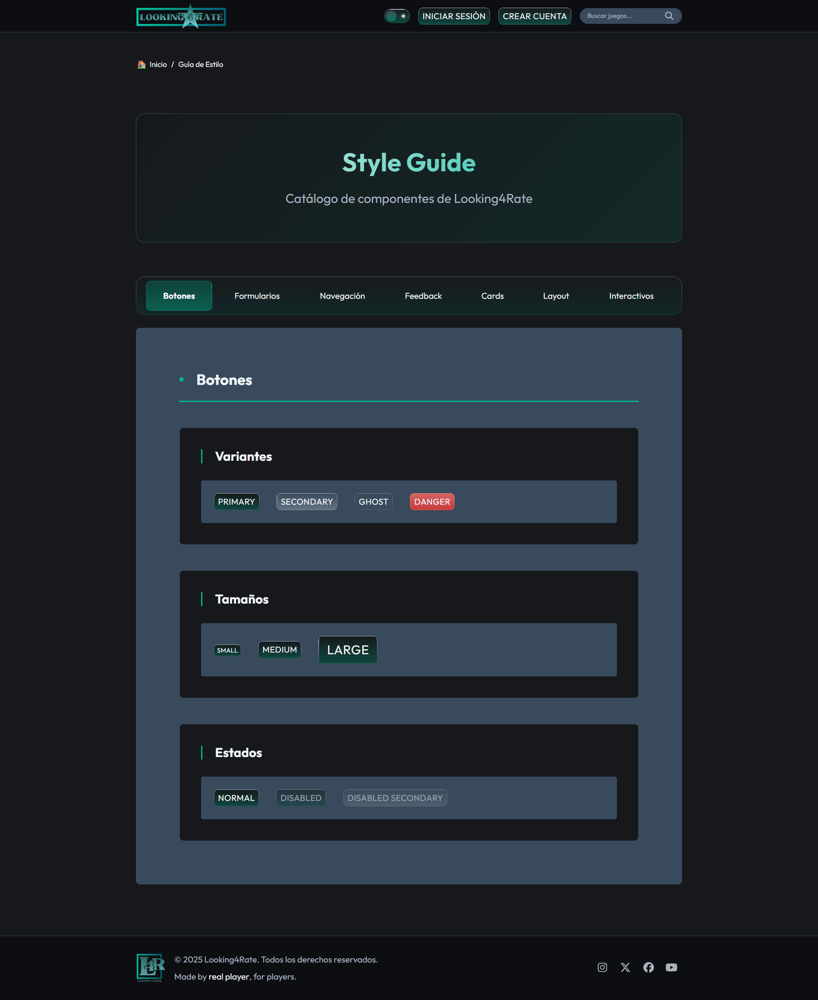 |

*Tab de Botones mostrando las 4 variantes (primary, secondary, ghost, danger), los 3 tamaños (sm, md, lg) y estados (normal, disabled).*

#### Tab de Formularios

| Tab Formularios |
|:---------------:|
| 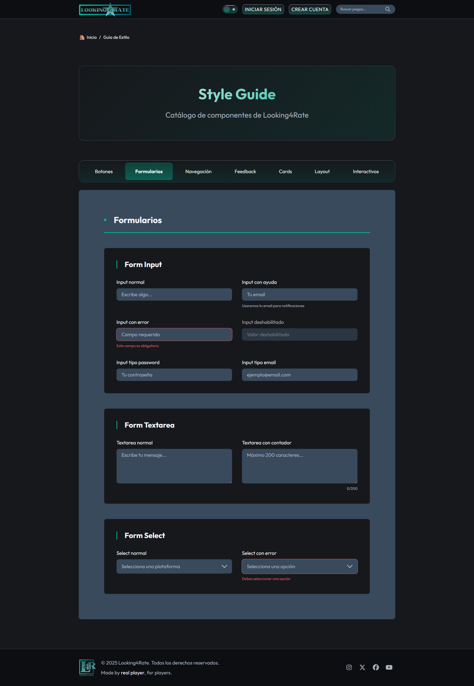 |

*Tab de Formularios con Form Input (normal, con ayuda, con error, deshabilitado, password, email), Textarea (normal, con contador) y Select.*

#### Tab de Navegación

| Tab Navegación |
|:--------------:|
| 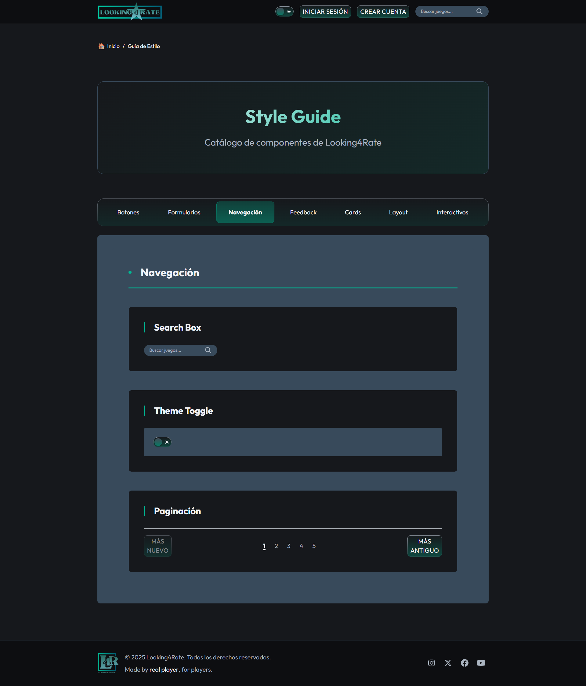 |

*Tab de Navegación mostrando SearchBox, ThemeSwitcher y Pagination.*

#### Tab de Feedback

| Tab Feedback |
|:------------:|
| 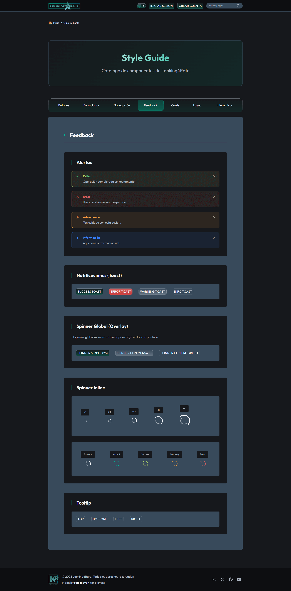 |

*Tab de Feedback con Alertas (4 tipos), botones para disparar Notificaciones Toast, Spinner Global (3 variantes) y Spinner Inline (5 tamaños, 5 colores).*

#### Tab de Cards

| Tab Cards |
|:---------:|
| 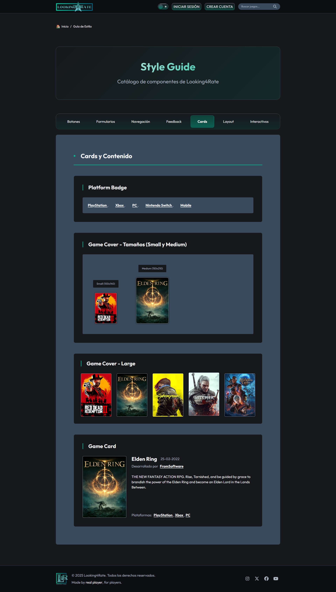 |

*Tab de Cards mostrando Platform Badges, Game Cover (3 tamaños) y Game Card completo.*

#### Tab de Layout

| Tab Layout |
|:----------:|
| 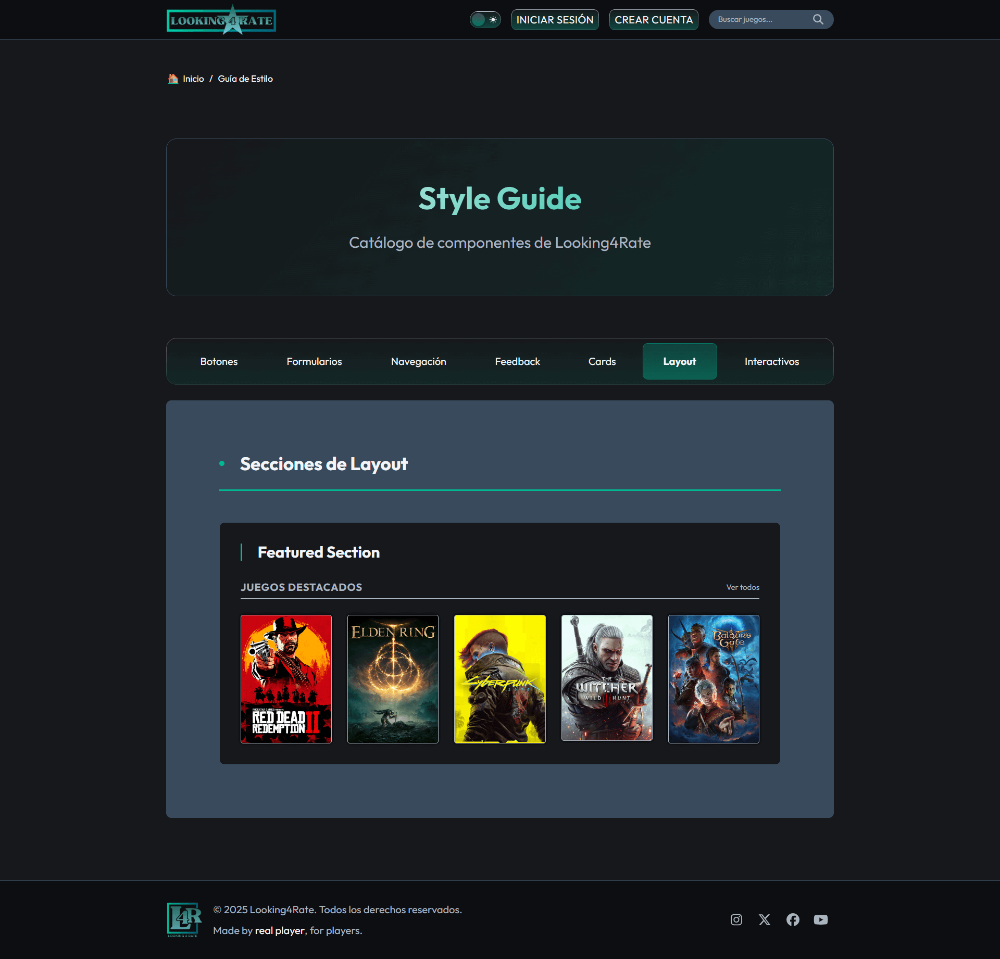 |

*Tab de Layout con Featured Section y grid de portadas de juegos.*

#### Tab de Interactivos

| Tab Interactivos |
|:----------------:|
| 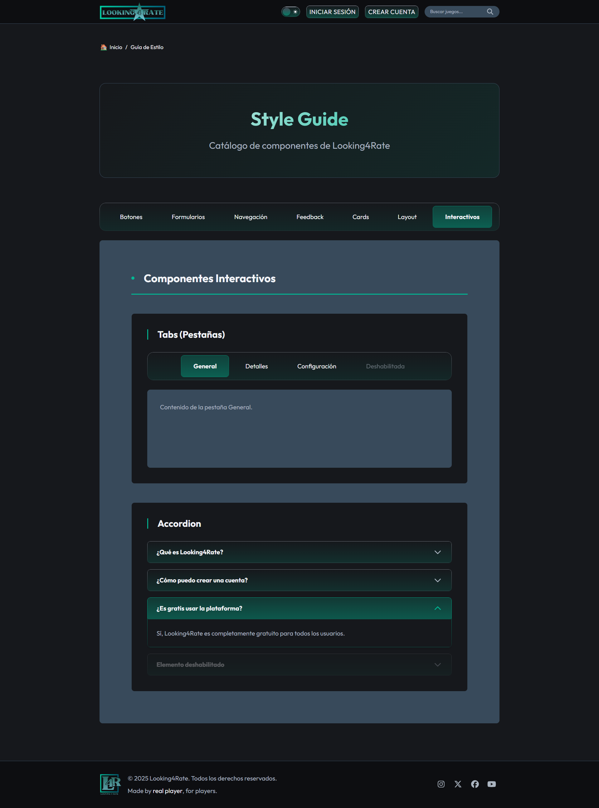 |

*Tab de Interactivos mostrando Tabs anidadas y Accordion con múltiples items.*

---

# Sección 4: Responsive Design

## 4.1 Breakpoints definidos

El sistema de breakpoints de Looking4Rate está definido en `frontend/src/styles/00-settings/_variables.scss` y sigue una estrategia **desktop-first** usando `max-width`:

| Breakpoint | Valor | Dispositivo | Justificación |
|------------|-------|-------------|---------------|
| `$breakpoint-xl` | 80rem (1280px) | Desktop estándar | Punto donde el diseño desktop completo empieza a requerir ajustes |
| `$breakpoint-lg` | 64rem (1024px) | Desktop pequeño | Límite para laptops y monitores pequeños |
| `$breakpoint-md` | 48rem (768px) | Tablet | Estándar de tablets en orientación portrait |
| `$breakpoint-sm` | 40rem (640px) | Móvil grande | Transición a navegación móvil (menú hamburguesa) |
| `$breakpoint-xs` | 20rem (320px) | Móvil pequeño | Dispositivos más pequeños (iPhone SE, etc.) |

### Justificación de valores

- **1280px (xl):** Es el ancho estándar para diseño desktop, usado por la mayoría de monitores y resoluciones comunes.
- **1024px (lg):** Punto de transición donde los layouts de múltiples columnas empiezan a necesitar ajustes.
- **768px (md):** Estándar de la industria para tablets iPad en orientación portrait.
- **640px (sm):** Punto donde la navegación desktop se vuelve inutilizable y se activa el menú hamburguesa.
- **320px (xs):** Garantiza compatibilidad con los dispositivos móviles más pequeños del mercado.

---

## 4.2 Estrategia responsive

### Decisión: Desktop-First

Looking4Rate utiliza una estrategia **desktop-first**, lo que significa que los estilos base están diseñados para pantallas grandes y se usan media queries con `max-width` para adaptar progresivamente a pantallas más pequeñas.

### Justificación

1. **Naturaleza de la aplicación:** Looking4Rate es una aplicación de catálogo y seguimiento de videojuegos donde los usuarios pasan tiempo explorando contenido, lo cual es más cómodo en desktop.

2. **Complejidad visual:** Los layouts con múltiples carátulas de juegos, paneles de interacción y detalles se diseñaron pensando primero en el espacio disponible en desktop.

3. **Audiencia objetivo:** Los gamers, público principal de la aplicación, utilizan frecuentemente ordenadores de escritorio.

4. **Facilidad de simplificación:** Es más intuitivo simplificar un diseño complejo para móvil que agregar complejidad desde un diseño móvil simple.

### Ejemplo de código (Desktop-First)

```scss
// frontend/src/app/pages/home/home.scss

// Estilos base para DESKTOP
.home__covers {
  display: grid;
  grid-template-columns: repeat(5, 1fr); // 5 columnas en desktop
  gap: $spacing-3;
}

// Adaptación para TABLET (768px)
@media (max-width: $breakpoint-md) {
  .home__covers {
    display: flex;
    flex-wrap: wrap;
    justify-content: center; // Centrar filas incompletas
    gap: $spacing-3;
    
    .home__cover-item {
      flex: 0 0 auto;
      width: 9rem;
    }
  }
}

// Adaptación para MÓVIL (640px)
@media (max-width: $breakpoint-sm) {
  .home__covers {
    gap: $spacing-2;
    
    .home__cover-item {
      width: 9rem; // Mismo tamaño que tablet para buena visibilidad
    }
  }
}
```

### Mixins de responsive

Se han creado mixins en `_mixins.scss` para facilitar la escritura de media queries consistentes:

```scss
// frontend/src/styles/01-tools/_mixins.scss

// Mixin para cada breakpoint específico
@mixin desktop-xl {
  @media (max-width: $breakpoint-xl) { @content; }
}

@mixin desktop-lg {
  @media (max-width: $breakpoint-lg) { @content; }
}

@mixin tablet {
  @media (max-width: $breakpoint-md) { @content; }
}

@mixin mobile {
  @media (max-width: $breakpoint-sm) { @content; }
}

@mixin mobile-xs {
  @media (max-width: $breakpoint-xs) { @content; }
}

// Mixin genérico para breakpoint personalizado
@mixin respond-to($breakpoint) {
  @media (max-width: $breakpoint) { @content; }
}
```

---

## 4.3 Container Queries

### Componente implementado: SearchGameCard

El componente `search-game-card` implementa Container Queries para adaptarse automáticamente según el ancho del contenedor donde se renderice.

#### Definición del contenedor

```scss
// frontend/src/app/components/shared/search-game-card/search-game-card.scss

:host {
  display: block;
  container-type: inline-size;
  container-name: search-card;
}
```

#### Container Queries implementadas

```scss
// ==========================================================================
// CONTAINER QUERIES
// Permite que el componente se adapte según su contenedor padre,
// independientemente del viewport. Útil cuando el componente se usa
// en sidebars, modales o layouts con ancho variable.
// ==========================================================================

// Contenedor mediano (menos de 400px de ancho)
@container search-card (max-width: 400px) {
  .search-game-card {
    &__cover {
      width: 6rem;
    }

    &__title {
      font-size: $font-size-md;
    }

    &__year {
      font-size: $font-size-md;
    }

    &__badge {
      font-size: $font-size-sm;
      padding: 3px 6px;
    }
  }
}

// Contenedor pequeño (menos de 300px de ancho)
@container search-card (max-width: 300px) {
  .search-game-card {
    gap: $spacing-2;

    &__cover {
      width: 5rem;
    }

    &__header {
      flex-direction: column;
      align-items: flex-start;
      gap: 0.25rem;
    }

    &__title {
      font-size: $font-size-sm;
    }

    &__year {
      font-size: $font-size-sm;
    }

    &__badge {
      font-size: $font-size-xs;
      padding: 2px 4px;
    }
  }
}
```

### Mixin reutilizable para Container Queries

Se creó un mixin genérico para facilitar la implementación de Container Queries en otros componentes:

```scss
// frontend/src/styles/01-tools/_mixins.scss

// Define un contenedor para container queries
@mixin container($name: null) {
  container-type: inline-size;
  @if $name {
    container-name: $name;
  }
}

// Media query basada en el contenedor
@mixin container-query($min-width: null, $max-width: null, $name: null) {
  @if $max-width {
    @if $name {
      @container #{$name} (max-width: #{$max-width}) {
        @content;
      }
    } @else {
      @container (max-width: #{$max-width}) {
        @content;
      }
    }
  }
}
```

### ¿Por qué SearchGameCard?

1. **Componente reutilizable:** Se usa en la página de búsqueda pero podría usarse en sidebars, modales o widgets.
2. **Layout complejo:** Contiene carátula, título, año, desarrollador y plataformas que necesitan reorganizarse.
3. **Independencia del contexto:** Si se coloca en un contenedor estrecho (sidebar), se adapta automáticamente sin depender del viewport.

---

## 4.4 Adaptaciones principales

### Tabla resumen de adaptaciones por viewport

| Elemento | Desktop (1280px+) | Tablet (768px) | Móvil (640px) | Móvil pequeño (320px) |
|----------|-------------------|----------------|---------------|----------------------|
| **Navegación** | Barra horizontal con dropdown de usuario | Barra horizontal con dropdown | Menú hamburguesa con búsqueda expandible | Menú hamburguesa compacto |
| **Hero (Home)** | 85vh, texto 32px | 60vh, texto 24px | 50vh, texto 24px | 50vh, texto 24px |
| **Grid carátulas** | 5 columnas fijas | Flex-wrap, 9rem por carátula | Flex-wrap centrado, 9rem | Flex-wrap centrado, 6rem |
| **Game Detail** | 2 columnas (carátula + info) | 2 columnas compactas | 1 columna apilada | 1 columna compacta |
| **Panel interacción** | Botones en columna vertical | Botones en columna | Botones horizontales | Botones horizontales compactos |
| **Search results** | Cards con carátula 10rem | Cards con carátula 10rem | Cards con carátula 8rem | Cards con carátula 6rem |
| **Títulos sección** | Título + VER MÁS en línea | Título + VER MÁS en línea | Título + VER MÁS en línea | Título + VER MÁS en línea |
| **Formularios** | Ancho fijo con márgenes | Ancho completo | Ancho completo | Ancho completo, inputs más grandes |

---

## 4.5 Páginas implementadas

### Lista de páginas responsive

| Página | Ruta | Descripción | Adaptaciones clave |
|--------|------|-------------|-------------------|
| **Home** | `/` | Página principal con hero y secciones de juegos | Hero responsive, grid de carátulas adaptativo, secciones con flex-wrap |
| **Game Detail** | `/juego/:id` | Detalle de un juego con carátula, info y panel de interacción | Layout 2→1 columnas, panel horizontal en móvil |
| **Search** | `/buscar` | Resultados de búsqueda de juegos | Cards con Container Queries, botón "mostrar más" escalable |
| **Profile** | `/perfil` | Perfil del usuario con estadísticas y listas | Grid adaptativo de estadísticas, listas responsive |
| **Settings** | `/ajustes` | Configuración de cuenta del usuario | Formularios a ancho completo, inputs optimizados |
| **Style Guide** | `/style-guide` | Catálogo de componentes UI | Grid de ejemplos adaptativo |
| **Not Found** | `/404` | Página de error 404 | Layout centrado responsive |

---

## 4.6 Screenshots comparativos

### Página Home

| Desktop (1280px) | Tablet (768px) | Móvil (375px) |
|:----------------:|:--------------:|:-------------:|
| 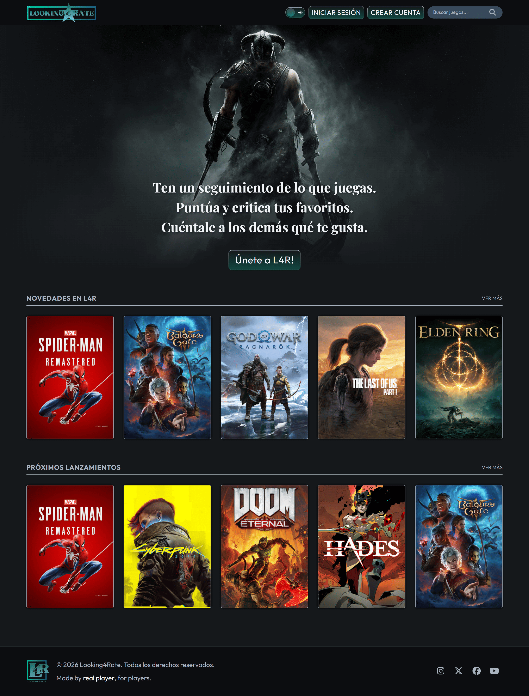 | 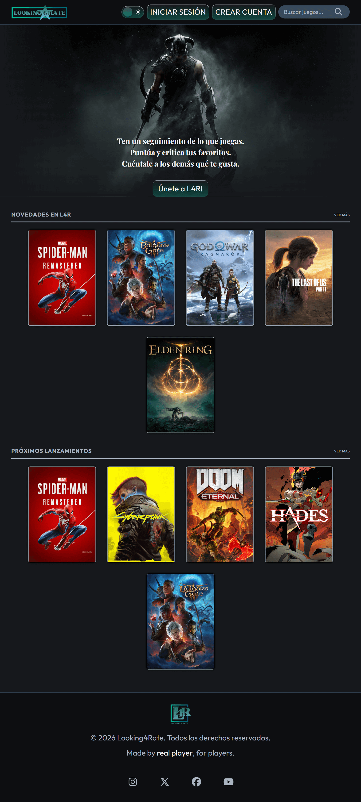 |  |

*Desktop: hero a pantalla completa, navegación horizontal y grid de 5 carátulas por fila.  
Tablet: hero reducido, carátulas en flex-wrap centradas y menú hamburguesa.  
Móvil: menú hamburguesa, búsqueda expandible y carátulas centradas en filas flexibles.*

---

### Página Game Detail

| Desktop (1280px) | Tablet (768px) | Móvil (375px) |
|:----------------:|:--------------:|:-------------:|
| 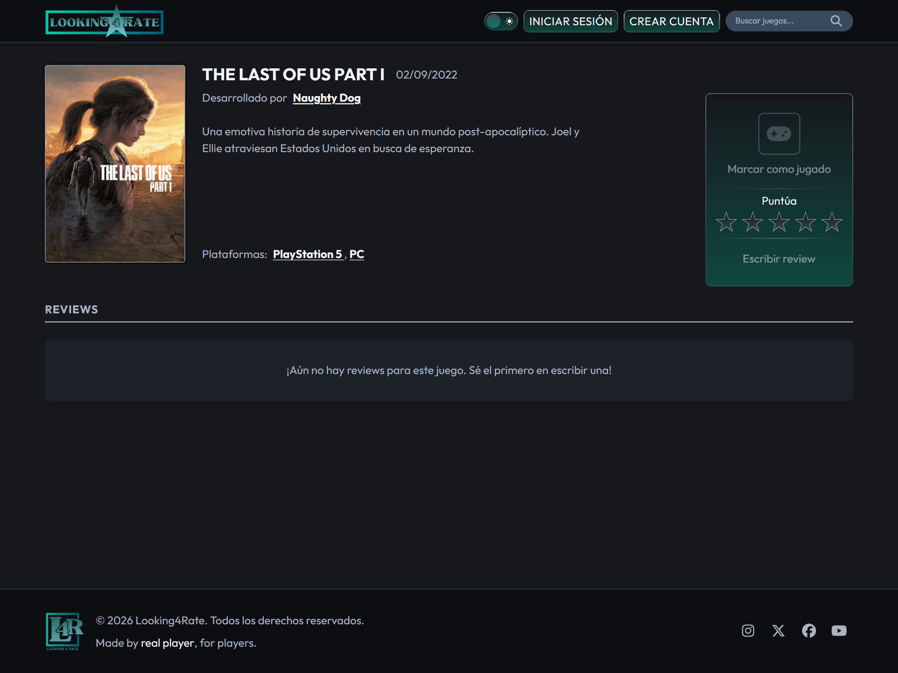 | 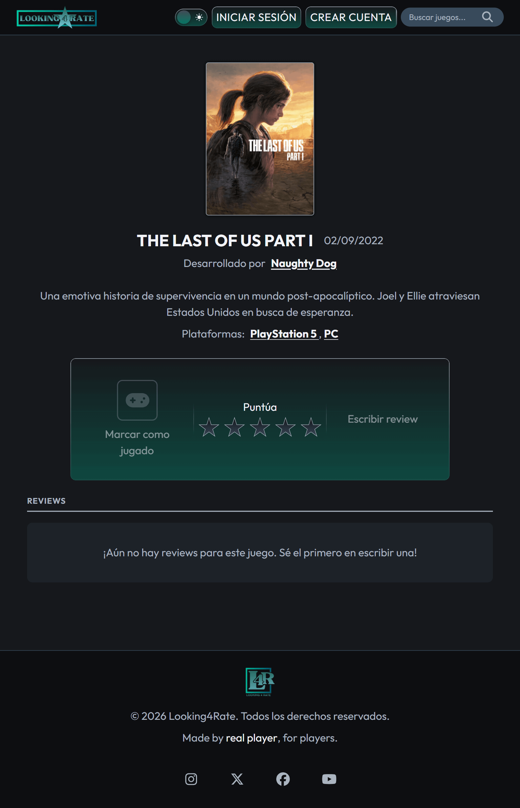 | 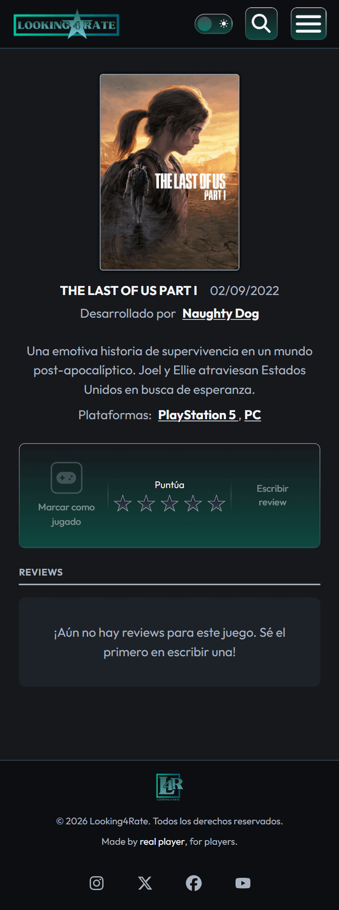 |

*Desktop: layout de 2 columnas (carátula izquierda, información y panel de interacción derecha).  
Tablet: mantiene 2 columnas con proporciones ajustadas.  
Móvil: layout de 1 columna (carátula arriba, información abajo, botones de interacción en fila horizontal).*

---

### Página Search

| Desktop (1280px) | Tablet (768px) | Móvil (375px) |
|:----------------:|:--------------:|:-------------:|
| 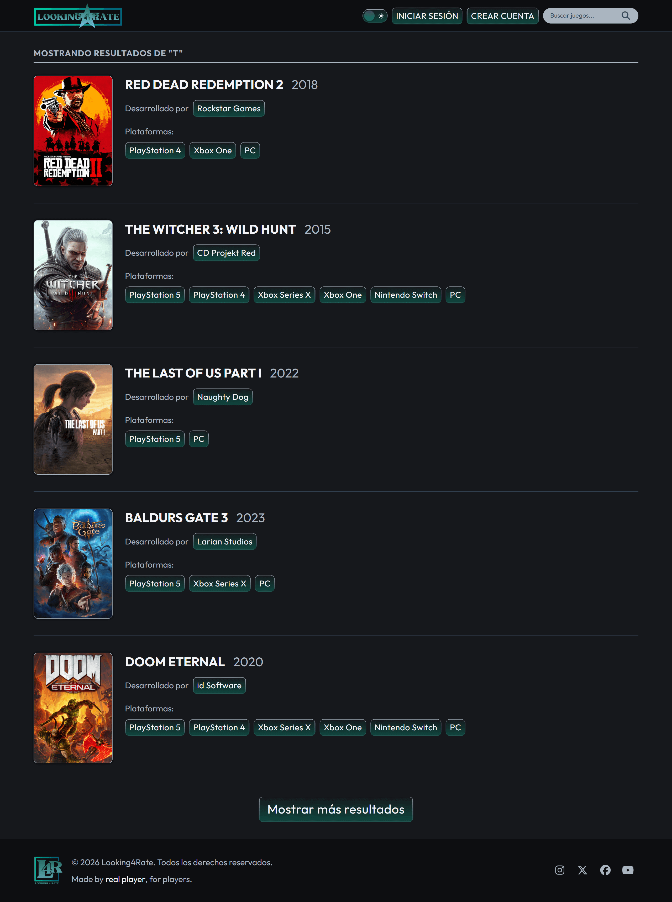 | 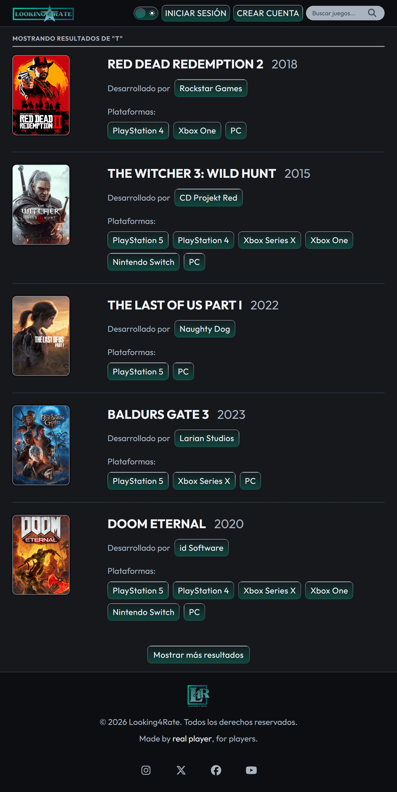 | 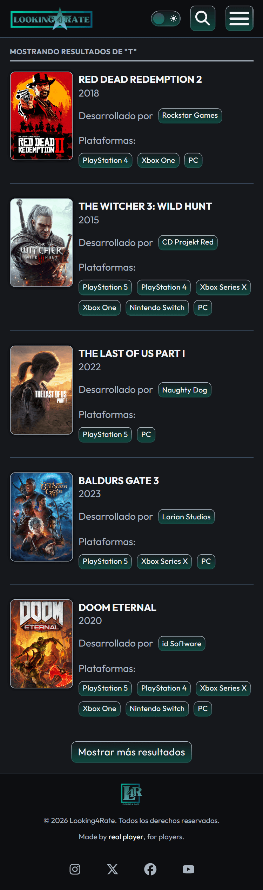 |

*Desktop: tarjetas de resultados amplias mostrando carátula, título, desarrollador y plataformas.  
Tablet: tarjetas adaptadas, carátulas de 10rem y badges legibles.  
Móvil: tarjetas compactas gracias a Container Queries, carátulas de 8rem y botón "Mostrar más" prominente.*

---

### Notas sobre testing

El responsive design ha sido verificado en los siguientes viewports usando Chrome DevTools y Firefox Developer Tools:

- **320px** (iPhone SE, móviles pequeños)
- **375px** (iPhone 12/13/14, móviles estándar)
- **768px** (iPad, tablets)
- **1024px** (iPad Pro, laptops pequeños)
- **1280px** (Desktop estándar)

También se ha verificado el comportamiento del menú hamburguesa, la búsqueda expandible móvil, y el centrado de carátulas en filas incompletas.

---

# Sección 5: Optimización multimedia

Esta sección documenta las estrategias de optimización de imágenes y animaciones CSS implementadas en Looking4Rate para mejorar el rendimiento y la experiencia de usuario.

## 5.1 Formatos elegidos

### Formatos de imagen utilizados

| Formato | Uso | Justificación |
|---------|-----|---------------|
| **AVIF** | Hero background | Mejor compresión (50% menos que JPG), ideal para imágenes grandes con muchos detalles. Soporte en navegadores modernos >95%. |
| **WebP** | Logos | Excelente balance entre compresión y compatibilidad. Soporta transparencia. Soporte universal en navegadores actuales. |
| **PNG** | Favicons | Soporte universal obligatorio para favicons. Transparencia perfecta en tamaños pequeños. |

### Decisión AVIF vs WebP vs JPG

**AVIF:**
- Mejor compresión (30-50% menos que WebP)
- Ideal para fotografías y fondos grandes
- Codificación más lenta
- **Uso:** Hero background (imágenes >100KB)

**WebP:**
- Excelente compatibilidad (>97% navegadores)
- Soporta transparencia
- Buena compresión (25-35% menos que PNG/JPG)
- **Uso:** Logos, iconos, imágenes con transparencia

**JPG:**
- Compatibilidad universal (100%)
- No soporta transparencia
- Mayor peso que AVIF/WebP
- **Uso:** Fallback para navegadores muy antiguos (no implementado por bajo uso)

### Iconografía (SVG)

**FontAwesome (https://fontawesome.com/)**

La aplicación utiliza la librería **FontAwesome v7.1.0** para toda la iconografía de la interfaz. Esta librería renderiza iconos como SVG inline optimizados automáticamente por el navegador.

**Ventajas:**
- Iconos vectoriales escalables sin pérdida de calidad
- Optimización automática por la librería
- Tree-shaking: solo se incluyen los iconos usados
- No requieren optimización manual

**Implementación:**
```typescript
// frontend/src/app/fontawesome.config.ts
import { FaIconLibrary } from '@fortawesome/angular-fontawesome';
import { faHome, faUserCircle, faCog } from '@fortawesome/free-solid-svg-icons';
import { faInstagram, faTwitter, faFacebook } from '@fortawesome/free-brands-svg-icons';
```

**Uso en templates:**
```html
<fa-icon [icon]="['fas', 'home']"></fa-icon>
<fa-icon [icon]="['fab', 'instagram']"></fa-icon>
```

## 5.2 Herramientas utilizadas

### Squoosh (https://squoosh.app/)
**Uso principal:** Optimización y conversión de todas las imágenes del proyecto.

### TinyPNG (https://tinypng.com/)
**Uso:** Compresión adicional de PNGs para favicons.

## 5.3 Resultados de optimización

### Tabla de imágenes optimizadas

| Imagen | Tamaño original | Tamaño optimizado | Reducción |
|--------|-----------------|-------------------|----------|
| hero-background-large.avif | ~800KB (JPG original) | 163KB | **80%** |
| hero-background-medium.avif | ~400KB | 112KB | **72%** |
| hero-background-small.avif | ~200KB | 102KB | **49%** |
| logoL4R-large.webp | ~150KB (PNG original) | 20KB | **87%** |
| logoL4R-medium.webp | ~80KB | 19KB | **76%** |
| logoL4R-small.webp | ~40KB | 8KB | **80%** |
| logoL4R-favicon-large.webp | ~100KB (PNG original) | 17KB | **83%** |
| logoL4R-favicon-medium.webp | ~50KB | 19KB | **62%** |
| logoL4R-favicon-small.webp | ~25KB | 7KB | **72%** |
| favicon-32x32.png | ~5KB | 2.88KB | **42%** |
| favicon-16x16.png | ~3KB | 0.99KB | **67%** |

### Resumen de optimización

- **Total imágenes optimizadas:** 11 archivos
- **Peso total original estimado:** ~1.8MB
- **Peso total optimizado:** ~471KB
- **Reducción total:** **74%**
- **Todas las imágenes < 200KB:**

## 5.4 Tecnologías implementadas

### 5.4.1 Elemento `<picture>` (Art Direction)

El elemento `<picture>` permite servir diferentes imágenes según el viewport, optimizando la carga para cada dispositivo.

**Implementación en Header:**
```html
<!-- frontend/src/app/components/layout/header/header.html -->
<a routerLink="/" class="header__logo">
  <picture>
    <source
      media="(max-width: 640px)"
      srcset="assets/img/logos/logoL4R-small.webp"
    >
    <source
      media="(max-width: 1024px)"
      srcset="assets/img/logos/logoL4R-medium.webp"
    >
    
  </picture>
</a>
```

**Implementación en Footer:**
```html
<!-- frontend/src/app/components/layout/footer/footer.html -->
<picture>
  <source
    media="(max-width: 640px)"
    srcset="assets/img/logos/logoL4R-favicon-small.webp"
  >
  <source
    media="(max-width: 1024px)"
    srcset="assets/img/logos/logoL4R-favicon-medium.webp"
  >
  
</picture>
```

### 5.4.2 Background responsive con CSS Media Queries

Para el hero background se utiliza CSS con media queries para cargar diferentes tamaños:

```scss
// frontend/src/app/pages/home/home.scss
.hero {
  // Móviles: 800px de ancho
  background: url('/assets/img/hero/hero-background-small.avif') center center / cover no-repeat;
  
  // Tablets (768px+): 1400px de ancho
  @media (min-width: 768px) {
    background-image: url('/assets/img/hero/hero-background-medium.avif');
  }
  
  // Desktop (1280px+): 1920px full resolution
  @media (min-width: 1280px) {
    background-image: url('/assets/img/hero/hero-background-large.avif');
  }
}
```

### 5.4.3 Atributo `loading` (Lazy Loading)

El atributo `loading` controla cuándo se cargan las imágenes:

| Valor | Uso | Elementos |
|-------|-----|----------|
| `eager` | Imágenes críticas above-the-fold | Header logo |
| `lazy` | Imágenes below-the-fold | Footer logo, game covers, avatars |

**Ejemplo de implementación:**
```html
<!-- Imagen crítica - carga inmediata -->


<!-- Imagen no crítica - carga diferida -->

```

## 5.5 Animaciones CSS

### Principio: Solo `transform` y `opacity`

**¿Por qué solo estas propiedades?**

Las propiedades `transform` y `opacity` son las únicas que el navegador puede animar usando la **GPU (Graphics Processing Unit)** sin provocar repaint o reflow del DOM:

**Beneficios:**
- Animaciones a 60fps consistentes
- Menor consumo de CPU
- Mejor experiencia en dispositivos móviles
- No causa Layout Shift

### 5.5.1 Loading Spinner

**Descripción:** Spinner de doble círculo con rotación en direcciones opuestas.

**Archivo:** `frontend/src/app/components/shared/spinner-inline/spinner-inline.scss`

```scss
@keyframes spin {
  to { transform: rotate(360deg); }
}

@keyframes spin-reverse {
  to { transform: rotate(-360deg); }
}

.spinner-inline__circle {
  animation: spin 1.2s linear infinite;
}

.spinner-inline__circle-inner {
  animation: spin-reverse 0.9s linear infinite;
  opacity: 0.6;
}
```

**Propiedades animadas:** `transform: rotate()`

### 5.5.2 Star Pulse (Micro-interacción bounce)

**Descripción:** Efecto de pulso al seleccionar una estrella en el rating.

**Archivo:** `frontend/src/app/components/shared/star-rating/star-rating.scss`

```scss
@keyframes starPulse {
  0% { transform: scale(1); }
  50% { transform: scale(1.25); }
  100% { transform: scale(1); }
}

.star-rating__icon--selected {
  animation: starPulse 0.3s ease-out;
}
```

**Propiedades animadas:** `transform: scale()`
**Duración:** 300ms (dentro del rango 150-500ms)

### 5.5.3 Tooltip Fade In

**Descripción:** Aparición suave del tooltip con desplazamiento.

**Archivo:** `frontend/src/app/components/shared/tooltip/tooltip.scss`

```scss
@keyframes tooltipFadeIn {
  from {
    opacity: 0;
    transform: translateY(4px);
  }
  to {
    opacity: 1;
    transform: translateY(0);
  }
}

.tooltip__content {
  animation: tooltipFadeIn 0.15s ease forwards;
}
```

**Propiedades animadas:** `opacity`, `transform: translateY()`  
**Duración:** 150ms

### 5.5.4 Notification Slide In/Out

**Descripción:** Notificaciones que entran y salen deslizándose desde los bordes.

**Archivo:** `frontend/src/app/components/shared/notification/notification.scss`

```scss
@keyframes slideInRight {
  from {
    transform: translateX(100%);
    opacity: 0;
  }
  to {
    transform: translateX(0);
    opacity: 1;
  }
}

@keyframes slideOutRight {
  from {
    transform: translateX(0);
    opacity: 1;
  }
  to {
    transform: translateX(100%);
    opacity: 0;
  }
}

.notification--entering {
  animation: slideInRight $transition-base $transition-ease;
}

.notification--exiting {
  animation: slideOutRight $transition-base $transition-ease forwards;
}
```

**Propiedades animadas:** `transform: translateX()`, `opacity`   
**Duración:** 300ms ($transition-base) 

### 5.5.5 Transiciones Hover/Focus (8+ elementos)

**Configuración global de transiciones:**
```scss
// frontend/src/styles/00-settings/_variables.scss
$transition-fast: 150ms;
$transition-base: 300ms;
$transition-ease: ease-in-out;
```

**Elementos con transiciones implementadas:**

| Elemento | Archivo | Propiedad | Duración |
|----------|---------|-----------|----------|
| Botones | button.scss | `transform`, `box-shadow` | 200ms |
| Links | game-detail.scss | `color` | 200ms |
| Star rating | star-rating.scss | `transform` | 150ms |
| Search box | search-box.scss | `border-color` | 300ms |
| Theme switcher | theme-switcher.scss | `transform` | 300ms |
| User dropdown | user-dropdown.scss | `background` | 200ms |
| Cards | search-game-card.scss | `transform`, `box-shadow` | 300ms |
| Tabs | tabs.scss | `color`, `border` | 200ms |

**Ejemplo de transición hover:**
```scss
// frontend/src/app/components/shared/star-rating/star-rating.scss
.star-rating__button {
  transition: transform $transition-fast $transition-ease;
  
  &:hover:not(:disabled) {
    transform: scale(1.15);
  }
}
```

### Resumen de animaciones

| Animación | Tipo | Propiedades | Duración |
|-----------|------|-------------|----------|
| spin/spin-reverse | Spinner | transform | 1.2s/0.9s (infinite) |
| starPulse | Bounce | transform | 300ms |
| tooltipFadeIn | Fade-in | opacity, transform | 150ms |
| slideIn/Out | Slide | transform, opacity | 300ms |
| Hover transitions | Transition | transform, opacity | 150-300ms |

**Total:** 9 animaciones diferentes, todas cumpliendo las reglas de rendimiento.

---

# Sección 6: Sistema de temas

El sistema de temas de Looking4Rate permite al usuario alternar entre modo oscuro (por defecto) y modo claro, con detección automática de preferencias del sistema y persistencia de la elección.

## 6.1 Variables de tema

Las variables CSS se definen en `frontend/src/styles/00-settings/_css-variables.scss` usando CSS Custom Properties que permiten el cambio dinámico de tema sin recargar la página.

### Modo Oscuro (por defecto en `:root`)

```scss
:root {
  // Colores de fondo
  --bg-primary: #16181C;
  --bg-secondary: #384A5B;
  --bg-header-footer: #0D0E11;

  // Colores de texto
  --text-primary: #F2F4F8;
  --text-secondary: #AAB4C0;

  // Color de acento
  --color-accent: #00B894;

  // Colores semánticos
  --color-error: #D46363;
  --color-success: #B5D366;
  --color-warning: #F59E42;
  --color-info: #3B82F6;

  // Color de borde
  --border-color: #384A5B;

  // Colores de sombra
  --shadow-color: rgba(0, 0, 0, 0.3);
  --shadow-sm: 0 1px 2px 0 var(--shadow-color);
  --shadow-md: 0 4px 6px -1px var(--shadow-color);
  --shadow-lg: 0 10px 15px -3px var(--shadow-color);
  --shadow-xl: 0 20px 25px -5px var(--shadow-color);
  --shadow-glow-accent: 0 0 20px rgba(0, 184, 148, 0.3);

  // Estados hover/active
  --bg-hover: #1E2127;
  --bg-active: #1B1D22;
  --border-hover: #00B894;
  --text-hover: #00B894;

  // Hero overlay
  --hero-gradient-side: 30%;
  --hero-gradient-bottom: 50%;
}
```

### Modo Claro (`[data-theme='light']`)

```scss
[data-theme='light'] {
  // Colores de fondo
  --bg-primary: #E8EAED;
  --bg-secondary: #C5C9CE;
  --bg-header-footer: #0D0E11; // Mantiene oscuro para contraste

  // Colores de texto
  --text-primary: #1A1A1A;
  --text-secondary: #2D2D2D;
  
  // Colores para header/footer (mantienen texto claro)
  --text-header-footer: #F2F4F8;
  --text-header-footer-alt: #AAB4C0;

  // Color de acento (azul para modo claro)
  --color-accent: #0A7CFF;

  // Colores semánticos
  --color-error: #EF4444;
  --color-success: #22C55E;
  --color-warning: #F59E42;
  --color-info: #3B82F6;

  // Color de borde
  --border-color: #C5C9CE;
  --border-header-footer: #384A5B;

  // Colores de sombra (más suaves)
  --shadow-color: rgba(0, 0, 0, 0.15);
  --shadow-glow-accent: 0 0 20px rgba(10, 124, 255, 0.2);

  // Estados hover/active
  --bg-hover: #DFE1E4;
  --bg-active: #E2E4E7;
  --border-hover: #0A7CFF;
  --text-hover: #0A7CFF;

  // Hero overlay (más suave para mostrar más imagen)
  --hero-gradient-side: 22%;
  --hero-gradient-bottom: 40%;
}
```

### Tabla comparativa de variables

| Variable | Modo Oscuro | Modo Claro | Propósito |
|----------|-------------|------------|-----------|
| `--bg-primary` | #16181C | #E8EAED | Fondo principal |
| `--bg-secondary` | #384A5B | #C5C9CE | Fondo secundario |
| `--text-primary` | #F2F4F8 | #1A1A1A | Texto principal |
| `--text-secondary` | #AAB4C0 | #2D2D2D | Texto secundario |
| `--color-accent` | #00B894 | #0A7CFF | Color de acento |
| `--border-color` | #384A5B | #C5C9CE | Bordes |
| `--shadow-color` | rgba(0,0,0,0.3) | rgba(0,0,0,0.15) | Base de sombras |

## 6.2 Implementación del Theme Switcher

### Componente ThemeSwitcher

**Ubicación:** `frontend/src/app/components/shared/theme-switcher/`

El componente `ThemeSwitcher` es un toggle visual que permite cambiar entre temas y se ubica en el header de la aplicación.

```typescript
// theme-switcher.ts
@Component({
  selector: 'app-theme-switcher',
  standalone: true,
  templateUrl: './theme-switcher.html',
  styleUrl: './theme-switcher.scss',
})
export class ThemeSwitcher implements OnInit, AfterViewInit, OnDestroy {
  isDarkMode = true;
  private prefersDarkScheme: MediaQueryList | null = null;

  ngOnInit(): void {
    if (this.isBrowser) {
      this.initializeTheme();
      this.setupSystemPreferenceListener();
      this.subscribeToStateService();
    }
  }

  // Inicializa el tema con prioridad:
  // 1. Preferencia guardada en localStorage
  // 2. Preferencia del sistema (prefers-color-scheme)
  // 3. Tema oscuro por defecto
  private initializeTheme(): void {
    const stateTheme = this.stateService.getState().ui.theme;
    
    if (stateTheme === 'light') {
      this.isDarkMode = false;
      this.applyTheme('light');
    } else if (stateTheme === 'dark') {
      this.isDarkMode = true;
      this.applyTheme('dark');
    } else {
      // Detectar preferencia del sistema
      this.prefersDarkScheme = window.matchMedia('(prefers-color-scheme: dark)');
      this.isDarkMode = this.prefersDarkScheme.matches;
      this.applyTheme(this.isDarkMode ? 'dark' : 'light');
    }
  }

  // Aplica el tema modificando data-theme en <html>
  private applyTheme(theme: 'dark' | 'light'): void {
    if (theme === 'light') {
      document.documentElement.setAttribute('data-theme', 'light');
    } else {
      document.documentElement.removeAttribute('data-theme');
    }
  }

  // Toggle del tema
  toggleTheme(event?: Event): void {
    this.isDarkMode = !this.isDarkMode;
    const theme = this.isDarkMode ? 'dark' : 'light';
    this.applyTheme(theme);
    this.stateService.setTheme(theme); // Guarda en localStorage
  }
}
```

### Template del Toggle

```html
<!-- theme-switcher.html -->
<button 
  #toggleButton
  class="theme-switcher" 
  (click)="toggleTheme($event)"
  (keydown)="onKeyDown($event)"
  [attr.aria-label]="isDarkMode ? 'Cambiar a modo claro' : 'Cambiar a modo oscuro'"
  [attr.aria-pressed]="!isDarkMode"
  role="switch"
  type="button">
  <span class="theme-switcher__track">
    <!-- Icono Luna -->
    <svg class="theme-switcher__icon theme-switcher__icon--moon" viewBox="0 0 24 24">
      <path d="M21.752 15.002A9.718..."/>
    </svg>
    <!-- Icono Sol -->
    <svg class="theme-switcher__icon theme-switcher__icon--sun" viewBox="0 0 24 24">
      <path d="M12 2.25a.75.75..."/>
    </svg>
    <!-- Thumb deslizable -->
    <span class="theme-switcher__thumb" 
          [class.theme-switcher__thumb--light]="!isDarkMode">
    </span>
  </span>
</button>
```

### Ubicación en Header

El componente se incluye en el header tanto en versión desktop como móvil:

```html
<!-- header.html -->
<header class="header">
  <!-- Navegación desktop -->
  <nav class="header__actions header__actions--desktop">
    <app-theme-switcher></app-theme-switcher>
    <!-- ... otros elementos -->
  </nav>

  <!-- Controles móvil -->
  <menu class="header__mobile-controls">
    <app-theme-switcher></app-theme-switcher>
    <!-- ... otros elementos -->
  </menu>
</header>
```

### Detección de preferencia del sistema

```typescript
private setupSystemPreferenceListener(): void {
  if (!this.prefersDarkScheme) {
    this.prefersDarkScheme = window.matchMedia('(prefers-color-scheme: dark)');
  }
  
  // Escuchar cambios en la preferencia del sistema
  this.prefersDarkScheme.addEventListener('change', (e: MediaQueryListEvent) => {
    const stateTheme = this.stateService.getState().ui.theme;
    if (stateTheme === 'system') {
      this.isDarkMode = e.matches;
      this.applyTheme(this.isDarkMode ? 'dark' : 'light');
    }
  });
}
```

### Prioridad de temas

| Prioridad | Fuente | Descripción |
|-----------|--------|-------------|
| 1 | localStorage | Tema guardado por el usuario |
| 2 | `prefers-color-scheme` | Preferencia del sistema operativo |
| 3 | Tema oscuro | Valor por defecto |

### Transiciones suaves entre temas

Las transiciones están configuradas en `_elements.scss` para un cambio suave (300ms):

```scss
// frontend/src/styles/03-elements/_elements.scss
html {
  background-color: var(--bg-primary);
  transition: background-color $transition-base $transition-ease; // 300ms
}

body {
  background-color: var(--bg-primary);
  color: var(--text-primary);
  transition: background-color $transition-base $transition-ease,
              color $transition-base $transition-ease;
}

h1, h2, h3, h4, h5, h6 {
  color: var(--text-primary);
  transition: color $transition-base $transition-ease;
}

p {
  color: var(--text-secondary);
  transition: color $transition-base $transition-ease;
}

input, textarea, select {
  transition: border-color $transition-base $transition-ease,
              color $transition-base $transition-ease;
}
```

### Hero con transición suave

El hero usa `mask-image` con CSS Custom Properties para transiciones suaves:

```scss
// frontend/src/app/pages/home/home.scss
.hero__overlay {
  background-color: var(--bg-primary);
  transition: background-color $transition-base $transition-ease;
  
  // Máscara con variables CSS para intensidad diferente por tema
  mask-image: 
    linear-gradient(to right, black 0%, transparent var(--hero-gradient-side)),
    linear-gradient(to left, black 0%, transparent var(--hero-gradient-side)),
    linear-gradient(to top, black 0%, transparent var(--hero-gradient-bottom));
}
```

## 6.3 Capturas de pantalla

### Home - Modo Oscuro vs Modo Claro

| Modo Oscuro | Modo Claro |
|-------------|------------|
| 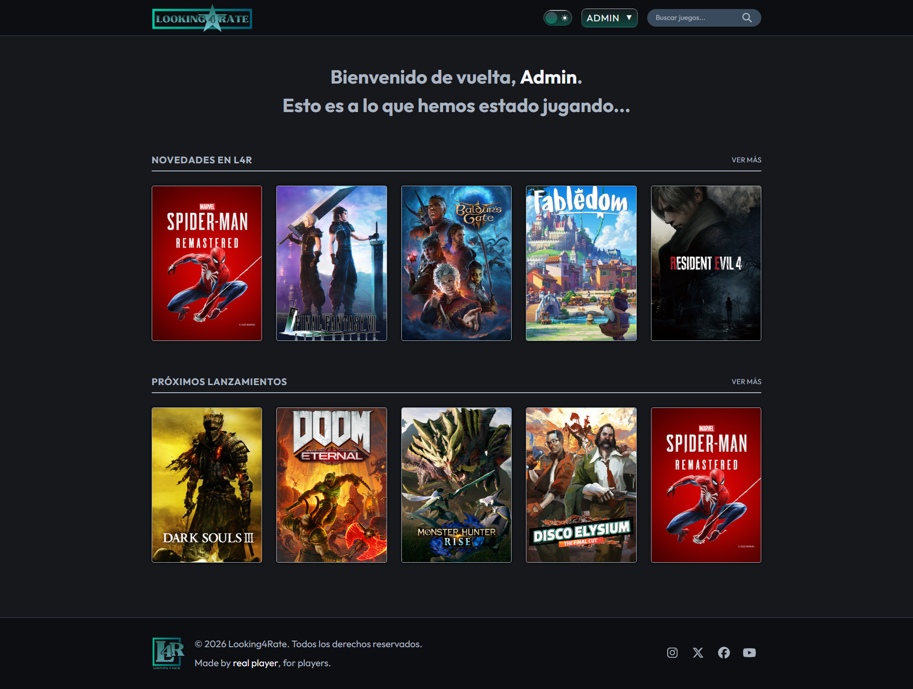 | 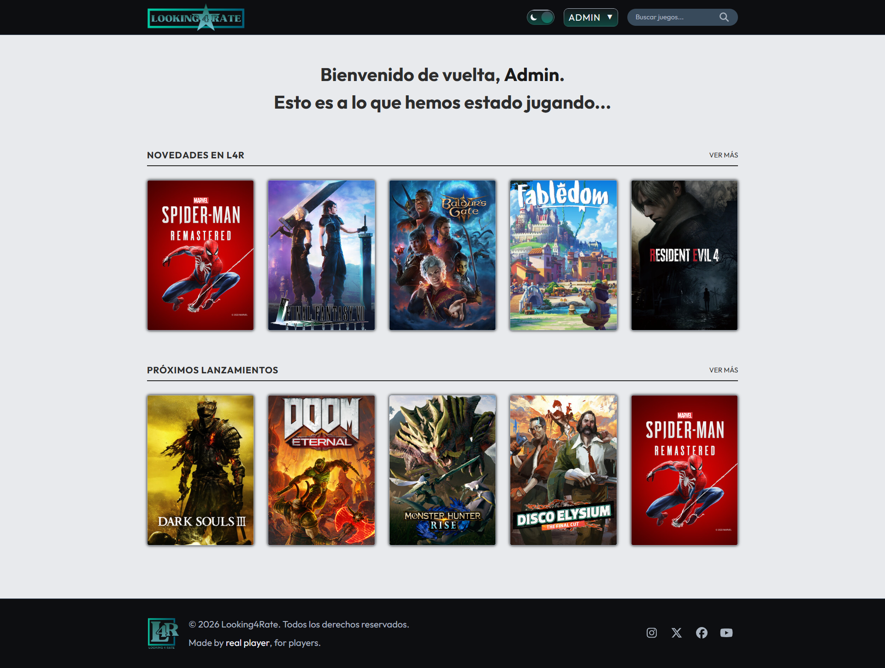 |

*La página principal muestra el hero con viñeta adaptativa y las tarjetas de juegos con colores invertidos.*

### Perfil - Modo Oscuro vs Modo Claro

| Modo Oscuro | Modo Claro |
|-------------|------------|
|  | 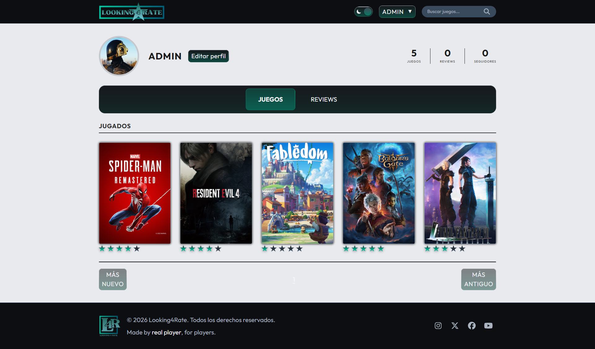 |

*El perfil de usuario con estadísticas, tabs de navegación y grid de juegos adaptado a cada tema.*

### Detalle de Juego - Modo Oscuro vs Modo Claro

| Modo Oscuro | Modo Claro |
|-------------|------------|
| 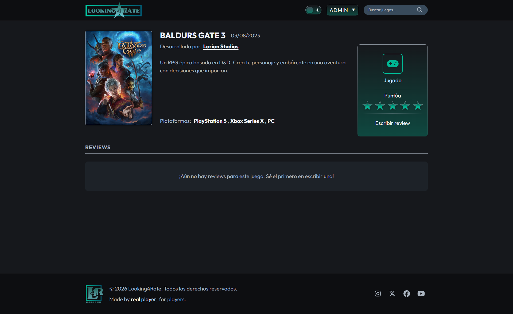 | 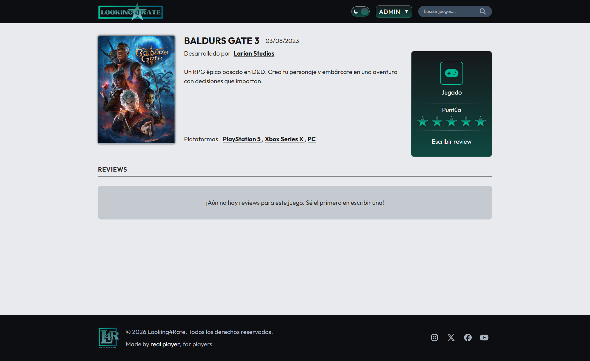 |

*La página de detalle con información del juego, panel de interacciones y reviews con colores adaptados.*