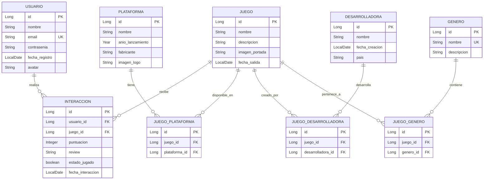

# Documentación Backend - Looking4Rate

## Índice
- [1. Diagrama Entidad-Relación](#1-diagrama-entidad-relación)
- [2. Entidades](#2-entidades)
  - [2.1 Usuario](#21-usuario)
  - [2.2 Juego](#22-juego)
  - [2.3 Interaccion](#23-interaccion)
  - [2.4 Plataforma](#24-plataforma)
  - [2.5 Desarrolladora](#25-desarrolladora)
  - [2.6 Genero](#26-genero)
  - [2.7 Tablas Intermedias](#27-tablas-intermedias)
- [3. DTOs Iniciales](#3-dtos-iniciales)
- [4. Repositorios](#4-repositorios)
- [5. Relaciones](#5-relaciones)

---

## 1. Diagrama Entidad-Relación

```
┌─────────────────┐          ┌─────────────────────┐          ┌─────────────────┐
│    USUARIO      │          │     INTERACCION     │          │      JUEGO      │
├─────────────────┤          ├─────────────────────┤          ├─────────────────┤
│ PK id           │          │ PK id               │          │ PK id           │
│    nombre       │──1────N──│ FK usuario_id       │──N────1──│    nombre       │
│    email (UK)   │          │ FK juego_id         │          │    descripcion  │
│    contrasenia  │          │    puntuacion       │          │    imagen_port. │
│    fecha_reg.   │          │    review           │          │    fecha_salida │
│    avatar       │          │    estado_jugado    │          └────────┬────────┘
└─────────────────┘          │    fecha_interacc.  │                   │
                             └─────────────────────┘                   │
                                                                       │
         ┌─────────────────────────────────────────────────────────────┼───────────────────────────────────────┐
         │                                                             │                                       │
         │                                                             │                                       │
         ▼                                                             ▼                                       ▼
┌─────────────────┐          ┌─────────────────────┐          ┌─────────────────┐          ┌─────────────────────┐
│  PLATAFORMA     │          │  JUEGO_PLATAFORMA   │          │ JUEGO_DESARROLL │          │  JUEGO_GENERO       │
├─────────────────┤          ├─────────────────────┤          ├─────────────────┤          ├─────────────────────┤
│ PK id           │──1────N──│ PK id               │          │ PK id           │──N────1──│ PK id               │
│    nombre       │          │ FK juego_id         │          │ FK juego_id     │          │ FK juego_id         │
│    anio_lanz.   │          │ FK plataforma_id    │          │ FK desarroll_id │          │ FK genero_id        │
│    fabricante   │          └─────────────────────┘          └─────────────────┘          └──────────┬──────────┘
│    imagen_logo  │                                                    ▲                              │
└─────────────────┘                                                    │                              │
                                                                       │                              ▼
                             ┌─────────────────────┐                   │                   ┌─────────────────────┐
                             │   DESARROLLADORA    │───────────────────┘                   │      GENERO         │
                             ├─────────────────────┤                                       ├─────────────────────┤
                             │ PK id               │                                       │ PK id               │
                             │    nombre           │                                       │    nombre (UK)      │
                             │    fecha_creacion   │                                       │    descripcion      │
                             │    pais             │                                       └─────────────────────┘
                             └─────────────────────┘
```

### Diagrama en formato Mermaid (para visualización)



---

## 2. Entidades

### 2.1 Usuario

Representa a los usuarios registrados en la plataforma que pueden valorar y reseñar videojuegos.

| Campo | Tipo | Restricciones | Descripción |
|-------|------|---------------|-------------|
| id | Long | PK, Auto-increment | Identificador único |
| nombre | String | NOT NULL | Nombre de usuario |
| email | String | NOT NULL, UNIQUE | Correo electrónico |
| contrasenia | String | NOT NULL | Contraseña (encriptada) |
| fecha_registro | LocalDate | NOT NULL, Auto | Fecha de registro |
| avatar | String | Nullable | URL de la imagen de perfil |

**Relaciones:**
- 1:N con `Interaccion` (un usuario puede tener muchas interacciones)

---

### 2.2 Juego

Representa los videojuegos que pueden ser valorados en la plataforma.

| Campo | Tipo | Restricciones | Descripción |
|-------|------|---------------|-------------|
| id | Long | PK, Auto-increment | Identificador único |
| nombre | String | NOT NULL | Nombre del juego |
| descripcion | String | NOT NULL | Descripción del juego |
| imagen_portada | String | NOT NULL | URL de la imagen de portada |
| fecha_salida | LocalDate | NOT NULL | Fecha de lanzamiento |

**Relaciones:**
- 1:N con `Interaccion` (un juego puede tener muchas interacciones)
- N:M con `Plataforma` (a través de `JuegoPlataforma`)
- N:M con `Desarrolladora` (a través de `JuegoDesarrolladora`)
- N:M con `Genero` (a través de `JuegoGenero`)

---

### 2.3 Interaccion

Representa la interacción entre un usuario y un juego (valoración, reseña, estado).

| Campo | Tipo | Restricciones | Descripción |
|-------|------|---------------|-------------|
| id | Long | PK, Auto-increment | Identificador único |
| usuario | Usuario | FK, NOT NULL | Usuario que interactúa |
| juego | Juego | FK, NOT NULL | Juego con el que se interactúa |
| puntuacion | Integer | Nullable (1-10) | Puntuación del juego |
| review | String | Nullable | Reseña escrita |
| estado_jugado | boolean | NOT NULL | Si ha jugado al juego |
| fecha_interaccion | LocalDate | NOT NULL, Auto | Fecha de la interacción |

**Relaciones:**
- N:1 con `Usuario`
- N:1 con `Juego`

---

### 2.4 Plataforma

Representa las plataformas de videojuegos (PlayStation, Xbox, PC, Nintendo Switch, etc.).

| Campo | Tipo | Restricciones | Descripción |
|-------|------|---------------|-------------|
| id | Long | PK, Auto-increment | Identificador único |
| nombre | String | NOT NULL | Nombre de la plataforma |
| anio_lanzamiento | Year | NOT NULL | Año de lanzamiento |
| fabricante | String | NOT NULL | Empresa fabricante |
| imagen_logo | String | Nullable | URL del logo |

**Relaciones:**
- N:M con `Juego` (a través de `JuegoPlataforma`)

---

### 2.5 Desarrolladora

Representa las empresas desarrolladoras de videojuegos.

| Campo | Tipo | Restricciones | Descripción |
|-------|------|---------------|-------------|
| id | Long | PK, Auto-increment | Identificador único |
| nombre | String | NOT NULL | Nombre de la empresa |
| fecha_creacion | LocalDate | NOT NULL | Fecha de fundación |
| pais | String | NOT NULL | País de origen |

**Relaciones:**
- N:M con `Juego` (a través de `JuegoDesarrolladora`)

---

### 2.6 Genero

Representa los géneros de videojuegos (Acción, RPG, Aventura, Shooter, etc.).

| Campo | Tipo | Restricciones | Descripción |
|-------|------|---------------|-------------|
| id | Long | PK, Auto-increment | Identificador único |
| nombre | String | NOT NULL, UNIQUE | Nombre del género |
| descripcion | String | Nullable | Descripción del género |

**Relaciones:**
- N:M con `Juego` (a través de `JuegoGenero`)

---

### 2.7 Tablas Intermedias

#### JuegoPlataforma
Relación N:M entre Juego y Plataforma.

| Campo | Tipo | Restricciones |
|-------|------|---------------|
| id | Long | PK |
| juego | Juego | FK |
| plataforma | Plataforma | FK |

#### JuegoDesarrolladora
Relación N:M entre Juego y Desarrolladora.

| Campo | Tipo | Restricciones |
|-------|------|---------------|
| id | Long | PK |
| juego | Juego | FK |
| desarrolladora | Desarrolladora | FK |

#### JuegoGenero
Relación N:M entre Juego y Genero.

| Campo | Tipo | Restricciones |
|-------|------|---------------|
| id | Long | PK |
| juego | Juego | FK |
| genero | Genero | FK |

---

## 3. DTOs Iniciales

Los DTOs (Data Transfer Objects) se utilizan para transferir datos entre el frontend y el backend, evitando exponer las entidades JPA directamente.

### 3.1 UsuarioDTO
```java
// Para respuestas - Sin contraseña
public record UsuarioDTO(
    Long id,
    String nombre,
    String email,
    LocalDate fechaRegistro,
    String avatar
) {}
```

### 3.2 UsuarioRegistroDTO
```java
// Para registro de nuevos usuarios
public record UsuarioRegistroDTO(
    String nombre,
    String email,
    String contrasenia
) {}
```

### 3.3 UsuarioLoginDTO
```java
// Para login
public record UsuarioLoginDTO(
    String email,
    String contrasenia
) {}
```

### 3.4 JuegoDTO
```java
// Para respuestas - Información completa del juego
public record JuegoDTO(
    Long id,
    String nombre,
    String descripcion,
    String imagenPortada,
    LocalDate fechaSalida,
    List<String> plataformas,
    List<String> desarrolladoras,
    List<String> generos,
    Double puntuacionMedia,
    Integer totalReviews
) {}
```

### 3.5 JuegoResumenDTO
```java
// Para listados - Información resumida
public record JuegoResumenDTO(
    Long id,
    String nombre,
    String imagenPortada,
    LocalDate fechaSalida,
    Double puntuacionMedia
) {}
```

### 3.6 JuegoCreacionDTO
```java
// Para crear/actualizar juegos
public record JuegoCreacionDTO(
    String nombre,
    String descripcion,
    String imagenPortada,
    LocalDate fechaSalida,
    List<Long> plataformaIds,
    List<Long> desarrolladoraIds,
    List<Long> generoIds
) {}
```

### 3.7 InteraccionDTO
```java
// Para respuestas
public record InteraccionDTO(
    Long id,
    Long usuarioId,
    String nombreUsuario,
    Long juegoId,
    String nombreJuego,
    Integer puntuacion,
    String review,
    boolean estadoJugado,
    LocalDate fechaInteraccion
) {}
```

### 3.8 InteraccionCreacionDTO
```java
// Para crear/actualizar interacciones
public record InteraccionCreacionDTO(
    Long juegoId,
    Integer puntuacion,
    String review,
    boolean estadoJugado
) {}
```

### 3.9 PlataformaDTO
```java
public record PlataformaDTO(
    Long id,
    String nombre,
    Integer anioLanzamiento,
    String fabricante,
    String imagenLogo
) {}
```

### 3.10 DesarrolladoraDTO
```java
public record DesarrolladoraDTO(
    Long id,
    String nombre,
    LocalDate fechaCreacion,
    String pais
) {}
```

### 3.11 GeneroDTO
```java
public record GeneroDTO(
    Long id,
    String nombre,
    String descripcion
) {}
```

---

## 4. Repositorios

### 4.1 UsuarioRepository

```java
public interface UsuarioRepository extends JpaRepository<Usuario, Long> {
    
    // Buscar por email (para login)
    Optional<Usuario> findByEmail(String email);
    
    // Verificar si existe un email (para registro)
    boolean existsByEmail(String email);
    
    // Buscar usuarios por nombre (parcial, ignorando mayúsculas)
    List<Usuario> findByNombreContainingIgnoreCase(String nombre);
}
```

### 4.2 JuegoRepository

```java
public interface JuegoRepository extends JpaRepository<Juego, Long> {
    
    // Buscar por nombre (parcial, ignorando mayúsculas) - YA EXISTE
    List<Juego> findByNombreContainingIgnoreCase(String nombre);
    
    // Juegos ordenados por fecha de salida descendente (más recientes primero)
    List<Juego> findAllByOrderByFechaSalidaDesc();
    
    // Juegos con fecha de salida posterior a hoy (próximos lanzamientos)
    List<Juego> findByFechaSalidaAfterOrderByFechaSalidaAsc(LocalDate fecha);
    
    // Juegos lanzados en un rango de fechas
    List<Juego> findByFechaSalidaBetween(LocalDate inicio, LocalDate fin);
    
    // Juegos más valorados (query personalizada con JPQL)
    @Query("SELECT j FROM Juego j LEFT JOIN j.interacciones i " +
           "GROUP BY j ORDER BY AVG(i.puntuacion) DESC NULLS LAST")
    List<Juego> findTopRatedGames(Pageable pageable);
    
    // Juegos con más interacciones/reviews
    @Query("SELECT j FROM Juego j LEFT JOIN j.interacciones i " +
           "GROUP BY j ORDER BY COUNT(i) DESC")
    List<Juego> findMostReviewedGames(Pageable pageable);
}
```

### 4.3 InteraccionRepository

```java
public interface InteraccionRepository extends JpaRepository<Interaccion, Long> {
    
    // Todas las interacciones de un usuario
    List<Interaccion> findByUsuarioId(Long usuarioId);
    
    // Todas las interacciones/reviews de un juego
    List<Interaccion> findByJuegoId(Long juegoId);
    
    // Interacción específica de un usuario con un juego
    Optional<Interaccion> findByUsuarioIdAndJuegoId(Long usuarioId, Long juegoId);
    
    // Verificar si existe interacción entre usuario y juego
    boolean existsByUsuarioIdAndJuegoId(Long usuarioId, Long juegoId);
    
    // Reviews de un juego ordenadas por fecha (más recientes primero)
    List<Interaccion> findByJuegoIdOrderByFechaInteraccionDesc(Long juegoId);
    
    // Reviews con puntuación (para calcular media)
    List<Interaccion> findByJuegoIdAndPuntuacionIsNotNull(Long juegoId);
    
    // Media de puntuación de un juego
    @Query("SELECT AVG(i.puntuacion) FROM Interaccion i WHERE i.juego.id = :juegoId AND i.puntuacion IS NOT NULL")
    Double findAveragePuntuacionByJuegoId(@Param("juegoId") Long juegoId);
    
    // Contar reviews de un juego
    Long countByJuegoId(Long juegoId);
    
    // Juegos jugados por un usuario
    @Query("SELECT i FROM Interaccion i WHERE i.usuario.id = :usuarioId AND i.estado_jugado = true")
    List<Interaccion> findJuegosJugadosByUsuarioId(@Param("usuarioId") Long usuarioId);
}
```

### 4.4 PlataformaRepository

```java
public interface PlataformaRepository extends JpaRepository<Plataforma, Long> {
    
    // Buscar por nombre exacto
    Optional<Plataforma> findByNombre(String nombre);
    
    // Buscar por nombre (parcial)
    List<Plataforma> findByNombreContainingIgnoreCase(String nombre);
    
    // Buscar por fabricante
    List<Plataforma> findByFabricante(String fabricante);
    
    // Ordenar por año de lanzamiento
    List<Plataforma> findAllByOrderByAnioLanzamientoDesc();
}
```

### 4.5 DesarrolladoraRepository

```java
public interface DesarrolladoraRepository extends JpaRepository<Desarrolladora, Long> {
    
    // Buscar por nombre exacto
    Optional<Desarrolladora> findByNombre(String nombre);
    
    // Buscar por nombre (parcial)
    List<Desarrolladora> findByNombreContainingIgnoreCase(String nombre);
    
    // Buscar por país
    List<Desarrolladora> findByPais(String pais);
    
    // Ordenar por fecha de creación
    List<Desarrolladora> findAllByOrderByFechaCreacionAsc();
}
```

### 4.6 GeneroRepository

```java
public interface GeneroRepository extends JpaRepository<Genero, Long> {
    
    // Buscar por nombre exacto
    Optional<Genero> findByNombre(String nombre);
    
    // Buscar por nombre (parcial)
    List<Genero> findByNombreContainingIgnoreCase(String nombre);
    
    // Verificar si existe un género
    boolean existsByNombre(String nombre);
}
```

### 4.7 JuegoPlataformaRepository

```java
public interface JuegoPlataformaRepository extends JpaRepository<JuegoPlataforma, Long> {
    
    // Plataformas de un juego
    List<JuegoPlataforma> findByJuegoId(Long juegoId);
    
    // Juegos de una plataforma
    List<JuegoPlataforma> findByPlataformaId(Long plataformaId);
    
    // Eliminar relación específica
    void deleteByJuegoIdAndPlataformaId(Long juegoId, Long plataformaId);
    
    // Verificar si existe relación
    boolean existsByJuegoIdAndPlataformaId(Long juegoId, Long plataformaId);
}
```

### 4.8 JuegoDesarrolladoraRepository

```java
public interface JuegoDesarrolladoraRepository extends JpaRepository<JuegoDesarrolladora, Long> {
    
    // Desarrolladoras de un juego
    List<JuegoDesarrolladora> findByJuegoId(Long juegoId);
    
    // Juegos de una desarrolladora
    List<JuegoDesarrolladora> findByDesarrolladoraId(Long desarrolladoraId);
    
    // Eliminar relación específica
    void deleteByJuegoIdAndDesarrolladoraId(Long juegoId, Long desarrolladoraId);
}
```

### 4.9 JuegoGeneroRepository

```java
public interface JuegoGeneroRepository extends JpaRepository<JuegoGenero, Long> {
    
    // Géneros de un juego
    List<JuegoGenero> findByJuegoId(Long juegoId);
    
    // Juegos de un género
    List<JuegoGenero> findByGeneroId(Long generoId);
    
    // Eliminar relación específica
    void deleteByJuegoIdAndGeneroId(Long juegoId, Long generoId);
    
    // Verificar si existe relación
    boolean existsByJuegoIdAndGeneroId(Long juegoId, Long generoId);
}
```

---

## 5. Relaciones

### Resumen de Cardinalidades

| Relación | Tipo | Descripción |
|----------|------|-------------|
| Usuario - Interaccion | 1:N | Un usuario puede tener muchas interacciones |
| Juego - Interaccion | 1:N | Un juego puede tener muchas interacciones |
| Juego - Plataforma | N:M | Un juego puede estar en muchas plataformas y viceversa |
| Juego - Desarrolladora | N:M | Un juego puede tener varias desarrolladoras y viceversa |
| Juego - Genero | N:M | Un juego puede tener varios géneros y viceversa |

### Justificación del Modelo

1. **Interaccion como entidad independiente:** Permite almacenar puntuación, review y estado de juego de forma flexible. Un usuario puede indicar si ha jugado un juego sin necesidad de valorarlo.

2. **Relaciones N:M con tablas intermedias:** Permiten que un juego esté en múltiples plataformas, tenga varios desarrolladores y pertenezca a varios géneros, reflejando la realidad del mercado de videojuegos.

3. **Entidad Genero añadida:** Es fundamental para un sitio de rating de videojuegos poder filtrar y categorizar por géneros (Acción, RPG, Aventura, Shooter, Simulación, etc.).

---

## Notas para Futuras Iteraciones

- **Autenticación:** Implementar JWT o Spring Security para gestión de sesiones
- **Roles de usuario:** Posible adición de roles (admin, moderador, usuario)
- **Lista de deseos:** Posible entidad para guardar juegos que el usuario quiere jugar
- **Favoritos:** Sistema de favoritos independiente de las interacciones
- **Comentarios en reviews:** Sistema de comentarios anidados
- **Likes en reviews:** Posibilidad de dar like a reviews de otros usuarios
- **Editora/Publisher:** Entidad adicional para las publicadoras de juegos
