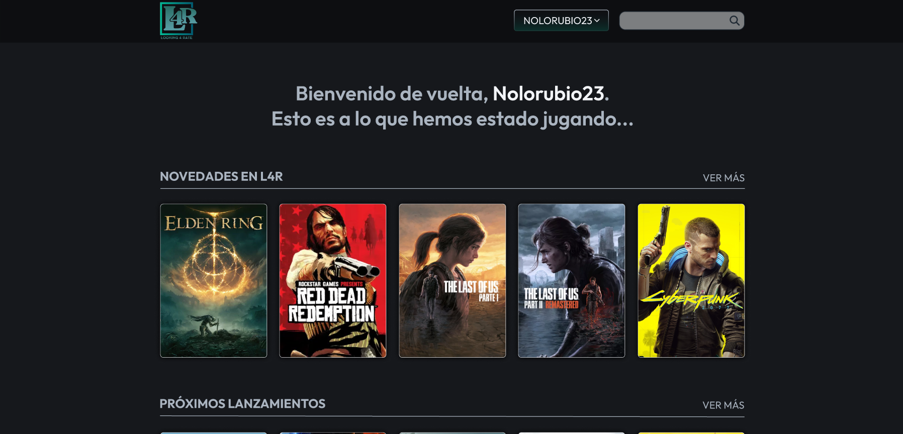
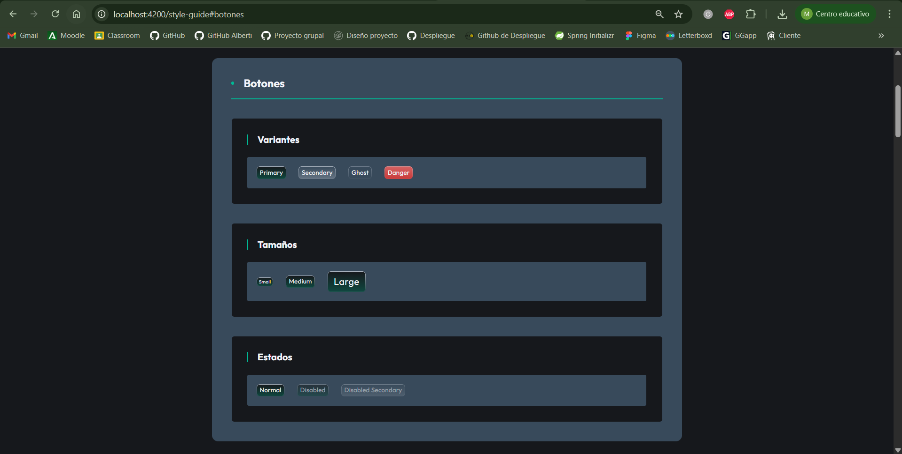
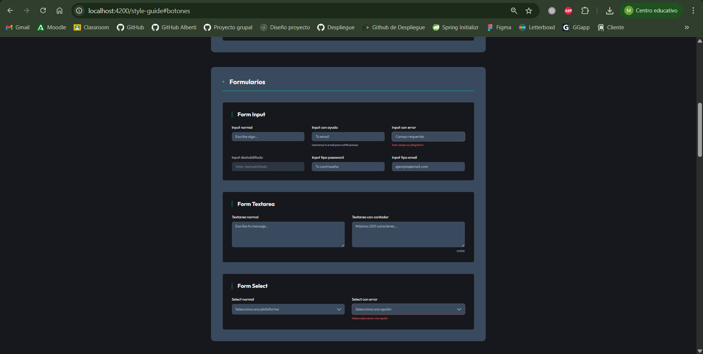
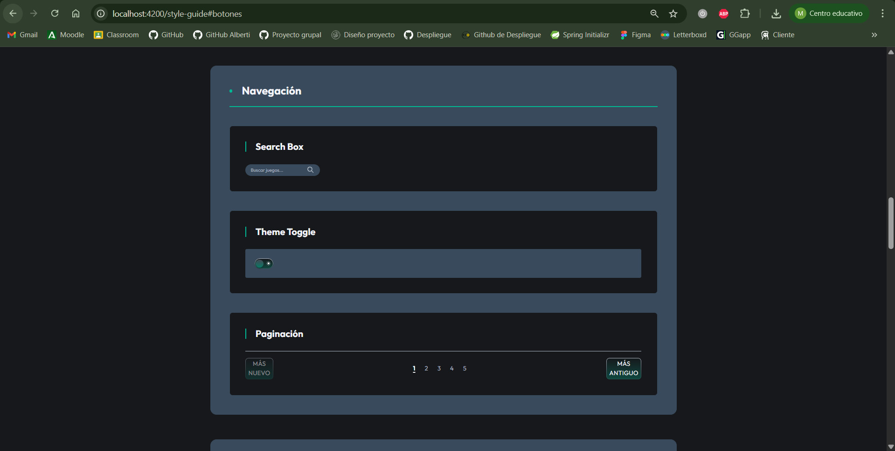
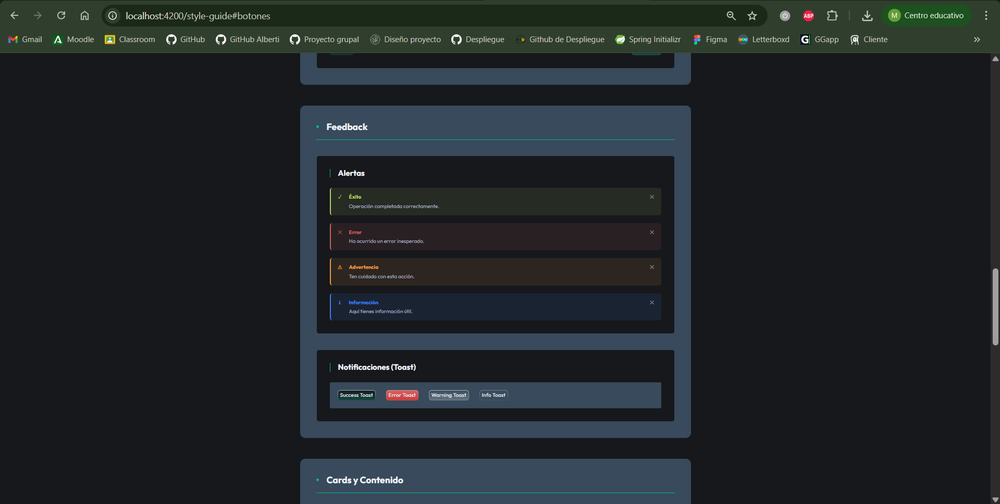
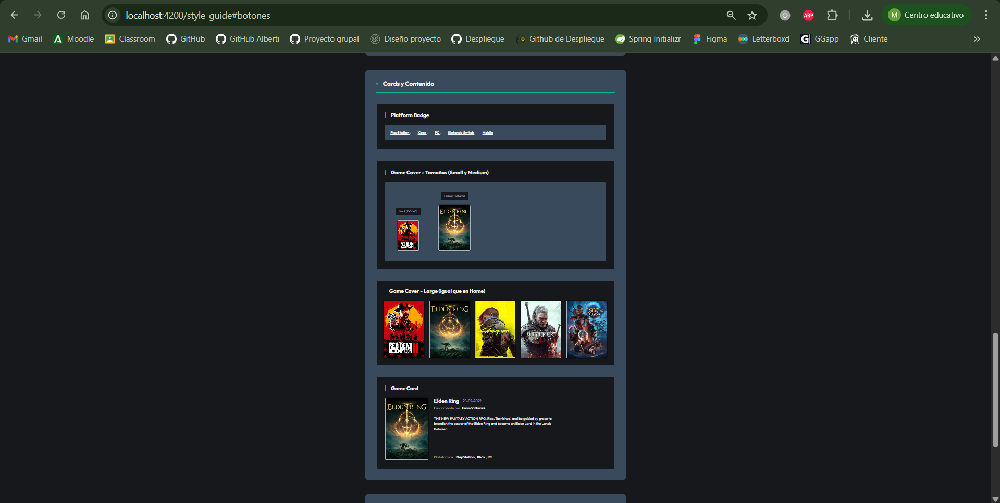

# Índice

- [Sección 1: Arquitectura CSS y comunicación visual](#sección-1-arquitectura-css-y-comunicación-visual)
	- [1.1 Principios de comunicación visual](#11-principios-de-comunicación-visual)
	- [1.2 Metodología CSS](#12-metodología-css)
	- [1.3 Organización de archivos: Estructura ITCSS](#13-organización-de-archivos-estructura-itcss)
	- [1.4 Sistema de Design Tokens](#14-sistema-de-design-tokens)
	- [1.5 Mixins y funciones](#15-mixins-y-funciones)
	- [1.6 ViewEncapsulation en Angular](#16-viewencapsulation-en-angular)
	- [Enfoque híbrido: ITCSS + Encapsulación Angular](#enfoque-híbrido-itcss--encapsulación-angular)
- [Sección 2: HTML semántico y estructura](#sección-2-html-semántico-y-estructura)
	- [2.1 Elementos semánticos utilizados](#21-elementos-semánticos-utilizados)
	- [2.2 Jerarquía de headings](#22-jerarquía-de-headings)
	- [2.3 Estructura de formularios](#23-estructura-de-formularios)
- [Sección 3: Sistema de componentes UI](#sección-3-sistema-de-componentes-ui)
	- [3.1 Componentes implementados](#31-componentes-implementados)
	- [3.2 Nomenclatura y metodología](#32-nomenclatura-y-metodología)
	- [3.3 Style Guide](#33-style-guide)
# Sección 1: Arquitectura CSS y comunicación visual.
## 1.1 Principios de comunicación visual

En el diseño de la interfaz de Looking4Rate se han aplicado los siguientes principios básicos de comunicación visual:

**Jerarquía:**  
Se utiliza el tamaño, el peso tipográfico y el espaciado para destacar los elementos más importantes, como títulos, botones principales y mensajes clave. Los encabezados son más grandes y en negrita, mientras que los textos secundarios y descripciones tienen menor tamaño y peso. El espaciado entre secciones ayuda a separar bloques de información y guiar la atención del usuario.

**Contraste:**  
El contraste se logra mediante el uso de colores diferenciados para elementos interactivos (botones, enlaces) y fondos. Los colores vivos se reservan para llamadas a la acción, mientras que los textos y fondos mantienen una paleta neutra para facilitar la lectura. También se emplea contraste en el tamaño y el peso de la tipografía para distinguir títulos de contenido secundario.

**Alineación:**  
La alineación principal es a la izquierda para textos y formularios, lo que mejora la legibilidad. Para elementos visuales y tarjetas se utiliza un sistema de grid ya implementado, asegurando que los componentes estén alineados de forma consistente y ordenada en diferentes resoluciones y dispositivos. En casos específicos, como mensajes centrales o modales, se emplea alineación centrada para destacar el contenido.

**Proximidad:**  
Los elementos relacionados, como campos de formularios, botones de acción y etiquetas, se agrupan mediante espaciado reducido entre ellos. Esto facilita la comprensión y el uso, ya que el usuario identifica rápidamente qué elementos pertenecen a la misma función o sección.

**Repetición:**  
Se repiten patrones visuales como el estilo de botones, tarjetas, iconografía y colores en toda la aplicación. Esto crea coherencia y familiaridad, permitiendo que el usuario reconozca rápidamente las acciones y secciones, y manteniendo una identidad visual uniforme en todo el proyecto.

### Ejemplo visual



A continuación se señalan ejemplos concretos de cada principio en la interfaz de Looking4Rate, según la captura de pantalla:

**Jerarquía:**
El mensaje de bienvenida (“Bienvenido de vuelta, Nolorubio23...”) utiliza un tamaño de fuente grande y negrita, destacando la importancia de la información principal. Los títulos de sección como “NOVEDADES EN L4R” y “PRÓXIMOS LANZAMIENTOS” también emplean mayor peso y tamaño para guiar la atención.

**Contraste:**
Se observa contraste en el uso de colores: el fondo oscuro permite que los textos claros y los elementos visuales (portadas de juegos) resalten. Los botones y enlaces (“VER MÁS”) utilizan un color diferente para indicar interactividad.

**Alineación:**
La alineación de los textos y elementos es principalmente a la izquierda, lo que mejora la legibilidad. Las tarjetas de juegos están alineadas mediante un sistema de grid, creando orden visual, consistencia y adaptabilidad en la interfaz.

**Proximidad:**
Las portadas de los juegos están agrupadas con poco espacio entre ellas, indicando que pertenecen a la misma categoría (“Novedades en L4R”). Los títulos y sus respectivas secciones están próximos, facilitando la relación visual.

**Repetición:**
Se repite el estilo de las tarjetas de juegos, el formato de los títulos de sección y el diseño de los botones/enlaces, lo que aporta coherencia y uniformidad a la interfaz.

## 1.2 Metodología CSS

Para la organización y estructuración de los estilos CSS en Looking4Rate se utiliza la metodología BEM (Block, Element, Modifier) la cual facilita la organización y el mantenimiento de los estilos en aplicaciones grandes y colaborativas como esta.

BEM permite:
- Evitar conflictos de nombres entre clases, ya que cada bloque, elemento y modificador tiene una estructura clara y única.
- Mejorar la legibilidad del código CSS, haciendo evidente la relación entre los componentes y sus partes.
- Favorecer la escalabilidad, permitiendo agregar nuevas variantes o modificar estilos sin afectar otras partes del sistema.

En BEM, cada clase se compone de tres partes principales:

- **Bloques:** Representan componentes independientes de la interfaz, por ejemplo `.ficha-juego`.
- **Elementos:** Son partes internas del bloque que dependen de él, por ejemplo `.ficha-juego__titulo`.
- **Modificadores:** Indican variaciones o estados del bloque o elemento, por ejemplo `.ficha-juego--destacada`.

**Ejemplo de nomenclatura BEM:**
```css
.ficha-juego { ... }
.ficha-juego__titulo { ... }
.ficha-juego__imagen { ... }
.ficha-juego--destacada { ... }
```

Esta metodología permite identificar rápidamente la función y relación de cada clase, favoreciendo la reutilización y el trabajo colaborativo en el proyecto.

## 1.3 Organización de archivos: Estructura ITCSS

En Looking4Rate se utiliza la metodología ITCSS (Inverted Triangle CSS) para organizar los archivos de estilos. ITCSS permite estructurar el CSS desde lo más genérico y global hasta lo más específico y particular, facilitando el mantenimiento y la escalabilidad.

El orden de las carpetas sigue el principio de menor a mayor especificidad:

1. **00-settings:** Variables globales (colores, tipografías, tamaños, breakpoints, etc.) que pueden ser reutilizadas en todo el proyecto.
2. **01-tools:** Mixins y funciones Sass que ayudan a generar estilos reutilizables y dinámicos.
3. **02-generic:** Estilos genéricos como resets y normalizaciones que afectan a todos los elementos.
4. **03-elements:** Estilos para elementos HTML básicos (`h1`, `p`, `ul`, `button`, etc.), sin clases.
5. **04-objects:** Estructuras de layout y sistemas de grid, que definen la organización visual sin aplicar estilos específicos.
6. **05-components:** Componentes reutilizables y específicos de la interfaz, como tarjetas, botones, formularios, etc.
7. **06-utilities:** Clases utilitarias para aplicar estilos rápidos y específicos (márgenes, alineaciones, colores, etc.).

### Árbol de carpetas de estilos

```plaintext
src/
	styles/
		main.scss
		00-settings/
			_variables.scss
		01-tools/
			_mixins.scss
		02-generic/
			_reset.scss
		03-elements/
			_elements.scss
		04-objects/
			_grid.scss
		05-components/
			(vacío o componentes específicos)
		06-utilities/
			(vacío o utilidades específicas)
```

Esta estructura permite que los estilos más generales se carguen primero y los más específicos al final, evitando conflictos y facilitando la sobrescritura controlada de reglas CSS.

## 1.4 Sistema de Design Tokens

En Looking4Rate se utilizan design tokens para definir variables globales que garantizan coherencia y flexibilidad en el diseño. Los principales grupos de tokens son:

### Colores

Se ha elegido una paleta oscura moderna, con acentos vibrantes y colores semánticos claros para mejorar la accesibilidad y la experiencia visual.  
- Los colores principales (`$color-primary-dark`, `$color-secondary-dark`) transmiten profesionalidad y permiten que los elementos destacados (botones, enlaces, badges) resalten con el color de acento (`$color-accent-dark`).
- Los colores semánticos (`$color-error-dark`, `$color-success-dark`, `$color-warning-dark`, `$color-info-dark`) facilitan la comunicación de estados y mensajes al usuario.
- La paleta de grises permite crear jerarquía visual y separar secciones sin perder armonía.

A continuación se documentan todas las variables utilizadas:

**Modo oscuro:**
- `$color-primary-dark`: Fondo principal (#16181C)
- `$color-secondary-dark`: Fondo secundario (#384A5B)
- `$color-accent-dark`: Color de acento y elementos destacados (#00B894)
- `$color-text-dark`: Texto principal (#F2F4F8)
- `$color-text-alt-dark`: Texto secundario (#AAB4C0)
- `$color-header-footer-dark`: Fondo de header y footer (#0D0E11)

**Colores semánticos (oscuro):**
- `$color-error-dark`: Error (#D46363)
- `$color-success-dark`: Éxito (#B5D366)
- `$color-warning-dark`: Advertencia (#F59E42)
- `$color-info-dark`: Información (#3B82F6)

**Modo claro:**
- `$color-primary-light`: Fondo principal (#EDEDED)
- `$color-secondary-light`: Fondo secundario (#597085)
- `$color-accent-light`: Color de acento (#0A7CFF)
- `$color-text-light`: Texto principal (#1A1A1A)
- `$color-text-alt-light`: Texto secundario (#4E4F50)
- `$color-header-footer-light`: Fondo de header y footer (#2A2F2F)

**Colores semánticos (claro):**
- `$color-error-light`: Error (#EF4444)
- `$color-success-light`: Éxito (#22C55E)
- `$color-warning-light`: Advertencia (#F59E42)
- `$color-info-light`: Información (#3B82F6)

**Paleta de grises:**
- `$color-gray-50-dark` a `$color-gray-900-dark`: Diferentes tonos de gris para fondos, bordes y separadores

### Tipografía

Se utiliza la fuente principal 'Outfit' por su legibilidad y estilo contemporáneo, y 'Playfair Display' como secundaria para títulos elegantes.  
- La escala tipográfica está basada en múltiplos de 8px, lo que facilita la modularidad y la consistencia en todos los tamaños de pantalla.
- Los pesos tipográficos permiten diferenciar títulos, subtítulos y textos secundarios, mejorando la jerarquía visual.

A continuación se documentan todas las variables utilizadas:

- `$font-primary`: 'Outfit', Arial, sans-serif (principal, moderna y legible)
- `$font-secondary`: 'Playfair Display', serif (secundaria, elegante para títulos)

**Escala de tamaños (base 8px):**
- `$font-size-xs`: 8px
- `$font-size-sm`: 12px
- `$font-size-md`: 16px
- `$font-size-lg`: 24px
- `$font-size-xl`: 32px
- `$font-size-2xl`: 40px
- `$font-size-3xl`: 48px
- `$font-size-4xl`: 56px
- `$font-size-5xl`: 64px

**Pesos tipográficos:**
- `$font-weight-light`: 300
- `$font-weight-regular`: 400
- `$font-weight-medium`: 500
- `$font-weight-semibold`: 600
- `$font-weight-bold`: 700

**Alturas de línea:**
- `$line-height-tight`: 1.1
- `$line-height-normal`: 1.5
- `$line-height-relaxed`: 1.75

### Espaciado

El sistema de espaciado sigue una escala de 8px (`$spacing-1` a `$spacing-12`), lo que simplifica la alineación y el diseño responsivo.  
- Esta decisión permite mantener proporciones uniformes y facilita la adaptación a diferentes dispositivos.

A continuación se documentan todas las variables utilizadas:

- `$spacing-1`: 8px
- `$spacing-2`: 16px
- `$spacing-3`: 24px
- `$spacing-4`: 32px
- `$spacing-5`: 40px
- `$spacing-6`: 48px
- `$spacing-7`: 56px
- `$spacing-8`: 64px
- `$spacing-9`: 72px
- `$spacing-10`: 80px
- `$spacing-11`: 88px
- `$spacing-12`: 96px
- `$spacing-header-footer`: 60px

### Breakpoints

Los breakpoints (`$breakpoint-sm`, `$breakpoint-md`, `$breakpoint-lg`, `$breakpoint-xl`) están pensados para cubrir los dispositivos más comunes: móviles, tablets y escritorios.  
- Se han elegido valores estándar para asegurar que la interfaz se adapte correctamente y ofrezca una experiencia óptima en cualquier resolución.

A continuación se documentan todas las variables utilizadas:

- `$breakpoint-sm`: 640px (móvil grande)
- `$breakpoint-md`: 768px (tablet)
- `$breakpoint-lg`: 1024px (desktop)
- `$breakpoint-xl`: 1280px (desktop grande)

### Elevaciones (Sombras)

Las elevaciones (sombras) se utilizan para aportar profundidad y jerarquía visual a los componentes, ayudando a distinguir elementos interactivos y resaltando secciones importantes. Se han definido diferentes niveles de sombra para adaptarse a la importancia y el contexto de cada componente, desde sombras sutiles para tarjetas hasta sombras más marcadas para modales o elementos destacados.

A continuación se documentan todas las variables utilizadas:

- `$shadow-sm`: 0 1px 2px 0 rgba(0,0,0,0.08)
- `$shadow-md`: 0 4px 8px 0 rgba(0,0,0,0.12)
- `$shadow-lg`: 0 8px 16px 0 rgba(0,0,0,0.16)
- `$shadow-xl`: 0 16px 32px 0 rgba(0,0,0,0.20)

### Bordes

Los bordes permiten definir la separación y el énfasis visual entre componentes, aportando estructura y claridad a la interfaz. Se han definido diferentes grosores para adaptarse a la jerarquía y relevancia de cada elemento, desde bordes sutiles para tarjetas y campos de formulario hasta bordes más gruesos para elementos destacados o alertas.

A continuación se documentan todas las variables utilizadas:

- `$border-thin`: 1px
- `$border-medium`: 2px
- `$border-thick`: 4px

### Radios de borde

Los radios de borde permiten definir el nivel de redondez en los componentes, aportando suavidad y modernidad al diseño. Se han definido varios tamaños para adaptarse a diferentes tipos de elementos: desde esquinas sutilmente redondeadas en tarjetas y campos de formulario, hasta formas completamente circulares en avatares o badges.

A continuación se documentan todas las variables utilizadas:

- `$radius-sm`: 2px
- `$radius-md`: 4px
- `$radius-lg`: 8px
- `$radius-xl`: 16px
- `$radius-2xl`: 24px
- `$radius-full`: 9999px

### Transiciones

Las transiciones permiten suavizar los cambios visuales e interacciones en la interfaz, mejorando la experiencia del usuario y haciendo que las animaciones y efectos sean más agradables y naturales. Se han definido diferentes velocidades para adaptarse a la importancia de cada acción, desde transiciones rápidas para botones hasta transiciones más lentas para modales o elementos destacados.

A continuación se documentan todas las variables utilizadas:

- `$transition-fast`: 150ms
- `$transition-base`: 300ms
- `$transition-slow`: 500ms
- `$transition-ease`: ease-in-out

Este sistema de design tokens permite mantener la coherencia visual, facilita el mantenimiento y la evolución del diseño, y asegura que todos los componentes compartan la misma base estilística.

## 1.5 Mixins y funciones

A continuación se documentan los mixins creados en el proyecto, su utilidad y ejemplos de uso:

### 1. flex-center
**Descripción:** Centra cualquier elemento usando flexbox, tanto vertical como horizontalmente.
**Definición:**
```scss
@mixin flex-center {
	display: flex;
	justify-content: center;
	align-items: center;
}
```
**Ejemplo de uso:**
```scss
.contenedor {
	@include flex-center;
	height: 200px;
}
```

### 2. box-shadow
**Descripción:** Aplica una sombra al elemento. Permite personalizar el nivel de sombra.
**Definición:**
```scss
@mixin box-shadow($shadow: $shadow-md) {
	box-shadow: $shadow;
}
```
**Ejemplo de uso:**
```scss
.tarjeta {
	@include box-shadow($shadow-lg);
}
```

### 3. transition
**Descripción:** Aplica una transición estándar a cualquier propiedad CSS, con duración y timing configurables.
**Definición:**
```scss
@mixin transition($property: all, $duration: $transition-base, $timing: $transition-ease) {
	transition: $property $duration $timing;
}
```
**Ejemplo de uso:**
```scss
.boton {
	@include transition(background);
}
```

Estos mixins permiten escribir estilos más limpios, reutilizables y consistentes en todo el proyecto.

## 1.6 ViewEncapsulation en Angular

En este proyecto se utiliza la estrategia de encapsulación de estilos por defecto de Angular: **ViewEncapsulation.Emulated**.
Esto significa que los estilos definidos en cada componente solo afectan a ese componente, evitando conflictos y fugas de estilos entre diferentes partes de la aplicación.

**Justificación:**
- Mantener la encapsulación por componente mejora la mantenibilidad y escalabilidad del proyecto, ya que cada componente puede tener sus propios estilos sin interferir con otros.
- Permite aprovechar la modularidad de Angular y facilita el trabajo en equipo, ya que los desarrolladores pueden trabajar en componentes independientes sin preocuparse por efectos secundarios globales.
- Si en algún caso se requiere aplicar estilos globales (por ejemplo, para el layout principal o utilidades), se pueden definir en los archivos globales de estilos (`styles.scss`) y usar la encapsulación `None` solo en componentes muy específicos.

Por tanto, se mantendrá la estrategia **Emulated** en la mayoría de los componentes, asegurando una arquitectura de estilos robusta y predecible.

## Enfoque híbrido: ITCSS + Encapsulación Angular

En Looking4Rate se utiliza un enfoque híbrido para la gestión de estilos, combinando la organización global mediante ITCSS y la encapsulación por componente que ofrece Angular.

- **ITCSS** estructura los estilos globales en el archivo `main.scss`, donde se importan variables, mixins, resets, elementos, objetos, componentes y utilidades. Esto garantiza coherencia, escalabilidad y facilidad de mantenimiento en los estilos compartidos por toda la aplicación.
- **Encapsulación Angular (ViewEncapsulation.Emulated)** se aplica en los estilos de cada componente, asegurando que las reglas CSS definidas en el archivo de estilos de un componente solo afecten a ese componente. Así se evitan fugas de estilos y conflictos entre componentes.

Este enfoque permite:
- Mantener una base de estilos global robusta y bien organizada.
- Personalizar y aislar los estilos de cada componente sin afectar el resto de la aplicación.
- Definir estilos globales en `main.scss` para layout, tipografía y utilidades, mientras que los detalles y personalizaciones se gestionan en los estilos de cada componente.
- Favorecer el trabajo en equipo y la reutilización de estilos.

# Sección 2: HTML semántico y estructura

## 2.1 Elementos semánticos utilizados

En Looking4Rate se utilizan elementos semánticos de HTML5 para mejorar la accesibilidad, el SEO y la legibilidad del código. A continuación se describen los elementos utilizados y su propósito:

### `<header>`
Se utiliza para definir el encabezado principal de la aplicación, que contiene el logo, la navegación principal y las acciones del usuario (login, registro, búsqueda).

```html
<header class="header">
  <section class="header__container">
    <a routerLink="/" class="header__logo">
      
    </a>

    <nav class="header__actions">
      <app-theme-toggle></app-theme-toggle>
      <app-button (click)="loginClick.emit()">INICIAR SESIÓN</app-button>
      <app-button (click)="registerClick.emit()">CREAR CUENTA</app-button>
      <app-search-box 
        placeholder="Buscar juegos..."
        [(value)]="searchQuery"
        (search)="onSearch($event)">
      </app-search-box>
    </nav>
  </section>
</header>
```

### `<nav>`
Se utiliza para agrupar los enlaces de navegación. En el header contiene las acciones principales y en el footer agrupa los enlaces sociales y de información.

```html
<nav class="header__actions">
  <!-- Elementos de navegación y acciones -->
</nav>
```

### `<main>`
Define el contenido principal de la página. En Looking4Rate, el componente `app-main` envuelve el contenido dinámico de cada vista.

```html
<main class="main">
  <ng-content></ng-content>
</main>
```

### `<article>`
Se utiliza para contenido independiente y autocontenido. En Looking4Rate se emplea para los modales de login y registro, ya que representan unidades de contenido con sentido propio.

```html
<article class="login-modal">
  <header class="login-modal__header">
    <h2 class="login-modal__title">Inicio de sesión</h2>
    <!-- Contenido del modal -->
  </header>
  <!-- Formulario -->
</article>
```

### `<section>`
Agrupa contenido temáticamente relacionado. Se utiliza para dividir áreas dentro de componentes más grandes.

```html
<section class="header__container">
  <!-- Contenido agrupado del header -->
</section>

<section class="footer__social">
  <!-- Enlaces a redes sociales -->
</section>
```

### `<aside>`
Se utiliza para contenido complementario o secundario. En Looking4Rate se emplea para el overlay de los modales, indicando que es contenido que complementa al principal.

```html
<aside class="login-modal__overlay" (click)="onOverlayClick($event)">
  <article class="login-modal">
    <!-- Contenido del modal -->
  </article>
</aside>
```

### `<footer>`
Define el pie de página de la aplicación o de una sección. En Looking4Rate contiene información de copyright, enlaces sociales y el logo.

```html
<footer class="footer">
  <nav class="footer__container">
    <figure class="footer__logo-info">
      
      <section class="footer__info">
        <p class="footer__copyright">&copy; {{ currentYear }} Looking4Rate. Todos los derechos reservados.</p>
        <p class="footer__slogan">Made by <a href="#" class="footer__link">real player</a>, for players.</p>
      </section>
    </figure>
    <!-- Enlaces sociales -->
  </nav>
</footer>
```

### Estructura general de la aplicación

La estructura semántica completa de la aplicación sigue este patrón:

```html
<app-header>
  <!-- header con nav -->
</app-header>

<app-main>
  <router-outlet />
  <!-- Contenido dinámico de cada página -->
</app-main>

<app-footer>
  <!-- footer con información y enlaces -->
</app-footer>
```

## 2.2 Jerarquía de headings

En Looking4Rate se sigue una estrategia clara y consistente para los encabezados, respetando la jerarquía semántica y facilitando la navegación por lectores de pantalla.

### Reglas de jerarquía

| Nivel | Uso en Looking4Rate | Ejemplo |
|-------|---------------------|---------|
| **H1** | Título principal de la página de inicio (descripción del sitio) o mensaje de bienvenida al usuario logeado | "Bienvenido de vuelta, Nolorubio23. Esto es a lo que hemos estado jugando." |
| **H2** | Encabezados de secciones habituales de la página | "Novedades en L4R", "Próximos lanzamientos" |
| **H3** | Nombres de juegos en resultados de búsqueda o en la ficha individual de un juego | "The Legend of Zelda: Tears of the Kingdom" |

### Diagrama de jerarquía

```plaintext
PÁGINA DE INICIO (sin login)
└── H1: "Ten un seguimiento de lo que juegas.Puntúa y critíca tus favoritos.Cúentale a los demás qué te gusta."
    ├── H2: "Novedades en L4R"
    ├── H2: "Próximos lanzamientos"
    └── H2: "Mejor valorados"

PÁGINA DE INICIO (con login)
└── H1: "Bienvenido de vuelta, [NombreUsuario]"
    ├── H2: "Novedades en L4R"
    └── H2: "Próximos lanzamientos"
    └── H2: "Mejor valorados"

PÁGINA DE RESULTADOS DE BÚSQUEDA
└── H1: "Resultados de búsqueda"
    ├── H2: "Nombre del Juego 1"
    ├── H2: "Nombre del Juego 2"
    └── H2: "Nombre del Juego 3"

FICHA DE JUEGO
└── H1: (Oculto o mensaje contextual)
    └── H2: "Nombre del Juego"
```

### Principios aplicados

1. **Un solo H1 por página:** Cada página tiene únicamente un H1 que identifica el propósito principal de la vista. (La página no siempre tendrá un H1).
2. **No saltar niveles:** Nunca se pasa de H1 a H3 directamente; siempre se respeta la secuencia lógica.
3. **H2 para contenido destacado:** Los nombres de juegos utilizan H2 porque representan el contenido principal que el usuario busca.
4. **H3 para secciones de navegación:** Las secciones recurrentes de la interfaz utilizan H3 para mantener consistencia.

## 2.3 Estructura de formularios

En Looking4Rate se utilizan formularios semánticos y accesibles, empleando elementos como `<form>`, `<fieldset>`, `<legend>` y la correcta asociación entre `<label>` e `<input>`.

### Elementos utilizados

- **`<form>`:** Contenedor principal del formulario con el evento `ngSubmit` para manejar el envío.
- **`<fieldset>`:** Agrupa campos relacionados dentro del formulario.
- **`<legend>`:** Proporciona un título descriptivo para el grupo de campos.
- **`<label>`:** Etiqueta asociada a cada campo de entrada.

### Ejemplo: Formulario de login

```html
<form class="login-modal__form" (ngSubmit)="onSubmit()">
  <fieldset class="login-modal__fieldset">
    <legend class="login-modal__legend">Credenciales de acceso</legend>

    <app-form-input
      label="Nombre de usuario"
      type="text"
      name="username"
      placeholder=""
      [required]="true"
      [errorMessage]="usernameError"
      [value]="username"
      (valueChange)="username = $event"
      (inputBlur)="onUsernameBlur()">
    </app-form-input>

    <app-form-input
      label="Contraseña"
      type="password"
      name="password"
      placeholder=""
      [required]="true"
      [errorMessage]="passwordError"
      [value]="password"
      (valueChange)="password = $event"
      (inputBlur)="onPasswordBlur()">
    </app-form-input>
  </fieldset>

  <footer class="login-modal__actions">
    <button type="submit" class="login-modal__submit" [disabled]="!isFormValid">Iniciar</button>
  </footer>
</form>
```

### Componente `form-input`

El componente `app-form-input` encapsula la lógica y estructura de cada campo de formulario, garantizando accesibilidad y consistencia en toda la aplicación.

**Plantilla HTML (`form-input.html`):**

```html
<label class="form-input" [class.form-input--error]="errorMessage" [class.form-input--disabled]="disabled">
  <span class="form-input__label">
    {{ label }}
    @if (required) {
      <span class="form-input__required">*</span>
    }
  </span>

  <input
    [id]="id"
    [type]="type"
    [name]="name"
    [placeholder]="placeholder"
    [required]="required"
    [disabled]="disabled"
    [value]="value"
    (input)="onInputChange($event)"
    (blur)="onBlur()"
    class="form-input__field"
    [class.form-input__field--error]="errorMessage"
  />

  @if (errorMessage) {
    <p class="form-input__error">{{ errorMessage }}</p>
  }
  @if (helpText && !errorMessage) {
    <p class="form-input__help">{{ helpText }}</p>
  }
</label>
```

**Componente TypeScript (`form-input.ts`):**

```typescript
import { Component, Input, Output, EventEmitter, ViewEncapsulation } from '@angular/core';

@Component({
  selector: 'app-form-input',
  templateUrl: './form-input.html',
  styleUrl: './form-input.scss',
  encapsulation: ViewEncapsulation.None
})
export class FormInput {
  @Input() label = '';
  @Input() type = 'text';
  @Input() name = '';
  @Input() placeholder = '';
  @Input() required = false;
  @Input() disabled = false;
  @Input() errorMessage = '';
  @Input() helpText = '';
  @Input() value = '';

  @Output() valueChange = new EventEmitter<string>();
  @Output() inputBlur = new EventEmitter<void>();

  get id(): string {
    return `input-${this.name}`;
  }

  onInputChange(event: Event): void {
    const target = event.target as HTMLInputElement;
    this.value = target.value;
    this.valueChange.emit(this.value);
  }

  onBlur(): void {
    this.inputBlur.emit();
  }
}
```

### Asociación label-input

En el componente `form-input`, la asociación entre el `<label>` y el `<input>` se realiza de forma implícita mediante **anidamiento**: el `<input>` está contenido dentro del `<label>`. Esta técnica es una alternativa válida y semánticamente correcta al uso del atributo `for` con `id`.

**Ventajas del anidamiento:**
- No requiere generar IDs únicos manualmente.
- La asociación es automática e implícita.
- Simplifica el código y reduce posibles errores.

Adicionalmente, el componente genera un `id` único basado en el `name` del campo (`input-${this.name}`), lo que permite referencias externas si fuera necesario.

### Características de accesibilidad

1. **Labels descriptivos:** Cada campo tiene una etiqueta clara que describe su propósito.
2. **Indicador de campo requerido:** Los campos obligatorios muestran un asterisco (*) visual.
3. **Mensajes de error:** Los errores de validación se muestran junto al campo correspondiente.
4. **Texto de ayuda:** Se puede proporcionar información adicional para guiar al usuario.
5. **Estados visuales:** Los campos tienen estilos diferenciados para estados de error y deshabilitado.

# Sección 3: Sistema de componentes UI

En Looking4Rate se ha desarrollado un sistema de componentes UI reutilizables que garantizan consistencia visual, accesibilidad y mantenibilidad en toda la aplicación. Todos los componentes siguen la metodología BEM y utilizan los design tokens definidos en el sistema.

## 3.1 Componentes implementados

### Button (`app-button`)

**Propósito:** Componente de botón universal que puede renderizarse como `<button>`, `<a>` con `routerLink` (navegación interna) o `<a>` con `href` (enlaces externos).

**Variantes disponibles:**
- `primary` (default): Fondo con gradiente verde/accent, para acciones principales
- `secondary`: Fondo gris/neutro, para acciones secundarias
- `ghost`: Fondo transparente con borde sutil, para acciones terciarias
- `danger`: Fondo rojo para acciones destructivas o de alerta

**Tamaños disponibles:**
- `sm`: Pequeño (padding: 2px 6px, font-size: 12px)
- `md` (default): Mediano (padding: 4px 8px, font-size: 16px)
- `lg`: Grande (padding: 8px 16px, font-size: 24px)

**Estados que maneja:**
- Default: Estado base del botón
- Hover: Elevación con sombra y cambio de gradiente
- Active: Vuelve a posición original con sombra reducida
- Focus-visible: Outline de 2px con color accent
- Disabled: Pointer-events deshabilitados, opacidad reducida

**Ejemplo de uso:**
```html
<!-- Botón como button -->
<app-button variant="primary" size="md" (btnClick)="onAction()">
  GUARDAR
</app-button>

<!-- Botón como enlace interno -->
<app-button routerLink="/games/123" variant="secondary">
  VER DETALLE
</app-button>

<!-- Botón como enlace externo -->
<app-button href="https://example.com" variant="ghost">
  VISITAR WEB
</app-button>

<!-- Botón deshabilitado -->
<app-button [disabled]="true" variant="danger">
  ELIMINAR
</app-button>
```

---

### Alert (`app-alert`)

**Propósito:** Muestra mensajes de retroalimentación al usuario con diferentes niveles de importancia. Ideal para mensajes de estado, confirmaciones o errores que deben permanecer visibles hasta que el usuario los descarte.

**Variantes disponibles (tipos):**
- `success`: Verde, para confirmaciones y acciones exitosas
- `error`: Rojo, para errores y problemas
- `warning`: Naranja, para advertencias
- `info` (default): Azul, para información general

**Estados que maneja:**
- Visible: Alerta mostrada con su estilo correspondiente
- Dismissible: Con botón de cerrar (opcional)
- Cerrada: Oculta después de cerrar

**Ejemplo de uso:**
```html
<!-- Alerta de éxito con título -->
<app-alert type="success" title="¡Registro completado!">
  Tu cuenta ha sido creada correctamente.
</app-alert>

<!-- Alerta de error descartable -->
<app-alert 
  type="error" 
  title="Error de conexión" 
  [dismissible]="true"
  (closed)="onAlertClosed()">
  No se pudo conectar con el servidor.
</app-alert>

<!-- Alerta de advertencia -->
<app-alert type="warning">
  Tu sesión expirará en 5 minutos.
</app-alert>

<!-- Alerta informativa -->
<app-alert type="info" title="Actualización disponible">
  Hay una nueva versión de la aplicación.
</app-alert>
```

---

### FormInput (`app-form-input`)

**Propósito:** Campo de entrada de texto reutilizable con label, validación y mensajes de error/ayuda integrados. Encapsula la estructura semántica label-input.

**Tipos de input soportados:**
- `text` (default), `password`, `email`, `number`, `tel`, `url`, etc.

**Estados que maneja:**
- Default: Campo vacío o con valor
- Hover: Cambio de color de fondo
- Focus: Fondo claro con texto oscuro
- Error: Borde rojo y mensaje de error visible
- Disabled: Campo deshabilitado, no editable

**Ejemplo de uso:**
```html
<app-form-input
  label="Nombre de usuario"
  type="text"
  name="username"
  placeholder="Introduce tu nombre"
  [required]="true"
  [errorMessage]="usernameError"
  [(value)]="username"
  (inputBlur)="onUsernameBlur()">
</app-form-input>

<app-form-input
  label="Contraseña"
  type="password"
  name="password"
  [required]="true"
  helpText="Mínimo 6 caracteres"
  [(value)]="password">
</app-form-input>
```

---

### FormTextarea (`app-form-textarea`)

**Propósito:** Campo de texto multilínea con las mismas características que form-input. Incluye contador de caracteres opcional y control de redimensionado.

**Características adicionales:**
- `rows`: Número de filas visibles (default: 4)
- `maxLength`: Límite de caracteres (opcional)
- `resizable`: Control de redimensionado (default: true)

**Estados que maneja:**
- Default, Hover, Focus, Error, Disabled (igual que form-input)
- Con contador de caracteres visible

**Ejemplo de uso:**
```html
<app-form-textarea
  label="Descripción"
  name="description"
  placeholder="Escribe una descripción del juego..."
  [rows]="5"
  [maxLength]="500"
  [required]="true"
  [(value)]="description">
</app-form-textarea>
```

---

### FormSelect (`app-form-select`)

**Propósito:** Dropdown/select personalizado con diseño consistente. Incluye opciones configurables, placeholder y estados de validación.

**Estados que maneja:**
- Cerrado: Muestra el valor seleccionado o placeholder
- Abierto: Despliega las opciones disponibles
- Hover en opciones: Resaltado visual
- Disabled: No interactivo
- Error: Con mensaje de error

**Ejemplo de uso:**
```typescript
// En el componente
platformOptions: SelectOption[] = [
  { value: 'pc', label: 'PC' },
  { value: 'ps5', label: 'PlayStation 5' },
  { value: 'xbox', label: 'Xbox Series X' },
  { value: 'switch', label: 'Nintendo Switch' }
];
```

```html
<app-form-select
  label="Plataforma"
  name="platform"
  placeholder="Selecciona una plataforma"
  [options]="platformOptions"
  [required]="true"
  [(value)]="selectedPlatform">
</app-form-select>
```

---

### GameCover (`app-game-cover`)

**Propósito:** Muestra la carátula de un videojuego con aspect ratio preservado. Puede ser clicable si incluye enlace.

**Tamaños disponibles:**
- `sm`: Pequeño para listados compactos
- `md` (default): Mediano para grids de juegos
- `lg`: Grande para fichas de detalle

**Ejemplo de uso:**
```html
<!-- Cover simple -->
<app-game-cover
  src="/assets/img/zelda-totk.jpg"
  alt="The Legend of Zelda: Tears of the Kingdom"
  size="md">
</app-game-cover>

<!-- Cover con enlace -->
<app-game-cover
  src="/assets/img/cod-bo6.jpg"
  alt="Call of Duty: Black Ops 6"
  size="lg"
  routerLink="/games/cod-bo6">
</app-game-cover>
```

---

### GameCard (`app-game-card`)

**Propósito:** Card de detalle completo de un videojuego. Combina carátula grande con información: título, fecha de lanzamiento, desarrollador, descripción y plataformas.

**Componentes que usa:**
- `GameCover` para la carátula
- `PlatformBadge` para mostrar las plataformas

**Ejemplo de uso:**
```html
<app-game-card
  coverSrc="/assets/img/cod-black-ops.jpg"
  title="Call of Duty: Black Ops 6"
  releaseDate="09-11-2024"
  developer="Treyarch"
  developerLink="/developers/treyarch"
  description="La Guerra del Golfo como telón de fondo. Elige tu bando y lucha en una campaña ambientada en los 90."
  [platforms]="[
    { name: 'PlayStation', routerLink: '/platforms/playstation' },
    { name: 'Xbox', routerLink: '/platforms/xbox' },
    { name: 'PC', routerLink: '/platforms/pc' }
  ]">
</app-game-card>
```

---

### PlatformBadge (`app-platform-badge`)

**Propósito:** Badge/etiqueta que representa una plataforma de videojuegos. Puede ser un simple texto o un enlace.

**Estados que maneja:**
- Default: Badge estático
- Hover (si tiene enlace): Efecto visual de interactividad
- Focus-visible: Outline para accesibilidad

**Ejemplo de uso:**
```html
<!-- Badge estático -->
<app-platform-badge name="Nintendo Switch"></app-platform-badge>

<!-- Badge con enlace -->
<app-platform-badge 
  name="PlayStation 5" 
  routerLink="/platforms/ps5">
</app-platform-badge>
```

---

### SearchBox (`app-search-box`)

**Propósito:** Campo de búsqueda con icono de lupa integrado. Emite eventos de búsqueda y cambio de valor.

**Estados que maneja:**
- Default: Campo vacío
- Con valor: Texto introducido
- Focus: Resaltado del campo

**Ejemplo de uso:**
```html
<app-search-box
  placeholder="Buscar juegos..."
  [(value)]="searchQuery"
  (search)="onSearch($event)">
</app-search-box>
```

---

### ThemeToggle (`app-theme-toggle`)

**Propósito:** Botón toggle para cambiar entre modo oscuro y modo claro de la aplicación.

**Estados que maneja:**
- Modo oscuro (default): Muestra icono de sol
- Modo claro: Muestra icono de luna

**Ejemplo de uso:**
```html
<app-theme-toggle></app-theme-toggle>
```

---

### Pagination (`app-pagination`)

**Propósito:** Controles de paginación con botones de navegación (primero/último) y números de página clicables.

**Inputs configurables:**
- `currentPage`: Página actual (1-indexed)
- `totalPages`: Total de páginas
- `maxVisiblePages`: Máximo de números visibles (default: 5)
- `firstLabel`: Texto del botón primera página (default: "MÁS NUEVO")
- `lastLabel`: Texto del botón última página (default: "MÁS ANTIGUO")

**Estados que maneja:**
- Página actual: Resaltada visualmente
- Primera página: Botón "Más nuevo" deshabilitado
- Última página: Botón "Más antiguo" deshabilitado

**Ejemplo de uso:**
```html
<app-pagination
  [currentPage]="currentPage"
  [totalPages]="totalPages"
  [maxVisiblePages]="7"
  (pageChange)="onPageChange($event)">
</app-pagination>
```

---

### Notification (`app-notification`)

**Propósito:** Notificaciones flotantes tipo toast que aparecen en una esquina de la pantalla. Se auto-cierran después de un tiempo configurable.

**Variantes (tipos):**
- `success`, `error`, `warning`, `info`

**Posiciones disponibles:**
- `top-right` (default), `top-left`, `top-center`
- `bottom-right`, `bottom-left`, `bottom-center`

**Estados que maneja:**
- Entering: Animación de entrada
- Visible: Notificación mostrada
- Leaving: Animación de salida
- Pausado: Auto-cierre pausado al hover

**Ejemplo de uso:**
```html
<app-notification
  type="success"
  title="¡Guardado!"
  message="Los cambios se han guardado correctamente."
  position="top-right"
  [duration]="5000"
  [dismissible]="true"
  (closed)="onNotificationClosed()">
</app-notification>
```

---

### FeaturedSection (`app-featured-section`)

**Propósito:** Sección destacada con título y enlace opcional "Ver más". Usa `ng-content` para proyectar el contenido interno.

**Ejemplo de uso:**
```html
<app-featured-section
  title="NOVEDADES EN L4R"
  linkText="VER MÁS"
  linkRoute="/games/new">
  
  <!-- Contenido de la sección -->
  <div class="grid">
    <app-game-cover ...></app-game-cover>
    <app-game-cover ...></app-game-cover>
  </div>
  
</app-featured-section>
```

---

### LoginForm (`app-login-form`)

**Propósito:** Modal de inicio de sesión con formulario de usuario y contraseña. Incluye validación en tiempo real.

**Estados del formulario:**
- Campos vacíos
- Campos con error (validación)
- Formulario válido (botón habilitado)
- Modal abierto/cerrado

**Ejemplo de uso:**
```html
<app-login-form
  [isOpen]="showLoginModal"
  (close)="showLoginModal = false"
  (loginSubmit)="onLogin($event)">
</app-login-form>
```

---

### RegisterForm (`app-register-form`)

**Propósito:** Modal de registro con formulario de email, usuario y contraseña. Incluye validación de email, longitud mínima de usuario y contraseña.

**Validaciones incluidas:**
- Email: Formato válido requerido
- Usuario: Mínimo 3 caracteres
- Contraseña: Mínimo 6 caracteres

**Ejemplo de uso:**
```html
<app-register-form
  [isOpen]="showRegisterModal"
  (close)="showRegisterModal = false"
  (registerSubmit)="onRegister($event)">
</app-register-form>
```

---

## 3.2 Nomenclatura y metodología

### Estructura BEM aplicada

En Looking4Rate se aplica BEM (Block, Element, Modifier) de forma consistente en todos los componentes. A continuación se explica la estrategia con ejemplos reales:

#### ¿Qué es un Block?

Un **Block** es un componente independiente y reutilizable. El nombre del bloque describe su propósito, no su apariencia.

```scss
// Ejemplos de bloques en Looking4Rate
.btn { }           // Componente Button
.alert { }         // Componente Alert
.form-input { }    // Componente FormInput
.game-card { }     // Componente GameCard
.notification { }  // Componente Notification
```

#### ¿Qué es un Element?

Un **Element** es una parte interna del bloque que no tiene sentido por sí sola fuera del contexto del bloque. Se nombra con doble guion bajo (`__`).

```scss
// Elementos del bloque .alert
.alert__icon { }     // Icono dentro de la alerta
.alert__content { }  // Contenedor del contenido
.alert__title { }    // Título de la alerta
.alert__message { }  // Mensaje de la alerta
.alert__close { }    // Botón de cerrar

// Elementos del bloque .form-input
.form-input__label { }     // Label del campo
.form-input__field { }     // El input propiamente
.form-input__error { }     // Mensaje de error
.form-input__help { }      // Texto de ayuda
.form-input__required { }  // Indicador de requerido (*)

// Elementos del bloque .game-card
.game-card__cover { }       // Carátula del juego
.game-card__info { }        // Contenedor de información
.game-card__header { }      // Cabecera con título y fecha
.game-card__title { }       // Título del juego
.game-card__date { }        // Fecha de lanzamiento
.game-card__description { } // Descripción
.game-card__platforms { }   // Lista de plataformas
```

#### ¿Qué es un Modifier?

Un **Modifier** indica una variación del bloque o elemento. Se nombra con doble guion (`--`). Hay dos tipos principales:

**Modificadores de variante** (cambian la apariencia):
```scss
// Variantes del botón
.btn--primary { }    // Botón principal (verde)
.btn--secondary { }  // Botón secundario (gris)
.btn--ghost { }      // Botón transparente
.btn--danger { }     // Botón de peligro (rojo)

// Variantes de alerta por tipo
.alert--success { }  // Alerta de éxito
.alert--error { }    // Alerta de error
.alert--warning { }  // Alerta de advertencia
.alert--info { }     // Alerta informativa

// Variantes de tamaño
.btn--sm { }         // Botón pequeño
.btn--md { }         // Botón mediano
.btn--lg { }         // Botón grande

.game-cover--sm { }  // Cover pequeño
.game-cover--md { }  // Cover mediano
.game-cover--lg { }  // Cover grande
```

**Modificadores de estado** (reflejan un estado temporal):
```scss
// Estados del botón
.btn--disabled { }           // Botón deshabilitado

// Estados del form-input
.form-input--error { }       // Campo con error
.form-input--disabled { }    // Campo deshabilitado
.form-input__field--error { } // Input con error (elemento modificado)

// Estados de notification
.notification--entering { }  // Animación de entrada
.notification--leaving { }   // Animación de salida
```

### Cuándo usar Modificadores vs Clases de Estado

**Modificadores BEM (`--`)** se usan cuando:
- El estado forma parte de la lógica del componente
- El estado se controla mediante `@Input()` en Angular
- La clase se genera dinámicamente en el componente

```typescript
// En button.ts
get classes(): string {
  return [
    'btn',
    `btn--${this.variant}`,   // Modificador de variante
    `btn--${this.size}`,      // Modificador de tamaño
    this.disabled ? 'btn--disabled' : ''  // Modificador de estado
  ].filter(Boolean).join(' ');
}
```

**Variables CSS locales** se usan para:
- Permitir sobrescribir estilos por variante sin duplicar código
- Mantener un sistema DRY (Don't Repeat Yourself)

```scss
.btn {
  // Variables CSS que las variantes pueden sobrescribir
  --btn-bg: #{$color-primary-dark};
  --btn-shadow: #{$shadow-hover-accent};
  
  background: var(--btn-bg);
  box-shadow: var(--btn-shadow);
  
  // La variante secondary sobrescribe las variables
  &--secondary {
    --btn-bg: #{$color-secondary-dark};
    --btn-shadow: #{$shadow-hover-lift};
  }
}
```

### Ejemplo completo: Anatomía del componente Alert

```scss
// BLOQUE: Componente independiente
.alert {
  // Variables CSS locales para customización por variante
  --alert-bg: var(--color-info);
  --alert-border: var(--color-info);
  
  // Estilos base del bloque
  display: flex;
  padding: $spacing-2;
  border-left: $border-thick solid var(--alert-border);
  
  // ELEMENTO: Icono
  &__icon {
    width: 1.5rem;
    color: var(--alert-border);
  }
  
  // ELEMENTO: Contenedor de contenido
  &__content {
    flex: 1;
    display: flex;
    flex-direction: column;
  }
  
  // ELEMENTO: Título
  &__title {
    font-weight: $font-weight-semibold;
    color: var(--alert-border);
  }
  
  // ELEMENTO: Mensaje
  &__message {
    color: var(--text-secondary);
  }
  
  // ELEMENTO: Botón cerrar
  &__close {
    cursor: pointer;
    
    &:hover {
      background-color: rgba(0, 0, 0, 0.1);
    }
  }
  
  // MODIFICADORES: Variantes por tipo
  &--success {
    --alert-border: var(--color-success);
  }
  
  &--error {
    --alert-border: var(--color-error);
  }
  
  &--warning {
    --alert-border: var(--color-warning);
  }
  
  &--info {
    --alert-border: var(--color-info);
  }
}
```

### Beneficios de esta estrategia

1. **Previsibilidad:** Mirando una clase, se sabe exactamente a qué componente pertenece
2. **Sin colisiones:** Los nombres son únicos y específicos
3. **Fácil mantenimiento:** Los estilos están encapsulados por componente
4. **Escalabilidad:** Añadir nuevas variantes o elementos es intuitivo
5. **Integración con Angular:** Los modificadores se generan dinámicamente mediante getters

---

## 3.3 Style Guide

### ¿Qué es el Style Guide?

El Style Guide es una página especial de la aplicación (`/style-guide`) que muestra **todos los componentes UI** en sus diferentes variantes y estados. Sirve como:

1. **Documentación visual:** Referencia rápida de todos los componentes disponibles
2. **Testing visual:** Permite verificar que los componentes se ven correctamente
3. **Herramienta de desarrollo:** Facilita el desarrollo y ajuste de estilos
4. **Guía de referencia:** Muestra cómo usar cada componente

### Estructura del Style Guide

El Style Guide está organizado en secciones:

1. **Botones:** Todas las variantes (primary, secondary, ghost, danger) y tamaños (sm, md, lg)
2. **Formularios:** Form-input, form-textarea, form-select con estados normales y de error
3. **Navegación y búsqueda:** SearchBox, ThemeToggle, Pagination
4. **Feedback:** Alertas y notificaciones en todos sus tipos (success, error, warning, info)
5. **Cards:** GameCover en diferentes tamaños y GameCard completo
6. **Layout:** FeaturedSection con grid de covers

### Capturas de pantalla

#### Sección de botones



*Sección de botones mostrando las 4 variantes (primary, secondary, ghost, danger) en los 3 tamaños disponibles (sm, md, lg).*

#### Sección de Formularios



*Componentes de formulario: inputs de texto, password, textarea y select, mostrando estados normales y con error.*

#### Sección de navegación



*Componentes de navegación: barra de búsqueda, cambio de tema y paginación, mostrando su aspecto y estados interactivos.*

#### Sección de Feedback



*Alertas inline y notificaciones toast en sus 4 tipos: success, error, warning e info.*

#### Sección de Cards



*GameCover en tamaños sm, md, lg y GameCard completo con información del juego.*

### Acceso al Style Guide

El Style Guide está disponible en desarrollo navegando a:

```
http://localhost:4200/style-guide
```

La ruta está definida en `app.routes.ts`:

```typescript
{
  path: 'style-guide',
  loadComponent: () => import('./pages/style-guide/style-guide').then(m => m.StyleGuide)
}
```

### Uso del Style Guide

El Style Guide es una herramienta de desarrollo que permite:

- **Verificar consistencia visual:** Todos los componentes en un solo lugar
- **Probar temas:** Usar el ThemeToggle para ver componentes en modo claro/oscuro
- **Detectar regresiones:** Cambios en estilos globales se reflejan inmediatamente
- **Onboarding:** Nuevos desarrolladores pueden familiarizarse con los componentes
- **Comunicación:** Compartir con diseñadores para validar la implementación

> **Nota:** Las capturas de pantalla deben añadirse manualmente a la carpeta `docs/design/img/` después de generar las imágenes del Style Guide en funcionamiento.